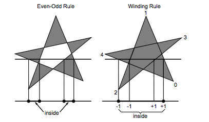
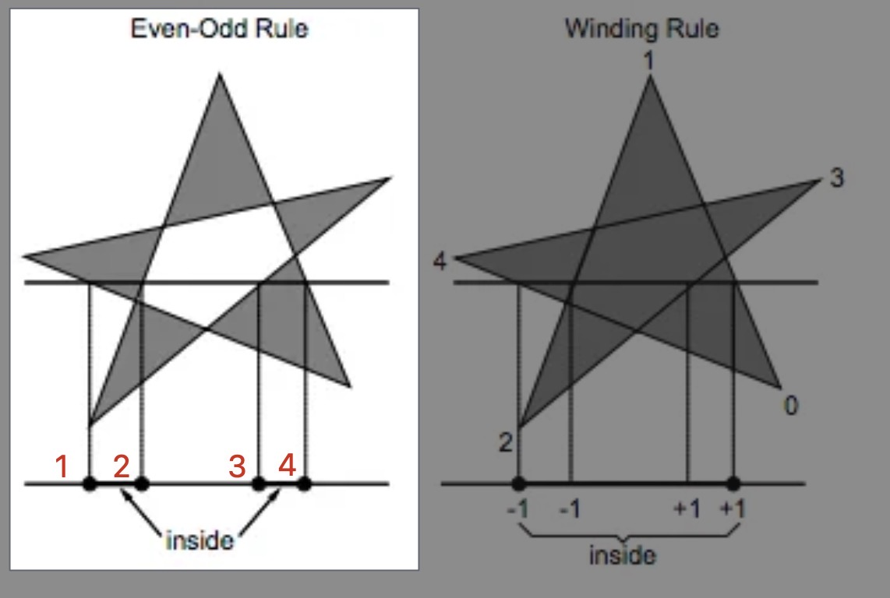
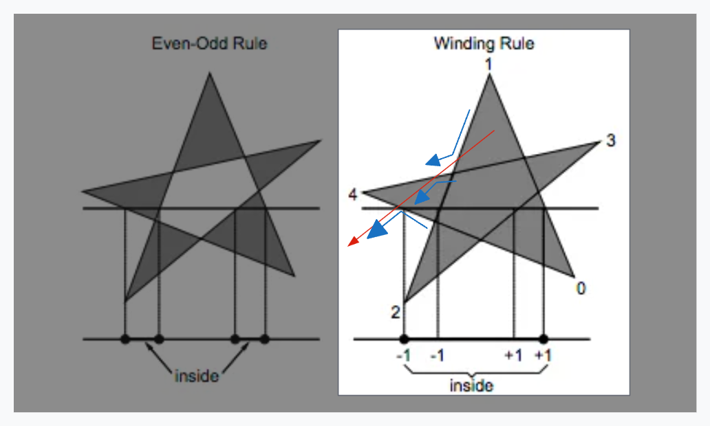
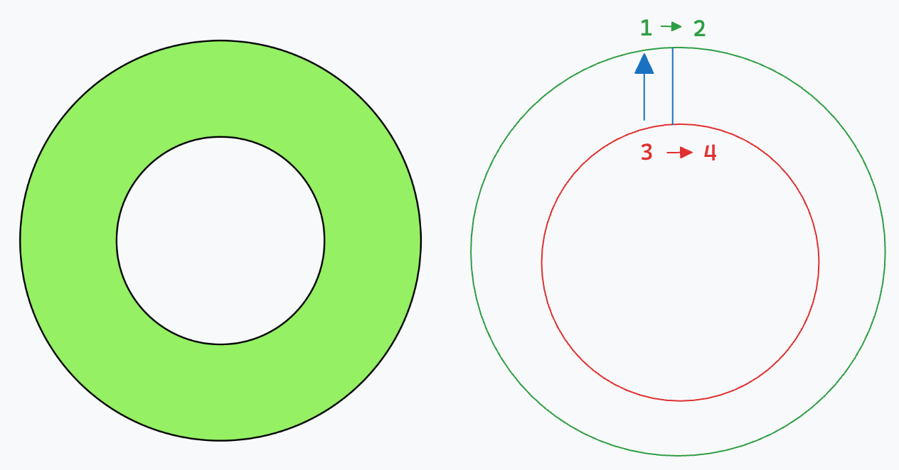
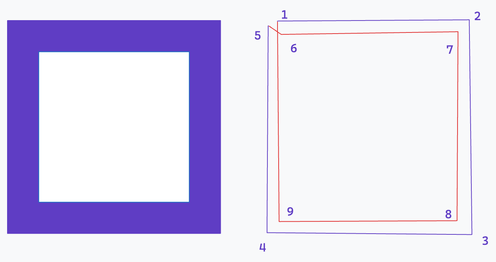
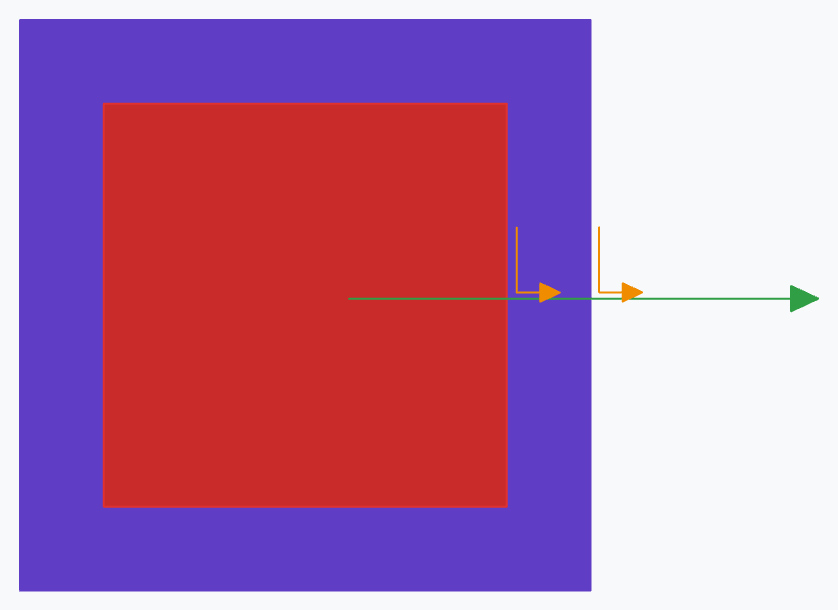
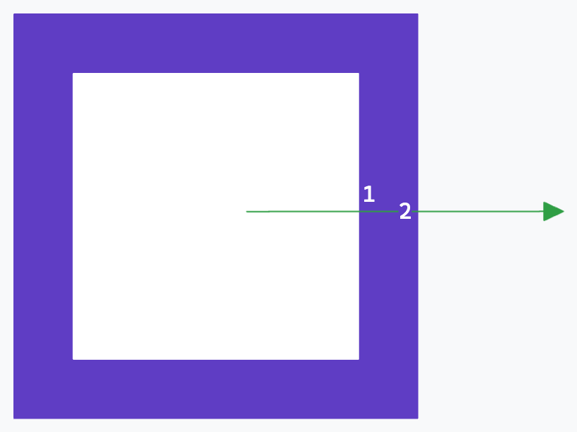
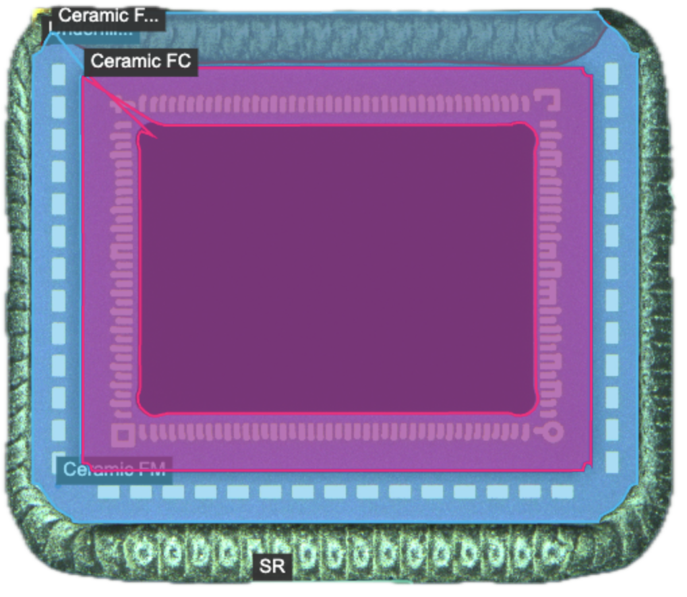
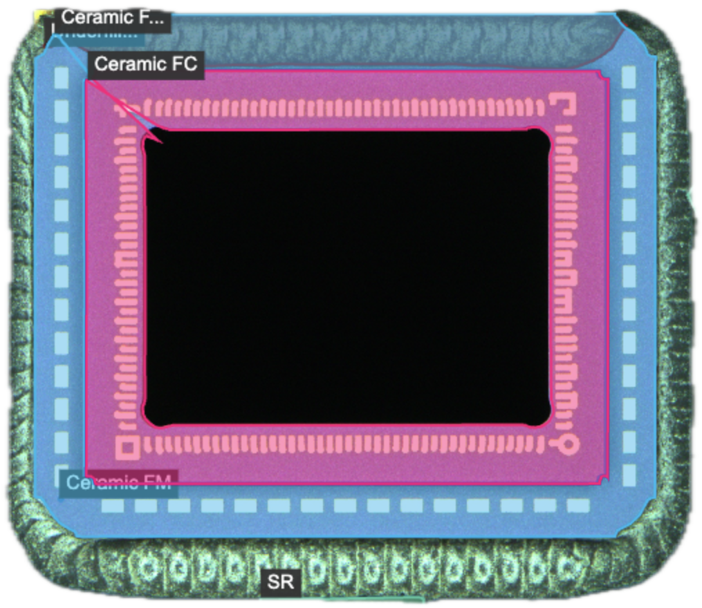

# Canvas 填充规则

> [MDN-Canvas.context2D.fill(path, fillRule)](https://developer.mozilla.org/en-US/docs/Web/API/CanvasRenderingContext2D/fill) 关于 `fillRule` 的介绍，并分享一个业务上遇到的有趣案例。

## fillRule 原理

该属性对应了两套填充规则，这两套填充规则不仅在 Canvas 中发挥作用，在 SVG 等常见图形绘制的领域也十分常见。但其中的原理相信很多人都是一知半解，这篇文章就来介绍一下这两套填充规则：

- evenodd（奇偶规则）

- nonzero（非零填充）

 

### evenodd（奇偶规则）

规则：从任意一点向外发送一条射线，每经过一条线就记录一个交点，最后计算交点数量。如果是奇数，则判断为该区域需要填充，反之则不需要填充。

以该图为例，图上黑色线从空白区域发射，可以简单看成从左到右依次与四根线相交形成了四个交点，因此计算得出的总数就是四个，为偶数不需要填充区域

 

### nonzero（非零填充）

规则：从任意一点向外发送一条射线，每经过一条线就计算方向，方向为以射线指向为箭头方向，计算与线形成的折线的时钟方向，顺时针则 +1，逆时针则 -1，最终结果如果非零，则判断为该区域需要填充，反之则不需要填充。

以该图为例，图上红色线从内部填充区域发射，依照方向与三根线相交形成了三个交点，每个交点依照箭头的方向形成时钟方向，可以得到第一个交点方向为顺时针，后续两个交点的方向为逆时针，因此最后计算得出的总数为 -1，不满足非零的情况，所以需要填充色块。

 

## 应用场景

> 这两个填充规则在多数情况下我们其实并不了解会产生什么样的差别，所以接下来这个案例或许可以给你一个参考的方向。

在做图像分割时，我们常常会在该领域里遇到一类场景：将 Mask 数据转化成坐标，即变成用 Polygon 多边形来表示，简单实现为 openCV 中的轮廓提取算法。在这类算法中就会涉及到对孔洞的处理，形成孔洞通常有两种方式，连线与相交。

1. 连线，先将各层轮廓独立绘制成路径，最后通过孔洞的关系将路径通过连线的方式闭合，就可以用闭合区域来实现填充的功能了。

   

   填充路径：从 `1->2` 绘制外轮廓，从 `3->4` 绘制内轮廓，最后从 `4->2` 得到一个闭合区域用于填充。

    

2. 相交，先根据孔洞关系设计路径，确保各层轮廓首尾相连可以通过一笔画成，这样利用「非零填充」的校验规则也能实现孔洞效果。

   

   填充路径：从 `1->...->9->1`，这样覆盖上去后可以使用两种校验规则就能看到明显差异了，但也当然算实现了孔洞效果。

   - 非零填充，两个逆时针为 -2 ，即结果非零需要填充

   

   - 奇偶校验，两个交点，结果为偶数，不需要填充

   

   具体可以看下小节的实际案例分析，就是利用「相交」方法实现的。

 

### 实际案例（轮廓寻找算法）

- 非零填充

  

- 奇偶校验

  

很明显，在该场景下使用「奇偶校验」的展示效果才是满足业务需求的，因此在处理孔洞时，需要额外注意填充规则的影响，希望能帮助大家在遇到该类场景是能跳过一些坑。
