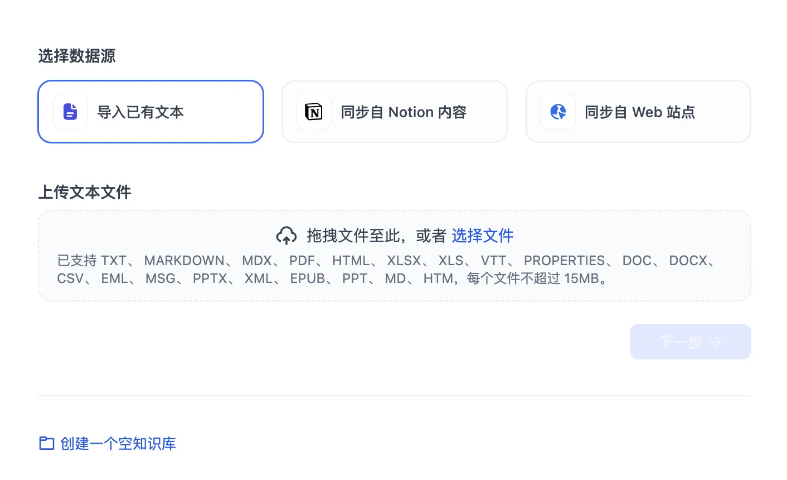
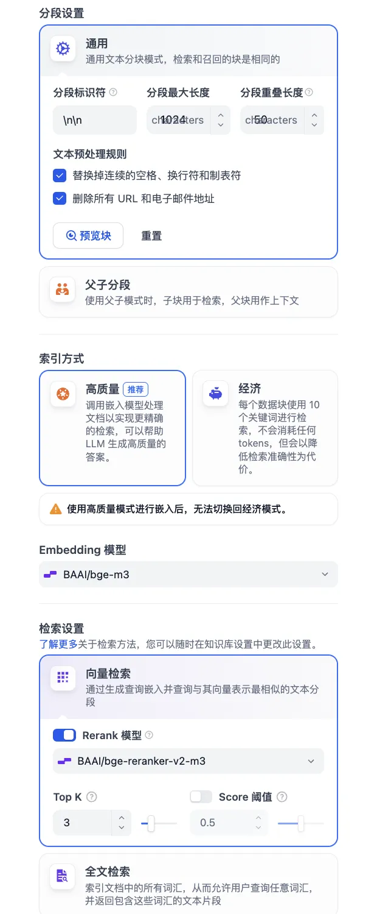
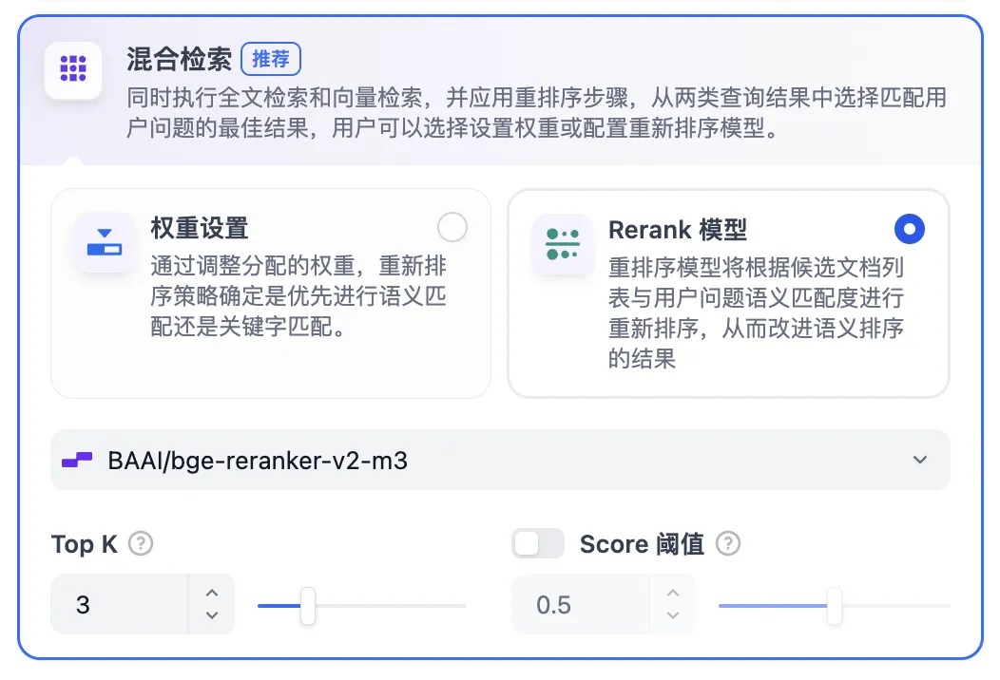
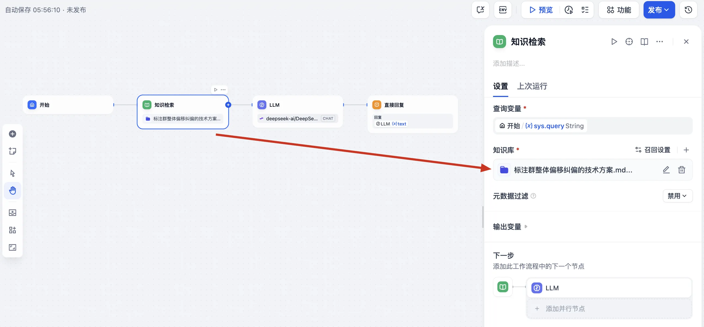
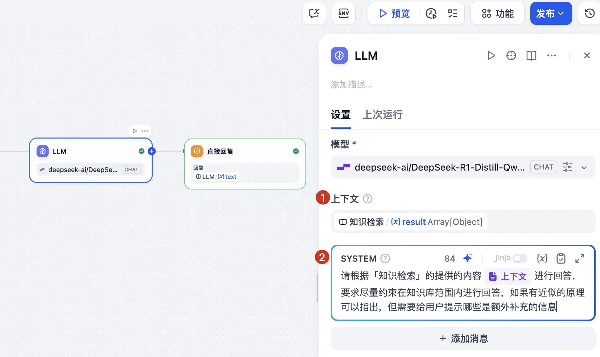
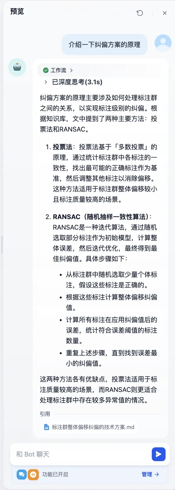

# Dify RAG 构建团队知识库

最近在梳理项目的系统架构文档，当前项目已经进入稳定期，迫切需要释放人力资源去投入新项目研发上，期望我们能将项目各模块的代码仓库进行 AI 托管，后续可以承接日常维护的各项工作，甚至是能通过详实的产品文档进行需求开发。

这一篇文章主要介绍 AI 托管前置工作中关于 RAG 知识库搭建的过程，核心目标是为帮助大家了解如何为智能体提供内部准确的描述，无论是系统架构、组件模块都能让智能体提取出准确的信息用于后续的编码、QA 。一个附加的目标是让代码仓库脱离人的限制以应对越来越频繁的组织架构调整。

<br/>

## Dify 部署

> [dify 官方部署文档](https://docs.dify.ai/zh-hans/getting-started/install-self-hosted/docker-compose)

**选择合适的版本**

尽量使用 LTS ，或者至少是 v1.0.0 以上的版本。依照官方使用 docker 部署的时候，**切记切换版本**！否则会出现对接模型 API 时各类异常问题

```sh
# 假设当前最新版本为 0.15.3 ❌
git clone https://github.com/langgenius/dify.git --branch 0.15.3 ❌
git clone https://github.com/langgenius/dify.git --branch 1.8.1 ✅
```

**切换 docker 镜像源**

[docker 轩辕国内镜像源](https://docker.xuanyuan.me/)

```sh
sudo vim /etc/docker/daemon.json <<EOF
{
    "registry-mirrors": [
        "https://docker.xuanyuan.me"
    ]
}
EOF

systemctl daemon-reload
systemctl restart docker
```

**切换端口号**

如果 docker 启动时，服务器端口冲突了，记得修改一下端口

```sh
# .env
EXPOSE_NGINX_PORT=80
EXPOSE_NGINX_SSL_PORT=443

# docker-compose.yml 建议同步检查一下
ports:
	- "${EXPOSE_NGINX_PORT:-80}:${NGINX_PORT:-80}"	
	- "${EXPOSE_NGINX_SSL_PORT:-443}:${NGINX_SSL_PORT:-443}"

# 重新启动即可
docker compose down
docker compose up -d
```

**注册一下管理帐号**

登陆 `http://localhost:<ur-port>/install`  注册你的管理员帐号即可访问 dify 啦～ 

<br/>

## Dify 模型对接

**硅基流动**

> 这个类似 anyrouter 会给你提供各类模型 API 的集成，我们可以在这里找到（白嫖）需要的各类模型

*去网上找一个邀请码再注册，这样能多一些使用的免费额度。*

我们大概会使用这些模型（公司内部可以选别的，演示就只用一些免费的即可）

- 对话模型：DeepSeek-R1-0528-Qwen3-8B
- 推理模型：QwQ-32B/Qwen3-8B
- embedding：bge-m3
- reranker：bge-reranker-v2-m3

当然这里也支持 Ollama 、open-ai api，如果你有足够的资源也可以考虑在本地部署一个推理模型。

**dify 模型供应商接入 API** 

> [dify 模型 API 接入官方教程](https://docs.dify.ai/zh-hans/guides/model-configuration/readme)

1. 在「硅基流动」注册一个 API key
2. 在「dify/插件」安装硅基流动插件
3. 在「dify/模型供应商/硅基流动」填入 key 并选择新增一个模型
4. 可以在「授权」上看到若干可用的免费模型

<br/>

## Dify - Chatflow

1. 新建一个「知识库」并导入各类知识文档

   

2. 根据自己的文档内容选择对应的分块规则

   

3. 检索设置启用「混合检索」，并调整 Embedding 模型和 Rerank 模型的选择符合期望

   

4. 在左侧就可以进行分块的预览啦，可以根据预览的内容进行各类微调，最后，对知识库进行保存，Dify 会自动对上传的所有文件进行检索

5. 在「工作室」新建一个 Chatflow 用于验证知识库效果

   1. 新建一个画布

   2. 在起始节点后新增一个「知识检索」节点用于提供知识库信息

      

   3. 在 LLM 节点切换模型并提供「知识检索」的上下文信息，否则 LLM 节点无法使用知识检索的内容

      

6. 点击右上角「预览」并添加引用以及智能提示下一句功能来测试知识库检索效果

   

7. 可以看到智能体已经严格按照我们的要求进行了回答，并给我们提供了对应检索到的文档。

<br/>

## 后续

自此，我们就简单地搭建出了一个完整的 RAG 可行方案。目前这个应用还是一个简单的 RAG 演示案例，可以说只具备简单的文档总结，还远远达不到工程应用的水准，甚至你会发现这里的检索效果还不如直接把文档上传给 LLM 的效果要来得好。

要做到工程级别的回答水准并让其发挥上述 AI 托管的功能还需要做如下工作，涉及到一些基建协助的工作，以及容易涉及到技术敏感内容我就不一一展开了。

- 使用业界更先进的推理模型：Gemini 2.5 pro 、Claude code 4 
- **对知识库中的文档进行更细致的整理**，统一且标准的格式，调整分段分块的配置，对数据进行清洗与标注，提升每一块的质量
- 使用业界更先进的索引重排模型（embedding 和 rerank ）
- 更复杂的工作流和完善的上下文信息（通常通过细致的 prompt），可以考虑使用网络搜索，以及利用脚本去动态拉取内部最新资料
- 使用动态更新的知识库提供最及时的语料，如配置一个 S3 存储的知识库 + Dify 自动检索
- Chatflow 切换成 Agent Flow 并通过 MCP 对外提供服务，进一步满足 AI 托管智能检索知识库的要求


