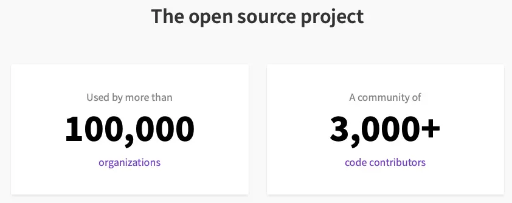
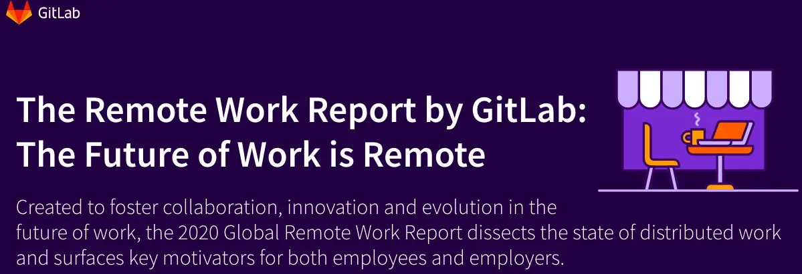

# 疫情对软件开发的工作模式的影响

## 作者

网络工程 xjosiah

## 摘要

本篇文章通过对两个互联网软件公司 Twitter 和 Gitlab 在疫情期间的远程开发模型进行浅析，讨论了远程开发模型的前景，以及疫情对软件开发的工作模式产生了何种影响，并为如何减轻新冠疫情对公司运营的冲击和如何使软件开发人员能尽快适应远程办公模式提供了一些资料参考。

### 关键词

新冠疫情下 软件开发 异地办公 家庭工作模型 远程工作模式 地理分离式公司 互联网行业

## 引言

新冠病毒是一场全人类的战役，它的肆虐给我们人类带来了的一场重大健康危机，同时也深刻地影响了我们人类的生活，特别是在还看不到疫情平息曙光的当下，我们更应该做好打持久战的准备，这意味着我们的生产方式、生活习惯和观念要都要因此做出相应的改变。本篇文章将通过浅析著名社交网站 Twitter 在疫情横行的当下实现让员工“居家办公”的例子，并结合疫情下其他的一些流行的开源项目如 Gitlab 的远程开发经验来简明分析疫情对软件开发方式产生了哪些的影响，从这些改变中积累一些能为我们所用的知识，如怎样更好地利用互联网来协作开发、如何更有效地进行团队沟通等，使得我们能尽可能平稳地度过疫情给我们带来的冲击。

## 正文

新冠疫情来势汹汹，而预防疫情最好的方式之一是带口罩和尽量避免人群聚集，但在传统的工作模式下，办公室就俨然变成了一个孕育疫情的温床：人群密集、流通性不好、人和人之间面对面地沟通十分频繁。因此一种被称为家庭工作（work from home model）的模式也就应运而生了，而著名的互联网社交软件公司 Twitter 就是在疫情发生后最早应用这种工作模式的公司之一，并且其宣布他们不会成为最早重新返回传统办公室工作模式的公司之一。

家庭工作模式，顾名思义其最大的特点就是在一定的安全控制下，利用互联网技术提供一个虚拟的工作场所，允许员工在远程接受管理并进行相关项目的工作，在疫情下，这种工作方式可以能最大程度地保障员工的生命健康，并且能继续维持公司的正常运转，这将为员工和企业带来巨大的优势，家庭工作模式在防疫的同时还给我们带来了一些额外的惊喜，让我们的比以往多了更多的选择。

1. 现在的我们可以多一些考虑如何无国界地进行工作了。在不受地域限制的情况下，企业可以扩大范围来招纳最优秀的员工。摆脱地域限制在很多行业都很有价值，一些大公司在地理位置上往往都会聚集在一起，从而耗尽本来就已经很紧张的资源，这样会造成房价虚高、员工生活压力大等问题，此外，员工工作环境可以进一步地得到提高，间接地提升产品开发的质量，在疫情下，这些因素要比以往任何时候都显得更为重要。家庭工作模式也为成千上万无法参加传统工作环境的人带来了机会，从而为企业提供了更多的积极进取且合格的人才，在之前，他们可能会因为住在农村或偏远地区而丧失了工作的机会。传统的办公模式其实是不适合特殊人群的，对于必须经常搬家的军人配偶、行动不便或者拥有健康问题的人群采用家庭工作可能是一种理想的工作方案，在帮助这些特殊人群来建立稳固的职业生涯的时候，企业往往还能收获到很多渴望学习和成长的优秀员工所带来的额外收益。
2. 家庭工作模式往往可以提高公司产品的质量。根据 Global Workplace Analytics 的研究发现，实现采用居家工作的企业会享受到很多由员工高满意度和高忠诚度所带来的好处，95％的雇主表示远程办公对员工保留率有很大影响，在采用了家庭办公模式的公司中有 46％的公司职员的流失数量下降了。此外 Global Workplace Analytics 引用了一些大公司的研究表明，居家办公的员工生产率比办公室员工高 15％至 45％。简而言之，经验丰富的员工对他们的工作的满意程度会转化为更高的产品质量，在当今的客户体验优先的服务行业中，这尤其重要，在这类行业中，不断增长的客户期望和不断增加的技术复杂性要求企业员工具有更多的技能和适应不断变化的需求的能力，通过这些研究我们可以发现居家办公的员工更加自由，比以往有了更高的自觉性，这将有助于员工为其负责的客户解决更多困难和复杂问题。
3. 家庭工作模式可以减少员工的适应时间，加快员工投入正式生产的速度。公司可以将入职培训从教室的转移到员工家中的电脑桌面上，虚拟教室不受空间限制的限制，培训人员可以在任何地方进行演示，从而可以更贴近工作环境的来随时培训新员工。甚至我们可以通过高度参与的多媒体课程使培训更加互动，让员工实践和指导学习的结合，在进行许多动手实践活动时，管理员、教练、项目团队负责人和技术人员的培训团队还能进一步地提供持续的培训和帮助，在培训时就进一步做到了模拟正式工作时的状态。
4. 在需求激增的同时，迅速提高服务响应速度而又不影响质量的能力是在家工作模型最有价值的优势之一。在一些大型活动引起公司销量波动的时候，这种工作模式可以短期的制定一个高质量的客户服务计划，这对于我们是否能在当今瞬息万变、竞争激烈的市场中取胜而言是至关重要的，由于培训时间短，公司还可以进一步考虑招收一些临时应急员工来缓解需求激增的压力
5. 在家办公的模式还可以实现全天候覆盖的产品服务体验。由于客户在任何时间、白天或晚上都希望获得产品附带的服务，因此，公司需要为客户服务中心配备值班员工，以满足 24/7/365 服务的需求，这在需求激增的旺季等高峰时段尤为重要。在家工作的员工可以轻松满足这一需求，员工无需担心在值班时间如何兼顾好照顾孩子、老人等日常琐事，也不必担忧深夜通勤到办公室的安全问题。实际上，许多员工更喜欢晚班和周末班，这完全取决于他们自己如何制定工作/生活平衡的个人计划，从公司运营的角度来看，这也节省了因全天候值班而带来的用于维护物理办公设施的成本。

了解完家庭工作模式的详情后，我们结合 Twitter 的相关经验来进一步讨论如何实现员工能平顺地从传统工作模式过渡到远程办公模式。Twitter 在 2020 年 3 月 1 号就暂停了所有非关键性的商务旅行和活动，并搭建了一个网站来专门为大众提供关于新型冠状病毒的最新情况，致力于在新冠病毒全球疫情爆发的时候帮助人们找到公开的与防疫相关的权威信息。3 月 2 号，Twitter 开始鼓励员工选择居家工作的方式来减少大规模传播新冠病毒的可能性，这标志着 Twitter 开始了对家庭工作模式的进一步探索，就如他们在网站中所写的一样：“尽管这对我们来说是一个巨大的改变，但我们已经朝着越来越分散的、越来越远程的工作方向发展。Twitter 是一家全球服务公司，我们致力于使任何地方的任何人都可以在 Twitter 上工作。” 到了 3 月 11 号，也就是鼓励员工居家办公的九天之后，Twitter 开始在全球范围内强制要求员工采用家庭工作模式，这是一个极具意义的改变，也是自疫情以来这家公司迈出的前所未有的一步，这项措施不仅可以很好地保证员工的安全，还是对当地社区、弱势群体和一直奋战在防疫第一线的医护人员的一种无条件的支持。

在强制要求员工居家办公后，Twitter 做出了很多努力来减少采用这种工作模式所带来的影响：

1. 向部分员工、承包商和供应商支付一定的补助和赔偿，很有人文情怀地照顾到了那些无法在家庭里开展工作的员工，使他们不至于失去生活的资金来源。

2. 为所有员工提供了额外的福利，减少他们因临时切换到居家工作而导致生活困难的可能性。所有员工（包括小时工）都将获得其家庭办公室设置费用的报销，并且通过与供应商的合作，还可以确保公司的承包商也能满足其在家工作的需求。在听取了员工的反馈后，Twitter 又扩大了政策范围，使报销包括了各类家庭办公设备，例如书桌，课桌椅和符合人体工学的椅子等，还允许员工报销在家里工作时产生的流量费用。
3. 引入了一个名叫#FlockTalk 的程序，这个程序会在员工陷入困难时期急需他人的帮助的时候被激活，员工通过这个程序可以在社区里分享他们正在面对的事情，程序背后是 Twitter 的专业团队来负责管理的，他们认为工作场所的健康状况和员工的心理健康状况之间存在直接的关联，借此来减轻疫情对员工心理的不良影响。
4. 提供各种居家办公的指南说明来帮助员工继续完成日常工作，同时又积极地向公众公开这些资料，因为在这种特殊的时期，分享见解和学习非常重要，Twitter 希望其不仅能帮助到自己的员工，还能让公司员工之外的其他人能更轻松地过渡到远程工作的模式。这里列举指南中几条有比较重要且实用的建议：
   - 家庭工作模式不会改变日常的工作，而只是意味着你将在不同的环境中进行工作，还要继续保证拥有一个舒服的工作环境、坚持记录好每天的工作内容和及时地和项目伙伴进行沟通以确保项目开发的进程顺畅。
   - 跟进项目伙伴，管理好分布式团队，项目经理应当为团队中的每个人（无论身在何处）提供一致且舒适的员工体验。要把握好管理的三个主要支柱：战略、成长和关怀，在团队完全处于分布式状态时，具体的改变其实并不多，这三个重要支柱依旧适用。
   - Twitter 上的所有会议和面试都将通过网络视频进行。完全虚拟的对话有其好处，这是将员工融入远程工作文化的理想之举，而对于那些将在远程工作的候选人来说，这也是一个很好的机会来积累与其他团队伙伴进行远程交互的经验。
   - Twitter 还共享了跨时区工作的指南，利用协作工具（各类社交通话软件，版本控制软件和分布式开发服务框架等）保持联系，并提供了人机工程学技巧，使得员工无论在家还是在旅途中都可以进行日常工作。

根据 Twitter 的首席人力资源官 Jennifer Christie 的在 2020 年 5 月 12 号的报告，经过几个月的尝试，Twitter 已经证明了其可以对分布在任何地方进行工作的员工提供很好的支持，在管理的权限下放后依旧不会影响公司的正常运作，当前他们可以迅速地对疫情下的各种情况作出响应，这已经变成了他们所具有的一种独特优势了。同时，如果员工很好地适应了居家工作的角色和状态，并希望能一直采用家庭办公的工作模式的话，那 Twitter 将允许员工永久地居家工作，当然，在他们想重回办公室的时候也是不会被阻止的。在接下来的几个月里，公司会在确保安全的情况下做好预防措施再重启办公室，但员工何时重回办公室完全取决于自己的抉择，重启办公室后也不会立刻回归到之前的模式，而是谨慎的、有意的、逐步进行改变的。除了极少数的情况外，各种商务旅行和面对面交流的公司活动都将不再被允许。

在 Jennifer Christie 提出的这些措施中，我们可以看到 Twitter 对员工和社区的健康是考虑得十分的周到，一家有责任感的公司会时刻把员工的生命健康放在第一顺位，这无论是在何种情况下都是进行任何工作的必要前提。特别是在科技蓬勃发展的当下，采用家庭办公这类远程开发的工作模式已经不再是一件技术难题，在公司层面更应该关心的是如何让员工融入到居家工作的环境中去，这也就要求了一家具有责任感的公司必须做到以员工为本，在制定政策的时候要深切地考虑到每一位员工在转变工作模式后需要面临的各种问题并及时给予员工帮助，就如同 Twitter 所做的一般，为员工提供一些额外的经济补贴、适当的人文关怀、各种技术上的帮助和详尽的办公指南，这些措施的最终目的都是让员工在采用家庭工作模式后尽可能地不受到额外的困扰，真正地体现“家庭工作模式只是意味着你将在不同的环境中进行工作”这一原则，根据 Global Workplace Analytics 数据显示，2017 年中国远程办公规模达 60 亿元，2012-2017 年的年均复合增速达到 95.52%，相关智库基于此数据预测 2020 年全年我国的远程办公市场规模有望达到 448.5 亿元，约为 2017 年市场规模的 7.5 倍，这表明居家办公的工作模式在疫情的刺激下会逐渐的成为一种新趋势，可以预见的是越来越多的公司会在全球疫情形势不明朗的情况下，开始考虑采用家庭工作模式来很好地规避健康风险，避免由疫情传播造成公司运转失效瘫痪。

除了 Twitter 之外，还有一个著名的开源项目 Gitlab 也完全采用了家庭工作这种模式，而且比 Twitter 更特殊的是，这家公司在创立之初就一直沿用了这种模式来进行工作。从 2011 年只有 2 个人的初创组合开始，到 2020 年发展成世界上最大的采用远程开发的公司，GitLab 在 65 个国家拥有超过 1200 名团队成员，每一个团队成员都是远程的，在世界任何地方都没有中央总部和公司所属的办公室，GitLab 在最近 4 年内经历了 50 倍的增长，在 2020 年达到了 1 亿美元 ARR 收入的大关，目前，GitLab 的估值为 27.5 亿美元，迄今已融资 4.26 亿美元。Gitlab 是自新冠疫情爆发以来为数不多还能取得如此卓越成果的团队之一，而这家公司依靠的就是一套完善的家庭工作制度来取得这些令人瞩目的成就的。

Gitlab 始终认为有效的沟通是一个公司稳定的地基，于是他们将员工手册开源后公布在了网上，任何人都能看到这家公司的办事准则，GitLab 的员工手册涵盖了公司价值观、内部沟通指南、开发流程、写作风格指南，以及如何请假、如何报销等工作的方方面面，这份文档已经变成如何实现远程开发办公的范本资料了。就如同 Gitlab 工作手册中描述的一般，GitLab 需要始终确保沟通方式适用于一个成长型团队，并且能够简化不同国家中新员工的入职程序。同时由于 Gitlab 是一家地理分离式公司，显而易见员工们不能转个头就询问同事一些事情，因此需要有一个针对各类问题的共识，让大家随时随地都能访问。另外，结果导向、公开透明、效率和协作是 Gitlab 非常重要的行为方式，因此一份开源公司手册对于 Gitlab 来说非常适合，实际上这份手册就是一个知识共享许可。这意味着大家都可以随意复制和使用这份手册，没有必要重复造轮子。尽管将员工手册开源出来并不是一个常规的方式，但 Gitlab 也希望有更多的人能接受这个理念，大家既能很方便地学习到 Gitlab 掌握的知识，也能看到手册的历史版本和编辑日志，看到 Gitlab 是如何实现当前的想法的，实际上公司是处在一个变化的状态中，人员流动、流程变更等等事项都意味着 Gitlab 需要经常更新工作指南来反应团队当前的状态。员工手册的更新同步于公司状态的变化，而通过与之关联的合并请求就能轻易地了解这个变化是如何产生的，如果员工手册不开放而且难以访问时（比如需要使用内网 VPN 登录查看），这份手册往往会变得陈旧且形同虚设。

在疫情期间，Gitlab 还发起了一个针对远程工作的调查，其研究的方法是对 3,000 名 21 岁及以上的专业人员进行了采访，这些受访者在 2020 年 1 月 30 日至 2020 年 2 月 10 日期间都进行了远程办公或者有机会选择远程办公，并且其工作的内容主要以数字产品为主，目的是为了探索远程工作的未来，为完善一个更实用的家庭工作模式做出贡献。根据这份调查报告我们可以了解到很多要点：

1. 采用所有人都采用家庭工作模式是最纯粹的远程工作形式，这可以让每个团队成员都处于公平竞争的环境中。有 43%的远程工作者认为，在一个所有员工都是远程工作的公司中工作是很重要的。目前，超过 1/4 的受访者属于全远程组织，他们没有固定的办公室，同一接受异步工作流程，每个员工都在自己的本土时区工作。另外有 12%的受访者属于全远程工作，但还是处在公司规定的时区同步进行工作。
2. 在远程工作的模式下每个人都能做出一定贡献。当每个人都有能力推动组织前进时，远程团队的真正力量就会被释放出来。56%的远程工作者表示，公司里的每个人都可以对流程、价值观和公司方向做出贡献，50%的远程工作者还默认共享文件，仅在万不得已的情况下才会依赖会议。
3. 远程工作者并不都是新时代下长期进行旅行的游牧民族。调查结果显示，38%的人认为没有通勤时间是远程工作中最重要的好处，他们可以把这些时间用来陪伴家人（43%）、工作（35%）、休息（36%）和锻炼（34%）。远程工作的员工们发现自己整体上更有生产力（52%）和效率（48%），74%的远程工作者认为他们的公司是可以让员工依照自己的价值观来生活的。此外，与传统观念不同的是，52%的远程工作者实际上减少了旅行。调查表明远程工作的另一个好处使员工能够专注于家庭的同时而不必放弃自己的事业，34%的人认为能够照顾家庭是远程工作的首要好处，调查还发现，为了代替通勤，43%的人能够花更多的时间与家人相处，而 55%的受访者有 18 岁以下的孩子。
4. 47%的人表示，在家工作时如何提高专注力是首要挑战，现在的“家庭工作模式”这个词已经不在局限于居家了，团队成员可以在任何他们能达到最佳工作效率的地方工作。
5. 近半数受访者认为自己很幸运能够在远程工作，他们对在这种工作模式下的体验评价前四名分别是很实用、受到了重视、觉得自己很聪明和感到自豪，只有不到 10%的受访者联想到 "孤独"、"疲惫 "和 "被误解"。
6. 远程 ≠ 孤独，人与人之间的互动是有温度的，这在远程环境中也是一样重要的。82%的远程工作者表示，他们的公司支持通过活动、峰会、见面会等方式进行在网络上举行面对面的聚会，同时，66%的受访者表示其已经与远程工作的社区建立了联系。

这些要点为我们展示一个新的蓝图，远程办公是对于员工而言也是有很多好处的。在新冠疫情的威胁下，人群聚集引起的潜在健康危机已经远远大于转变工作模式带来的阵痛，尤其是在互联网企业，面对面的传统工作模式显得愈发不重要了，远程工作模式已经越来越融入到我们的世界之中了。员工在这种工作模式下可以体验到比以往更多的人文关怀，生命健康也得到了更多的保障，还能拥有更多时间来陪伴家人和自我学习进步，从而获得更多由工作带来的成就感和实现自己的人生价值，对于公司而言也是双赢的，在远程工作模式下，既避免了健康危机，又增强了员工的归宿感。

在疫情期间，家庭工作这种远程工作模型已经率先在互联网行业得到了推广使用，从小众非主流开始走入到大众的视野之中，潜移默化地改变了软件开发的工作方式，各类异步开发工具、版本控制软件和网络社区都在这个特殊的时期发挥起了积极的影响。如 Twitter 这种受疫情影响临时从传统工作模式转化到家庭工作模式的公司也成功做到了双赢的情况，这证明了家庭工作模式在软件开发行业的推广使用其实是轻便的，不需要进行太多重构，是可以在短时间内就得到实现的，而 Gitlab 这种完全远程办公的公司，也从侧面证明了远程办公模式和传统工作模式都是可以正常应付日常工作的，相比与传统的工作模式，远程办公模式还能让员工有了更多自主选择的空间并节省了很多用于通勤的时间成本花销。从长期来看，这种工作模式会逐步地推广到越来越多的互联网公司，在减轻疫情影响的同时保证了公司还能照常运转，这都是值得我们这些即将从事软件开发或者已经是资深开发的人认真学习理解的。

## 结束语

在短短 11 周的课程之后，在课堂上我通过老师学习到了很多关于软件工程的知识，写这篇结课小论文时，又通过查找和整理资料更深入地了解到远程开发模型的概念和实现方法，我很开心能有这些的收获，同时我必须要真诚地感谢老师对我们的细心教导和照顾，这一学期能过和老师共同度过这一门课我感到十分的愉快！

## 参考文献

1. [Coronavirus: Staying safe and informed on Twitter By Twitter Inc. Friday, 3 April 2020](https://blog.twitter.com/en_us/topics/company/2020/covid-19.html)
2. [Keeping our employees and partners safe during #coronavirus By Jennifer Christie](https://blog.twitter.com/en_us/topics/company/2020/keeping-our-employees-and-partners-safe-during-coronavirus.html)
3. [Global Workplace Analytics Web](https://globalworkplaceanalytics.com.statscrop.com/)
4. [亿欧智库《2020 远程办公研究报告》](https://www.iyiou.com/intelligence/report698.html)
5. [The Remote Work Report by GitLab: The Future of Work is Remote](https://about.gitlab.com/remote-work-report/)
6. [How This Startup Made $10.5 Million in Revenue With Every Single Employee Working From Home](https://www.inc.com/cameron-albert-deitch/2018-inc5000-gitlab.html)
7. [Gitlab Team Handbook](https://link.jianshu.com/?t=http://link.zhihu.com/?target=https%3A//about.gitlab.com/handbook/)
