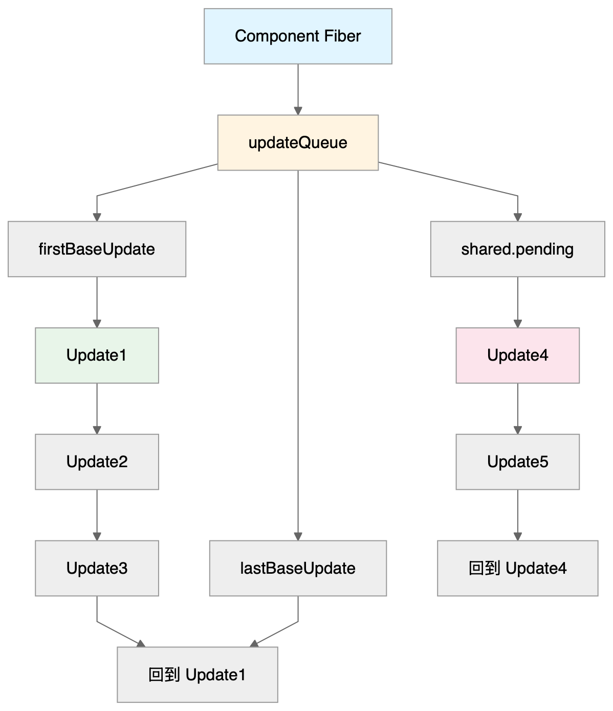
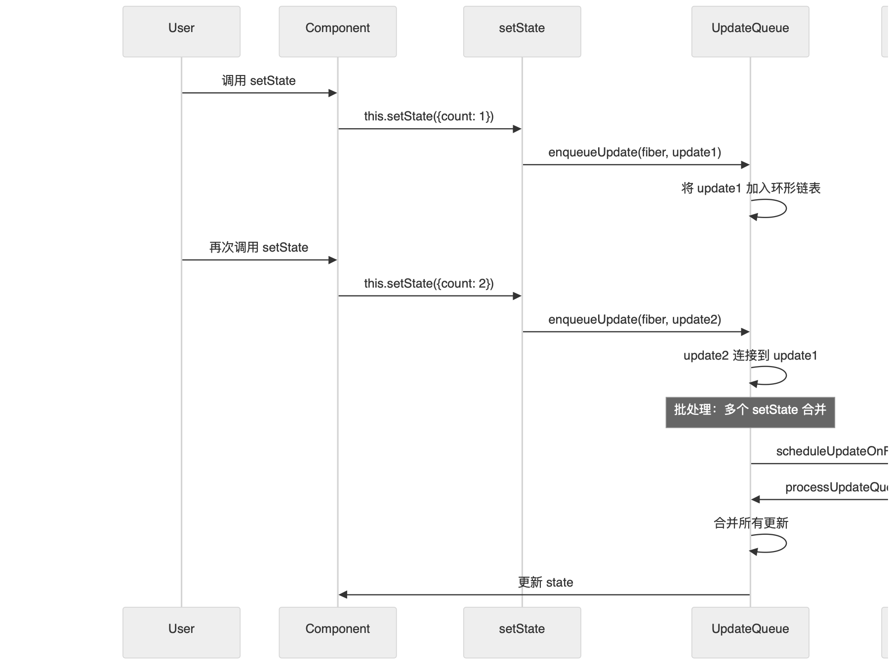
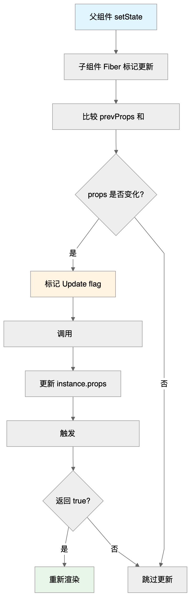
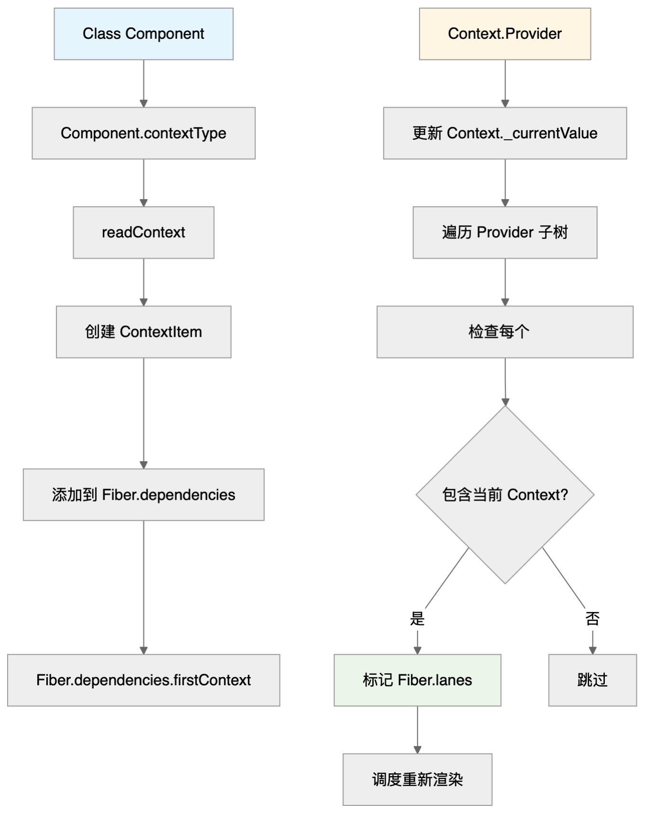
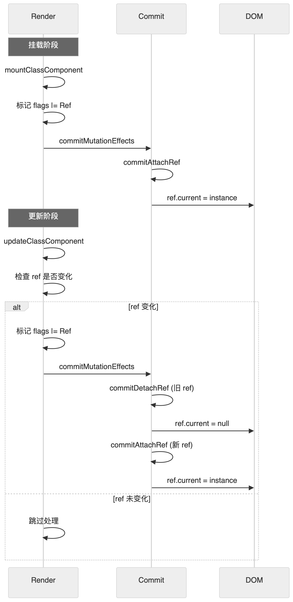
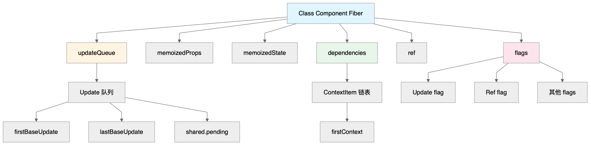

# React Class Component 简单理解

类组件的一切都从 `setState` 开始。

```jsx
class MyComponent extends React.Component {
  state = { count: 0 };
  
  handleClick = () => {
    this.setState({ count: this.state.count + 1 });
  };
}
```

**类组件的更新机制分为两个阶段：挂载和更新**

- **挂载阶段**：初始化组件实例，创建 Fiber 节点，设置初始 state 和 props
- **更新阶段**：通过 `setState` 创建 Update 对象，合并到更新队列，触发调度

## setState 的实现原理

`setState` 的核心是创建 Update 对象并加入更新队列，最终触发调度。

```js
// setState 的简化实现
Component.prototype.setState = function(partialState, callback) {
  // 获取当前组件对应的 Fiber
  const fiber = getInstanceFiber(this);
  
  // 创建 Update 对象
  const update = {
    payload: partialState,      // 要更新的状态
    callback: callback || null,  // 回调函数
    next: null,                  // 指向下一个 Update
  };
  
  // 将 Update 加入队列
  enqueueUpdate(fiber, update);
  
  // 调度更新
  scheduleUpdateOnFiber(fiber, fiber.lane);
};
```

### 挂载阶段：初始化组件实例

```js
function mountClassComponent(
  current: Fiber | null,
  workInProgress: Fiber,
  Component: any,
  props: any,
  renderLanes: Lanes,
): Fiber | null {
  // 1. 创建组件实例
  const instance = new Component(props, context);
  
  // 2. 初始化 state
  const state = instance.state || null;
  
  // 3. 将实例绑定到 Fiber
  workInProgress.stateNode = instance;
  instance._reactInternalFiber = workInProgress;
  
  // 4. 初始化更新队列
  initializeUpdateQueue(workInProgress);
  
  // 5. 处理 getDerivedStateFromProps（如果存在）
  if (typeof Component.getDerivedStateFromProps === 'function') {
    const partialState = Component.getDerivedStateFromProps(props, state);
    if (partialState !== null) {
      // 合并到 state
      workInProgress.memoizedState = Object.assign({}, state, partialState);
    }
  }
  
  return workInProgress;
}
```

### 更新阶段：处理 Update 队列

```js
function updateClassComponent(
  current: Fiber | null,
  workInProgress: Fiber,
  Component: any,
  nextProps: any,
  renderLanes: Lanes,
): Fiber | null {
  const instance = workInProgress.stateNode;
  
  // 1. 处理 props 更新
  if (instance.props !== nextProps) {
    // 标记需要更新
    workInProgress.flags |= Update;
  }
  
  // 2. 处理 state 更新队列
  const updateQueue = workInProgress.updateQueue;
  if (updateQueue !== null) {
    // 处理所有待处理的更新
    processUpdateQueue(workInProgress, updateQueue, nextProps, instance, renderLanes);
    
    // 获取处理后的新 state
    const nextState = workInProgress.memoizedState;
    
    // 3. 调用生命周期方法
    if (
      typeof instance.shouldComponentUpdate === 'function' &&
      !instance.shouldComponentUpdate(nextProps, nextState, nextContext)
    ) {
      // 跳过更新
      return bailoutOnAlreadyFinishedWork(current, workInProgress, renderLanes);
    }
    
    // 4. 调用 getDerivedStateFromProps（如果存在）
    if (typeof Component.getDerivedStateFromProps === 'function') {
      const partialState = Component.getDerivedStateFromProps(nextProps, nextState);
      if (partialState !== null) {
        nextState = Object.assign({}, nextState, partialState);
      }
    }
    
    // 5. 更新实例的 state 和 props
    instance.props = nextProps;
    instance.state = nextState;
  }
  
  return workInProgress;
}
```

### Update 队列的数据结构



```ts
// Update 队列结构
interface UpdateQueue<State> {
  baseState: State;              // 基础状态
  firstBaseUpdate: Update<State> | null;  // 第一个基础更新
  lastBaseUpdate: Update<State> | null;   // 最后一个基础更新
  shared: {
    pending: Update<State> | null;  // 待处理的更新（环形链表）
  };
  effects: Array<Update<State>> | null;  // 有回调的更新
}

// Update 对象结构
interface Update<State> {
  lane: Lane;                    // 优先级
  tag: UpdateTag;                // 更新类型（UpdateState、ReplaceState、ForceUpdate）
  payload: any;                  // 更新内容（对象或函数）
  callback: (() => mixed) | null; // 回调函数
  next: Update<State> | null;    // 指向下一个 Update
}

// Fiber 节点上的 updateQueue
fiber.updateQueue = {
  baseState: { count: 0 },
  firstBaseUpdate: null,
  lastBaseUpdate: null,
  shared: {
    pending: update3  // 指向环形链表的尾部
  },
  effects: [update1, update2]
};

// 环形链表结构：
// update1 → update2 → update3 → 回到 update1
// shared.pending 指向 update3
```

### processUpdateQueue：处理更新队列

```js
function processUpdateQueue<State>(
  workInProgress: Fiber,
  queue: UpdateQueue<State>,
  props: any,
  instance: any,
  renderLanes: Lanes,
): void {
  const queue = workInProgress.updateQueue;
  
  // 1. 将 shared.pending 的更新合并到 baseUpdate 链表
  let firstBaseUpdate = queue.firstBaseUpdate;
  let lastBaseUpdate = queue.lastBaseUpdate;
  
  let pendingQueue = queue.shared.pending;
  if (pendingQueue !== null) {
    queue.shared.pending = null;
    
    // 将环形链表展开
    const lastPendingUpdate = pendingQueue;
    const firstPendingUpdate = lastPendingUpdate.next;
    lastPendingUpdate.next = null;
    
    // 连接到 baseUpdate 链表
    if (lastBaseUpdate === null) {
      firstBaseUpdate = firstPendingUpdate;
    } else {
      lastBaseUpdate.next = firstPendingUpdate;
    }
    lastBaseUpdate = lastPendingUpdate;
  }
  
  // 2. 处理 baseUpdate 链表中的所有更新
  if (firstBaseUpdate !== null) {
    let newState = queue.baseState;
    let newLanes = NoLanes;
    let newBaseState = null;
    let newFirstBaseUpdate = null;
    let newLastBaseUpdate = null;
    let update = firstBaseUpdate;
    
    do {
      const updateLane = update.lane;
      
      // 检查优先级
      if (!isSubsetOfLanes(renderLanes, updateLane)) {
        // 优先级不够，保留到下次处理
        const clone: Update<State> = {
          lane: updateLane,
          tag: update.tag,
          payload: update.payload,
          callback: update.callback,
          next: null,
        };
        
        if (newLastBaseUpdate === null) {
          newFirstBaseUpdate = newLastBaseUpdate = clone;
          newBaseState = newState;
        } else {
          newLastBaseUpdate = newLastBaseUpdate.next = clone;
        }
        
        newLanes = mergeLanes(newLanes, updateLane);
      } else {
        // 优先级足够，处理这个更新
        if (newLastBaseUpdate !== null) {
          const clone: Update<State> = {
            lane: NoLane,
            tag: update.tag,
            payload: update.payload,
            callback: update.callback,
            next: null,
          };
          newLastBaseUpdate = newLastBaseUpdate.next = clone;
        }
        
        // 应用更新
        if (update.tag === UpdateState) {
          const payload = update.payload;
          if (typeof payload === 'function') {
            newState = payload(newState);
          } else {
            newState = Object.assign({}, newState, payload);
          }
        } else if (update.tag === ReplaceState) {
          newState = update.payload;
        } else if (update.tag === ForceUpdate) {
          // 强制更新，不改变 state
        }
        
        // 收集回调
        if (update.callback !== null) {
          if (queue.effects === null) {
            queue.effects = [];
          }
          queue.effects.push(update);
        }
      }
      
      update = update.next;
      if (update === null) {
        pendingQueue = queue.shared.pending;
        if (pendingQueue === null) {
          break;
        } else {
          // 继续处理新加入的更新
          update = firstPendingUpdate;
          queue.shared.pending = null;
        }
      }
    } while (true);
    
    // 3. 更新队列状态
    if (newLastBaseUpdate === null) {
      newBaseState = newState;
    }
    
    queue.baseState = newBaseState;
    queue.firstBaseUpdate = newFirstBaseUpdate;
    queue.lastBaseUpdate = newLastBaseUpdate;
    
    workInProgress.memoizedState = newState;
    workInProgress.lanes = newLanes;
  }
}
```

**setState 的批处理机制**



---

## Props 的处理机制

类组件通过 `this.props` 访问 props，props 的更新会触发组件重新渲染。

### 挂载阶段：初始化 props

```js
function mountClassComponent(
  current: Fiber | null,
  workInProgress: Fiber,
  Component: any,
  props: any,
  renderLanes: Lanes,
): Fiber | null {
  const instance = new Component(props, context);
  
  // 将 props 存储到 Fiber 和实例
  workInProgress.memoizedProps = props;
  instance.props = props;
  
  // 处理 getDerivedStateFromProps
  if (typeof Component.getDerivedStateFromProps === 'function') {
    const partialState = Component.getDerivedStateFromProps(props, instance.state);
    if (partialState !== null) {
      instance.state = Object.assign({}, instance.state, partialState);
    }
  }
  
  return workInProgress;
}
```

### 更新阶段：比较并更新 props

```js
function updateClassComponent(
  current: Fiber | null,
  workInProgress: Fiber,
  Component: any,
  nextProps: any,
  renderLanes: Lanes,
): Fiber | null {
  const instance = workInProgress.stateNode;
  const prevProps = workInProgress.memoizedProps;
  
  // 1. 比较 props 是否变化
  if (prevProps !== nextProps) {
    // 标记需要更新
    workInProgress.flags |= Update;
    
    // 2. 调用 componentWillReceiveProps（已废弃，但为了完整性列出）
    if (
      typeof instance.componentWillReceiveProps === 'function' &&
      !instance.componentWillReceiveProps.__suppressDeprecationWarning
    ) {
      instance.componentWillReceiveProps(nextProps, nextContext);
    }
    
    // 3. 处理 getDerivedStateFromProps
    if (typeof Component.getDerivedStateFromProps === 'function') {
      const partialState = Component.getDerivedStateFromProps(nextProps, instance.state);
      if (partialState !== null) {
        instance.state = Object.assign({}, instance.state, partialState);
      }
    }
  }
  
  // 4. 更新 Fiber 和实例的 props
  workInProgress.memoizedProps = nextProps;
  instance.props = nextProps;
  
  return workInProgress;
}
```

**Props 更新流程**



| 方面           | `setState`                    | `props` 更新                        |
| :------------- | :---------------------------- | :---------------------------------- |
| **触发方式**   | 组件自身调用 `setState`       | 父组件 state 改变导致 props 变化    |
| **更新队列**   | 有 `updateQueue` 更新队列     | 无队列，直接比较 props               |
| **合并机制**   | 多个 `setState` 会批处理合并  | 每次 props 变化都会触发更新检查      |
| **生命周期**   | 触发 `shouldComponentUpdate`  | 触发 `componentWillReceiveProps`     |
| **Fiber 标记** | `Update` flag                 | `Update` flag                        |

---

## Context 的处理机制

类组件通过 `contextType` 或 `Context.Consumer` 访问 Context。

### 挂载阶段：订阅 Context

```js
function mountClassComponent(
  current: Fiber | null,
  workInProgress: Fiber,
  Component: any,
  props: any,
  renderLanes: Lanes,
): Fiber | null {
  const instance = new Component(props, context);
  
  // 1. 处理 contextType
  if (typeof Component.contextType === 'object' && Component.contextType !== null) {
    const context = Component.contextType;
    instance.context = readContext(context);
    
    // 创建 ContextItem 添加到 Fiber 的 dependencies
    const contextItem = {
      context: context,
      memoizedValue: context._currentValue,
      next: null,
    };
    
    if (workInProgress.dependencies === null) {
      workInProgress.dependencies = {
        lanes: NoLanes,
        firstContext: contextItem,
      };
    } else {
      contextItem.next = workInProgress.dependencies.firstContext;
      workInProgress.dependencies.firstContext = contextItem;
    }
  }
  
  return workInProgress;
}
```

### 更新阶段：检查 Context 变化

```js
function updateClassComponent(
  current: Fiber | null,
  workInProgress: Fiber,
  Component: any,
  nextProps: any,
  renderLanes: Lanes,
): Fiber | null {
  const instance = workInProgress.stateNode;
  
  // 1. 处理 contextType
  if (typeof Component.contextType === 'object' && Component.contextType !== null) {
    const context = Component.contextType;
    const nextContext = readContext(context);
    
    // 2. 比较 context 是否变化
    if (instance.context !== nextContext) {
      // 标记需要更新
      workInProgress.flags |= Update;
      instance.context = nextContext;
    }
  }
  
  return workInProgress;
}
```

**Context 订阅关系**



| 方面           | `setState`                    | `Context` 更新                      |
| :------------- | :---------------------------- | :---------------------------------- |
| **订阅机制**   | 不涉及订阅，直接更新           | 组件订阅 Context 变化                |
| **更新触发**   | 通过 `setState` 函数          | 通过 `Context.Provider` 的 value 改变 |
| **存储位置**   | 在组件实例的 `state` 中        | 在 Context 对象的 `_currentValue` 中 |
| **依赖追踪**   | 无                            | 通过 Fiber.dependencies 追踪         |
| **性能优化**   | 通过 `childLanes` 跳过子树    | Context 变化时，所有消费者都会重新渲染 |

---

## 缓存机制：React.memo 和 shouldComponentUpdate

类组件通过 `shouldComponentUpdate` 和 `React.memo`（HOC）来控制渲染优化。

### shouldComponentUpdate

```js
class MyComponent extends React.Component {
  shouldComponentUpdate(nextProps, nextState) {
    // 自定义比较逻辑
    if (this.props.name !== nextProps.name) {
      return true;  // 需要更新
    }
    if (this.state.count !== nextState.count) {
      return true;  // 需要更新
    }
    return false;  // 跳过更新
  }
  
  render() {
    return <div>{this.props.name}: {this.state.count}</div>;
  }
}
```

### React.memo（HOC 包装类组件）

```js
function memo<Props>(
  Component: React.ComponentType<Props>,
  compare?: (prevProps: Props, nextProps: Props) => boolean,
): React.ComponentType<Props> {
  // 返回一个包装组件
  class MemoComponent extends React.Component<Props> {
    shouldComponentUpdate(nextProps: Props) {
      if (compare) {
        // 使用自定义比较函数
        return !compare(this.props, nextProps);
      } else {
        // 默认浅比较
        return !shallowEqual(this.props, nextProps);
      }
    }
    
    render() {
      return <Component {...this.props} />;
    }
  }
  
  return MemoComponent;
}
```

### 更新阶段的缓存检查

```js
function updateClassComponent(
  current: Fiber | null,
  workInProgress: Fiber,
  Component: any,
  nextProps: any,
  renderLanes: Lanes,
): Fiber | null {
  const instance = workInProgress.stateNode;
  const prevProps = workInProgress.memoizedProps;
  
  // 1. 处理 state 更新
  processUpdateQueue(workInProgress, updateQueue, nextProps, instance, renderLanes);
  const nextState = workInProgress.memoizedState;
  
  // 2. 调用 shouldComponentUpdate
  if (
    typeof instance.shouldComponentUpdate === 'function' &&
    !instance.shouldComponentUpdate(nextProps, nextState, nextContext)
  ) {
    // 跳过更新，复用之前的子节点
    return bailoutOnAlreadyFinishedWork(current, workInProgress, renderLanes);
  }
  
  // 3. 需要更新，继续渲染
  return workInProgress;
}

function bailoutOnAlreadyFinishedWork(
  current: Fiber | null,
  workInProgress: Fiber,
  renderLanes: Lanes,
): Fiber | null {
  // 复用之前的子节点，不重新渲染
  cloneChildFibers(current, workInProgress);
  return workInProgress.child;
}
```

**缓存机制流程图**


| 方面                 | `shouldComponentUpdate`       | `React.memo`（函数组件）            |
| :------------------- | :---------------------------- | :---------------------------------- |
| **使用方式**         | 类组件生命周期方法             | HOC 包装函数组件                     |
| **比较对象**         | props 和 state                | 仅 props                             |
| **返回值**           | boolean（true 更新，false 跳过） | boolean（true 跳过，false 更新）     |
| **默认行为**         | 总是返回 true（总是更新）      | 浅比较 props                         |
| **Fiber 标记**       | 无特殊标记                    | 无特殊标记                           |
| **性能优化**         | 跳过整个组件树渲染             | 跳过整个组件树渲染                   |

---

## Ref 的处理机制

类组件通过 `createRef` 或回调 ref 来获取 DOM 节点或组件实例。

### createRef

```js
class MyComponent extends React.Component {
  inputRef = React.createRef();
  
  componentDidMount() {
    // 访问 DOM 节点
    this.inputRef.current.focus();
  }
  
  render() {
    return <input ref={this.inputRef} />;
  }
}
```

### 回调 Ref

```js
class MyComponent extends React.Component {
  inputRef = null;
  
  setInputRef = (element) => {
    this.inputRef = element;
  };
  
  componentDidMount() {
    if (this.inputRef) {
      this.inputRef.focus();
    }
  }
  
  render() {
    return <input ref={this.setInputRef} />;
  }
}
```

### 挂载阶段：处理 Ref

```js
function mountClassComponent(
  current: Fiber | null,
  workInProgress: Fiber,
  Component: any,
  props: any,
  renderLanes: Lanes,
): Fiber | null {
  const instance = new Component(props, context);
  workInProgress.stateNode = instance;
  
  // 处理 ref
  if (workInProgress.ref !== null) {
    // 标记需要处理 ref
    workInProgress.flags |= Ref;
  }
  
  return workInProgress;
}

// 在 commit 阶段处理 ref
function commitAttachRef(finishedWork: Fiber): void {
  const ref = finishedWork.ref;
  if (ref !== null) {
    const instance = finishedWork.stateNode;
    
    if (typeof ref === 'function') {
      // 回调 ref
      ref(instance);
    } else {
      // createRef
      ref.current = instance;
    }
  }
}
```

### 更新阶段：处理 Ref 变化

```js
function updateClassComponent(
  current: Fiber | null,
  workInProgress: Fiber,
  Component: any,
  nextProps: any,
  renderLanes: Lanes,
): Fiber | null {
  const instance = workInProgress.stateNode;
  
  // 检查 ref 是否变化
  if (current !== null && current.ref !== workInProgress.ref) {
    // ref 变化，标记需要处理
    workInProgress.flags |= Ref;
  }
  
  return workInProgress;
}

// 在 commit 阶段处理 ref 变化
function commitDetachRef(current: Fiber): void {
  const currentRef = current.ref;
  if (currentRef !== null) {
    if (typeof currentRef === 'function') {
      // 回调 ref，传入 null
      currentRef(null);
    } else {
      // createRef，清空
      currentRef.current = null;
    }
  }
}

function commitAttachRef(finishedWork: Fiber): void {
  const ref = finishedWork.ref;
  if (ref !== null) {
    const instance = finishedWork.stateNode;
    
    if (typeof ref === 'function') {
      ref(instance);
    } else {
      ref.current = instance;
    }
  }
}
```

**Ref 处理流程**



| 方面           | `createRef`                   | `回调 Ref`                          |
| :------------- | :---------------------------- | :---------------------------------- |
| **存储方式**   | 存储在 ref 对象的 `current` 属性 | 直接调用回调函数                     |
| **更新时机**   | DOM 挂载/卸载时更新            | DOM 挂载/卸载时调用                  |
| **Fiber 标记** | `Ref` flag                    | `Ref` flag                           |
| **处理阶段**   | commit 阶段                    | commit 阶段                          |
| **清理方式**   | `ref.current = null`          | `ref(null)`                          |

---

## 所有更新机制的执行时机

所有更新触发都可以追踪到状态的改变，这些状态通过不同路径传播最终影响组件的 props、state、context 等的改变，React 是声明式的，你需要声明 "当状态是什么的时候，UI 长什么样子" ，最终这些更新触发都会导致 UI 的改变。

| 更新表现         | 实际源头            | 触发方式                |
| ---------------- | ------------------- | ----------------------- |
| 组件重新渲染     | 组件自身 state 改变 | `setState()`            |
| Props 改变       | 父组件 state 改变   | 父组件 `setState()`     |
| Context 值改变   | 某个组件 state 改变 | 那个组件的 `setState()` |
| 状态管理仓库改变 | store 内部状态改变  | `store.dispatch()`      |
| URL 改变         | 路由状态改变        | `history.push()`        |

基于这些认识，可以把 `setState、props、context、缓存、ref` 串联起来了：



**类组件的 Fiber 节点结构**

```js
Class Component Fiber 节点
├── stateNode: Component 实例
│   ├── props: 当前 props
│   ├── state: 当前 state
│   └── context: 当前 context
├── updateQueue: Update 队列
│   ├── baseState: 基础状态
│   ├── firstBaseUpdate: 第一个基础更新
│   ├── lastBaseUpdate: 最后一个基础更新
│   └── shared.pending: 待处理的更新（环形链表）
├── memoizedProps: 上次渲染的 props
├── memoizedState: 上次渲染的 state
├── dependencies: Context 依赖链表
│   └── firstContext: ContextItem1 → ContextItem2
├── ref: Ref 对象或回调函数
└── flags: Fiber 标记
    ├── Update: 需要更新
    ├── Ref: 需要处理 ref
    └── 其他标记...
```

通过一次更新，调度了一次 `scheduleUpdateOnFiber`，执行了各类更新机制的处理，标记出若干需要更新的子树，最终传递给 Root，在 `reconciler` 执行 render 构造双缓存树。

