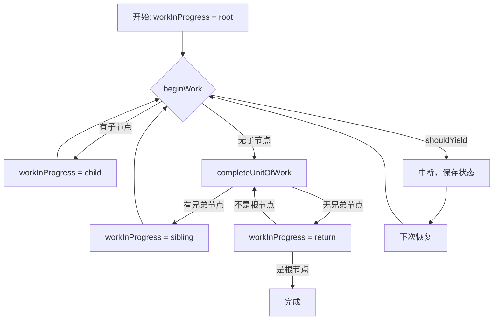

# React Reconciliation 协调核心过程

> Reconciliation（协调/调和）是 React 的 diff 算法核心，它决定了"哪些节点需要创建/更新/删除"。
>
> React 通过对比新旧 Fiber 树，标记需要更新的节点，然后一次性提交到 DOM。这个过程是可中断的、可恢复的，支持并发渲染。
>
> 核心思想：React 用循环（而不是递归）处理工作单元，通过处理 effectList 和 lanes 调度优先级任务。

## 什么是 Reconciliation？

设想一个场景：你点击按钮，状态从 `count: 1` 变成 `count: 2`，React 需要做什么？

1. **对比新旧虚拟 DOM**：找出哪些节点变了
2. **标记更新类型**：创建（Placement）、更新（Update）、删除（Deletion）
3. **构建新的 Fiber 树**：在内存中构建，不直接改 DOM
4. **提交到 DOM**：一次性应用所有变更

这就是 Reconciliation 的全过程。

## Double Buffering 双缓冲机制

React 使用双缓冲技术，同时维护两棵 Fiber 树：

| 树类型 | 作用 | 生命周期 |
|--------|------|----------|
| `current` | 当前已渲染的树 | 稳定，对应真实 DOM |
| `workInProgress` | 正在构建的新树 | 临时，构建完成后替换 current |

```ts
// 双缓冲的核心逻辑
let current = root.current;  // 当前树
let workInProgress = createWorkInProgress(current, pendingProps);  // 新树

// 构建完成后
root.current = workInProgress;  // 新树变成当前树
```

**为什么需要双缓冲？**

1. **可中断渲染**：可以随时丢弃 workInProgress，回退到 current
2. **并发安全**：current 树始终稳定，不会在渲染中被破坏
3. **性能优化**：复用 Fiber 节点，减少内存分配

## Effect 标记：Placement / Update / Deletion

React 通过 effect 标记告诉 Commit 阶段"要做什么"：

```ts
// Effect 类型（位掩码）
const Placement = 0b00000000000000010;      // 插入新节点
const Update = 0b00000000000000100;         // 更新属性
const Deletion = 0b00000000000001000;       // 删除节点
const ContentReset = 0b00000000000010000;   // 重置内容
const Ref = 0b00000000000100000;            // 更新 ref
const Passive = 0b00000000010000000;        // useEffect 副作用
```

**标记过程**：

```ts
function reconcileChildFibers(
  returnFiber: Fiber,
  currentFirstChild: Fiber | null,
  newChild: any,
  lanes: Lanes
): Fiber | null {
  // 1. 单节点对比
  if (typeof newChild === 'object' && newChild !== null) {
    switch (newChild.$$typeof) {
      case REACT_ELEMENT_TYPE:
        return placeSingleChild(
          reconcileSingleElement(returnFiber, currentFirstChild, newChild, lanes)
        );
    }
  }
  
  // 2. 多节点对比（数组）
  if (isArray(newChild)) {
    return reconcileChildrenArray(returnFiber, currentFirstChild, newChild, lanes);
  }
  
  // 3. 删除多余节点
  return deleteRemainingChildren(returnFiber, currentFirstChild);
}
```

**标记示例**：

```tsx
// 旧树
<div>
  <span key="a">A</span>
  <span key="b">B</span>
</div>

// 新树
<div>
  <span key="b">B</span>
  <span key="c">C</span>
</div>
```

标记结果：
- `key="a"` → **Deletion**（删除）
- `key="b"` → **Update**（更新位置）
- `key="c"` → **Placement**（插入）

## Key 如何影响 Reconciliation

Key 是 React 识别节点的唯一标识，直接影响 diff 性能。

### 没有 Key 的情况

```tsx
// 旧：A, B, C
// 新：B, C, D

// React 的对比策略（按索引）
// 索引 0: A → B (Update)
// 索引 1: B → C (Update)
// 索引 2: C → D (Update)
// 结果：3 次更新，性能差
```

### 有 Key 的情况

```tsx
// 旧：<div key="a">A</div>, <div key="b">B</div>, <div key="c">C</div>
// 新：<div key="b">B</div>, <div key="c">C</div>, <div key="d">D</div>

// React 的对比策略（按 key）
// key="a" → 删除
// key="b" → 复用（移动位置）
// key="c" → 复用（移动位置）
// key="d" → 插入
// 结果：1 删除 + 2 移动 + 1 插入，性能好
```

**Key 的匹配算法**：

```ts
function reconcileChildrenArray(
  returnFiber: Fiber,
  currentFirstChild: Fiber | null,
  newChildren: Array<any>,
  lanes: Lanes
): Fiber | null {
  // 1. 第一次遍历：从左到右找相同 key
  let resultingFirstChild: Fiber | null = null;
  let previousNewFiber: Fiber | null = null;
  
  let oldFiber = currentFirstChild;
  let newIdx = 0;
  let nextOldFiber = null;
  
  // 2. 遍历新数组，在旧数组中找匹配
  for (; oldFiber !== null && newIdx < newChildren.length; newIdx++) {
    if (oldFiber.index > newIdx) {
      nextOldFiber = oldFiber;
      oldFiber = null;
    } else {
      nextOldFiber = oldFiber.sibling;
    }
    
    const newFiber = updateSlot(
      returnFiber,
      oldFiber,
      newChildren[newIdx],
      lanes
    );
    
    if (newFiber === null) {
      if (oldFiber === null) {
        oldFiber = nextOldFiber;
      }
      break;  // key 不匹配，跳出
    }
    
    // 标记更新或复用
    if (shouldTrackSideEffects) {
      if (oldFiber && newFiber.alternate === null) {
        deleteChild(returnFiber, oldFiber);  // 标记删除
      }
    }
    
    // 构建链表
    if (previousNewFiber === null) {
      resultingFirstChild = newFiber;
    } else {
      previousNewFiber.sibling = newFiber;
    }
    previousNewFiber = newFiber;
    oldFiber = nextOldFiber;
  }
  
  // 3. 第二次遍历：处理剩余节点
  if (newIdx === newChildren.length) {
    // 新数组遍历完，删除剩余的旧节点
    deleteRemainingChildren(returnFiber, oldFiber);
    return resultingFirstChild;
  }
  
  if (oldFiber === null) {
    // 旧数组遍历完，插入剩余的新节点
    for (; newIdx < newChildren.length; newIdx++) {
      const newFiber = createChild(returnFiber, newChildren[newIdx], lanes);
      if (newFiber === null) continue;
      // ... 插入逻辑
    }
    return resultingFirstChild;
  }
  
  // 4. 构建 key 映射表，处理乱序情况
  const existingChildren = mapRemainingChildren(returnFiber, oldFiber);
  
  for (; newIdx < newChildren.length; newIdx++) {
    const newFiber = updateFromMap(
      existingChildren,
      returnFiber,
      newIdx,
      newChildren[newIdx],
      lanes
    );
    // ... 复用或创建逻辑
  }
  
  // 删除未使用的旧节点
  if (shouldTrackSideEffects) {
    existingChildren.forEach(child => deleteChild(returnFiber, child));
  }
  
  return resultingFirstChild;
}
```

**Key 的最佳实践**：

| 场景 | 推荐 | 不推荐 |
|------|------|--------|
| 列表渲染 | `key={item.id}` | `key={index}` |
| 动态列表 | 稳定的唯一标识 | 随机数、时间戳 |
| 固定列表 | 可省略（React 会用索引） | - |

## beginWork：向下遍历构建新树

`beginWork` 是 Render Phase 的核心，负责处理单个 Fiber 节点：

```ts
function beginWork(
  current: Fiber | null,
  workInProgress: Fiber,
  renderLanes: Lanes
): Fiber | null {
  // 1. 检查优先级：如果当前节点优先级不够，跳过
  if (current !== null) {
    const oldProps = current.memoizedProps;
    const newProps = workInProgress.pendingProps;
    
    if (oldProps !== newProps || hasLegacyContextChanged()) {
      didReceiveUpdate = true;
    } else {
      // 可以复用，检查子节点
      const didBailout = attemptToOptimizeUpdate(current, workInProgress, renderLanes);
      if (didBailout) {
        return bailoutOnAlreadyFinishedWork(current, workInProgress, renderLanes);
      }
    }
  } else {
    didReceiveUpdate = false;
  }
  
  // 2. 根据组件类型处理
  switch (workInProgress.tag) {
    case FunctionComponent:
      return updateFunctionComponent(current, workInProgress, Component, newProps, renderLanes);
    case ClassComponent:
      return updateClassComponent(current, workInProgress, Component, newProps, renderLanes);
    case HostComponent:
      return updateHostComponent(current, workInProgress, renderLanes);
    case HostText:
      return updateHostText(current, workInProgress);
    // ... 其他类型
  }
}
```

**处理函数组件**：

```ts
function updateFunctionComponent(
  current: Fiber | null,
  workInProgress: Fiber,
  Component: any,
  nextProps: any,
  renderLanes: Lanes
) {
  // 1. 重置 Hooks
  prepareToUseHooks(current, workInProgress);
  
  // 2. 执行组件函数，得到 children
  let nextChildren = renderWithHooks(
    current,
    workInProgress,
    Component,
    nextProps,
    context,
    renderLanes
  );
  
  // 3. 对比 children，标记 effect
  reconcileChildren(current, workInProgress, nextChildren, renderLanes);
  
  return workInProgress.child;  // 返回第一个子节点
}
```

**处理 Host 组件（DOM 节点）**：

```ts
function updateHostComponent(
  current: Fiber | null,
  workInProgress: Fiber,
  renderLanes: Lanes
) {
  const nextProps = workInProgress.pendingProps;
  const nextChildren = nextProps.children;
  
  // 标记属性更新
  markRef(current, workInProgress);
  
  // 对比 children
  reconcileChildren(current, workInProgress, nextChildren, renderLanes);
  
  return workInProgress.child;
}
```

## completeUnitOfWork：向上回溯收集 Effect

`completeUnitOfWork` 在完成一个节点后，向上回溯收集副作用：

```ts
function completeUnitOfWork(unitOfWork: Fiber): Fiber | null {
  workInProgress = unitOfWork;
  
  do {
    const current = workInProgress.alternate;
    const returnFiber = workInProgress.return;
    
    // 1. 完成当前节点的工作
    if ((workInProgress.flags & Incomplete) === NoFlags) {
      let next = completeWork(current, workInProgress, subtreeRenderLanes);
      
      if (next !== null) {
        // 还有工作要做，返回继续处理
        return next;
      }
      
      // 2. 收集 effect 到父节点
      if (
        returnFiber !== null &&
        (returnFiber.flags & Incomplete) === NoFlags
      ) {
        // 把当前节点的 effect 链到父节点的 effectList
        if (returnFiber.firstEffect === null) {
          returnFiber.firstEffect = workInProgress.firstEffect;
        }
        if (workInProgress.lastEffect !== null) {
          if (returnFiber.lastEffect !== null) {
            returnFiber.lastEffect.nextEffect = workInProgress.firstEffect;
          }
          returnFiber.lastEffect = workInProgress.lastEffect;
        }
        
        // 如果当前节点有 effect，也链上去
        const flags = workInProgress.flags;
        if (flags > PerformedWork) {
          if (returnFiber.lastEffect !== null) {
            returnFiber.lastEffect.nextEffect = workInProgress;
          } else {
            returnFiber.firstEffect = workInProgress;
          }
          returnFiber.lastEffect = workInProgress;
        }
      }
    } else {
      // 节点未完成（被中断），标记父节点
      if (returnFiber !== null) {
        returnFiber.flags |= Incomplete;
        returnFiber.subtreeFlags = NoFlags;
        returnFiber.deletions = null;
      }
    }
    
    // 3. 处理兄弟节点
    const siblingFiber = workInProgress.sibling;
    if (siblingFiber !== null) {
      return siblingFiber;  // 返回兄弟节点继续处理
    }
    
    // 4. 没有兄弟节点，向上回溯
    workInProgress = returnFiber;
  } while (workInProgress !== null);
  
  // 5. 回到根节点，工作完成
  return null;
}
```

**EffectList 的构建过程**：

```
处理节点 A
  ↓
completeWork(A)
  ├─ 标记 A 的 effect
  └─ 把 A 的 effect 链到父节点
  ↓
处理节点 B（A 的兄弟）
  ↓
completeWork(B)
  ├─ 标记 B 的 effect
  └─ 把 B 的 effect 链到父节点（接在 A 后面）
  ↓
回溯到父节点
  ├─ firstEffect → A
  └─ lastEffect → B
```

## 循环遍历：workLoop 的核心

React 使用循环而非递归遍历 Fiber 树，支持中断和恢复：

```ts
function workLoopConcurrent() {
  // 循环处理工作单元
  while (workInProgress !== null && !shouldYield()) {
    // 1. 向下遍历：beginWork
    workInProgress = performUnitOfWork(workInProgress);
  }
}

function performUnitOfWork(unitOfWork: Fiber): Fiber | null {
  // 向下遍历
  let next = beginWork(current, unitOfWork, subtreeRenderLanes);
  
  unitOfWork.memoizedProps = unitOfWork.pendingProps;
  
  if (next === null) {
    // 没有子节点，向上回溯
    next = completeUnitOfWork(unitOfWork);
  }
  
  return next;
}
```

**遍历流程**：



**中断与恢复**：

```ts
function shouldYield(): boolean {
  // 检查是否还有时间片
  if (deadline === null) {
    return false;  // 同步模式，不中断
  }
  
  if (deadline.timeRemaining() > timeHeuristicForUnitOfWork) {
    return false;  // 还有时间，继续
  }
  
  return true;  // 时间用完了，让出控制权
}

// 恢复时，从上次中断的地方继续
function performConcurrentWorkOnRoot(root: FiberRoot) {
  // 从 workInProgress 继续
  let lanes = getNextLanes(root, root.pendingLanes);
  let exitStatus = renderRootConcurrent(root, lanes);
  
  if (exitStatus === RootInProgress) {
    // 还没完成，继续调度
    ensureRootIsScheduled(root);
    return root;
  }
  
  // 完成，进入 Commit 阶段
  finishConcurrentRender(root, exitStatus);
}
```

## 总结

Reconciliation 是 React 性能的核心，通过以下机制实现高效更新：

1. **双缓冲**：current 和 workInProgress 两棵树，支持可中断渲染
2. **Effect 标记**：Placement/Update/Deletion，精确描述变更
3. **Key 优化**：通过 key 匹配复用节点，减少不必要的创建和删除
4. **循环遍历**：beginWork 向下，completeUnitOfWork 向上，支持中断恢复
5. **优先级调度**：通过 lanes 控制哪些更新优先处理

整个过程在内存中完成，不直接操作 DOM，最后在 Commit 阶段一次性提交，保证性能与一致性。

