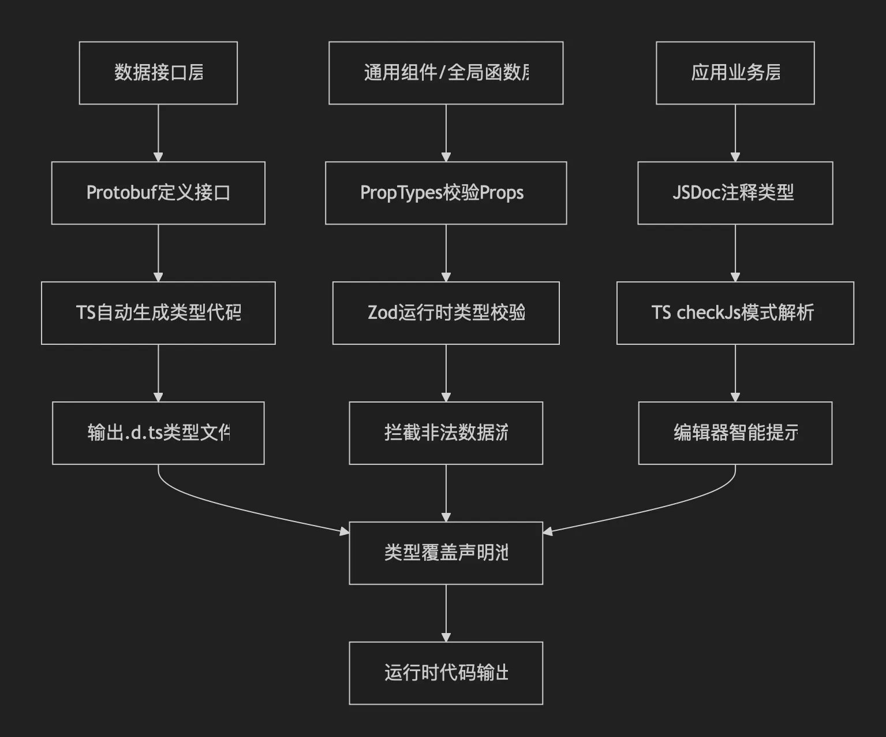

# TS 转 JS 三年后项目怎么样了？

在前端开发领域，TypeScript 与 JavaScript 的技术选型之争从未停歇。三年前，我们团队在技术主管的带领下，启动了一项技术转型——将现有项目从 TypeScript 逐步迁移回 JavaScript。

说实话，当初我对这个去TS化的决定是持保留态度的。即便当时项目中的 TypeScript 已经名存实亡——充斥着大量的`any`类型和`@ts-ignore`注释，变成了名副其实的 "AnyScript" ，但我还是觉得在多人合作的场景下，通过 TypeScript 至少能保证使用的下限，且在数据接口、通用组件上还是有用武之地的。

但三年过去，平台运行良好性能充分得到保障，拜托 TypeScript 束缚后开发迭代效率提升，项目运行及编译报错显著减少，从以结论倒退过程的逻辑来看，当初技术主管力排众议推动的这个决策，确实展现出了他的前瞻性。这不禁让我思考：我们是否应该重新评估 TypeScript 的价值？当项目规模、团队构成和业务特性达到某种平衡时，回归 JavaScript 有时候反而可能是一种更务实的选择。

接下来，我将从项目当时为什么“非降不可”、收束强类型检查的作用范围、从数据入口开始（借助编译检查）、从通用组件开始（运行时检查）、注释即文档五个方面来分享一下我们团队是如何在三年后将项目从 TypeScript 转回 JavaScript 的。

 

## 项目当时为什么“非降不可”呢？

不得不说，在当时对于团队来说 TypeScript 太“大”了。

- 职责大：TypeScript 涵盖方方面面覆盖较广，要求开发人员对 TypeScript 的熟悉程度较高，且对开发人员的编码规范的要求更高，不然就等着后续频繁处理复杂的编译告警、编译错误。
- 类型大：TypeScript 编码需要良好的抽象意识，从需求初始就考虑兼容的类型设计，且由于前端需求多变，类型声明往往和运行相悖，维护类型兼容、解决类型冲突慢慢成为一项日常工作消耗心力。
- 大包容：TypeScript 是一门很包容的语言，只需要 `as unknown as` 或者巧妙使用一下 `any` 就能绕开条条框框的要求，但这种绕开往往会直接造成一条链路的类型污染，要求研发过 PR 做到认真审查，但现实骨感在敏捷迭代时，往往一发不可收拾，逐渐变成一个模块接一个模块的 any script 化，后续没抽出单独的时间进行优化就再起不能了。

在 TypeScript 大包容和一众 EGO 大的研发友友们的推波助澜下，TypeScript 带来的收益逐渐覆盖了其带来的心智成本。与此同时，项目随公司成长，迭代推进得越来越快，研发人员数量成倍增长，面对越来越重的开发成本，逐渐将 TypeScript 的职能范围进行收束也就迫在眉睫了！

 

## 收束强类型检查的作用范围

是的，我们决定摒弃 TypeScript 这门语言，但不代表我们选择将壮士断腕般把 TypeScript 带来的收益也全部抛弃，与其说摒弃，倒不如说是收束 TS 的职能范围，让 TypeScript 自身或者静态类型检查这件事从全局聚焦到其最具有价值的区域。

- 静态类型检查：提供编译（IDE 运行）时错误检查，代码即文档；
- 完善的类型开发体验：为代码编辑器提供媲美 TypeScript 自身的完善类型提示；
- 保持 AI 提示友好：TypeScript 经常说的一句话「代码即文档」，这在 AI 时代能提供丰富的上下文是十分重要的一件事。

 

### 从数据入口开始（借助编译检查）

借用现代前端的一个概念「MVVM」来说，目前前端的主要工作是把数据转换成界面信息（UI/UX），数据即界面，数据就是一切前端的开始。只要从数据一开始就做成类型完备的，那后续数据流向业务组件时，从状态库到组件框架都能携带上完善的类型信息，从基本上能保证了工程根基的牢固，在应用模块搭建的时候，稍加补充也能做到类型丰富，享受类型带来的开发提速。

为了保证数据的类型完备，我们在项目的数据接口层依旧保留局部 TypeScript 的应用。上面提过的 TypeScript 会对项目的代码造成一系列链路的污染，为了全力避免这件事的发生，我们选择把数据接口层完全交由代码自动化生成。这部分通过 TypeScript + Protobuf 的配合实现（具体实现可以看我的另一篇博客 [ts-proto in frond](https://hamburgerdog.github.io/blog/ts-proto-in-frontend/)）只需要后端工程师写好 Protobuf 格式，前端就能直接生成接口代码，都不需要再通过 SwagUI 这种文档来对接了。

通过这样的设计，我们在状态库进行网络请求的时候，所有的响应数据都是自带完善的类型提示的，像 VSCode 之类的代码编辑器都能做到快速的开发提示，且由于自动化生成完全避免了人的影响，还不会出现任何 any script 代码造成污染，不额外增加 PR 审查时间，大幅提升了开发的体验感。普遍使用 Vibe Code 的时代下，通过生成后的接口代码还能立刻生成一个测试组件代码用来调试，充分做到既要又要。

 

### 从通用组件开始（运行时检查）

显然如果通用组件也用 TypeScript 来写的话很难避免人的参与，这也就无法避免一个链路的污染。且如果这里还使用编译时的检查和写 TypeScript 别无二致，依旧需要处理越来越复杂的编译配置、类型冲突。那有什么能兼顾这两者，还能在通用组件上进行完善的类型提示的呢？

当然有，PropTypes 和 Zod ！

- PropTypes，React 团队持续维护的工具，支持 Class 组件和 Hook 组件，通过静态挂载和配合 Eslint 可以实现运行时的告警和完善的类型提示；
- Zod，运行时类型检查的工具，代码运行时如果类型校验错误会主动报错，功能比 PropTypes 强大可以用在组件以外的地方，语法也更现代。

团队在具体实践过程中，通过代码规范来要求开发人员主动使用这两个工具，但在 Eslint 或者代码提交时做强制的限制。实践过程中，研发人员对于通用组件会主动维护运行时的类型检查，这并不会直接带来工程质量的提升（避免缺陷、减少缺陷），原因如下：

1. 在数据接口层和应用状态层基本已经对数据本身做了多次封装和处理，遇到数据格式错误情况并不多，且多数会在开发时就会在界面上暴露出来
2. 通用的组件也能通过入参提供对应的代码提示，不需要通过运行时的提前处理来提供完善的类型提示，得益于完善的类型根基，业务组件从状态层获取的数据也已经自带了类型；
3. 在通用层往往是抽象的，更注重界面交互本身，关注数据类型并不会直接产生功能影响，除非需要根据类型展示不同数据

对于 Zod 的应用场景则聚焦在全局通用的功能函数上，例如各类数据处理、文本校验，这个就比较常见就不再赘述了。

 

### 注释即文档

目前我们已经介绍了所有基础架构了，接下来就来讨论一下占据了 80% 研发时间的「开发业务组件」这项任务了。

开发业务组件通常分为三个步骤：首先是处理应用状态，接着根据交互来编写业务处理的逻辑，最后是把交互逻辑结合到组件上。

那在这个过程中，我们再使用任何检查都会拖累我们的研发数据，既然纯 JS 开发就要享受到 JS 带来的舒爽体验。因此，在这一步我们并不会对研发人员进行任何的类型上的限制，而是推荐他们规范使用 JSDoc ，即 JavaScript 的注释规范文档来提供完备的类型提示（注意这里只是提示而不是校验）。

1. 可以直接导入 TypeScript 的 Type/Inferface ，支持第三方库和数据接口层生成的类型文件，不会造成编译影响
2. 零迁移成本，可以在 JavaScript 中直接编写，不需要做改造也不需要额外的插件支持，但又能提供完整的类型提示
3. 学习成本低，常用的格式和注解符就几个，Vibe Code 可以通过上下文完美生成，后续又能反哺 Vibe Code
4. 支持范型，即使写范型的必要也不大，也满足你想跳类型体操的冲动
5. 有插件支持通过 JSDoc 导出

 

## 总结

|      层级       | 校验时机 |       技术栈       |        作用        |
| :-------------: | :------: | :----------------: | :----------------: |
|   数据接口层    |  编译时  |   TS + Protobuf    |   完善的类型根基   |
| 通用组件/函数层 |  运行时  |  PropTypes + Zod   | 可选的类型校验提升 |
|   应用业务层    |  开发时  | JSDoc + TS checkJs |   优秀的开发体验   |

