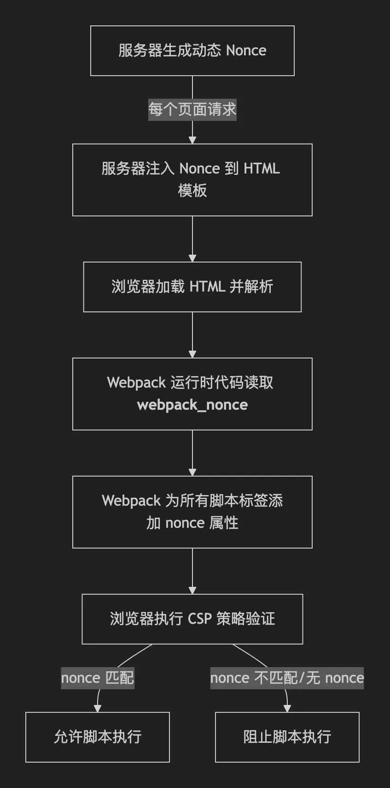

# Webpack 提升前端安全的方法

## 提升 CSP 安全的 nonce 方法

> CSP：内容安全策略，浏览器通过该策略可以拒绝内联脚本和外部脚本的注入，有效防御 XSS 的反射和存储攻击

在 webpack 中，可以通过 `__webpack_nonce__` 在运行时赋值的方法将可信的脚本都插入一个单次随机码，每次请求时，可以和服务器配合下发 nonce 码，这样浏览器在 CSP 策略下就能将安全的脚本和外部脚本进行区分。

**简单描述一下流程：**

1. 服务器生成 nonce 并注入到响应的 HTML 中
2. 浏览器执行 HTML 并赋值全局变量
3.  webpack 运行时获取到全局变量的 nonce 
4. webpack 将内部脚本全部插入 nonce
5. 浏览器执行 CSP 策略进行验证



### 服务器生成 nonce 

常用的服务器有三种方式，express/koa 启动服务、nginx 启动服务、webpack-dev-server 开发服务器。

首先提供一个 HTML 的基础模板来给 webpack 运行时提供一个 nonce 

```html
<html>
<head>
    <meta http-equiv="Content-Security-Policy" content="script-src 'nonce-<%= nonce %>'; style-src 'nonce-<%= nonce %>';">
</head>
<body>
    <script nonce="<%= nonce %>">
        window.__NONCE__ = '<%= webpackNonce %>';
        window.__webpack_nonce__ = '<%= webpackNonce %>';
    </script>
    <div id="app"></div>
</body>
</html>
```

服务器的核心作用就是在 HTML 的这个模板中注入 nonce 变量，这样浏览器就可以知道 CSP 的应用范围。

同时，根据这个策略我们也可以知道 nonce 的更新规则，**核心就是向服务器重新请求资源的时候需要会更新 nonce**（以单页面应用为例）

1. 刷新页面、打开新标签页的时候会更新 nonce；✅

2. 前进、回退页面的时候会更新 nonce；✅

3. SPA 的页面路由跳转不会更新 nonce；❌

4. AJAX 动态内容加载不会更新 nonce；❌


### webpack 如何使用 nonce 

注入 nonce 是 webpack 的运行时的内置功能，因此无需任何配置就能默认开启，激活的条件就是入口文件的声明是否有 `__webpack_nonce__` 变量的赋值

```js
// src/index.js 入口文件
__webpack_none = windows.__NONCE__; // 这里可以通过服务器生成 HTML 中携带一个 script 在全局注入服务器生成的 nonce
// __webpack_none = 'DEV_DEV_DEV' // 开发模式下可以固定一个值，但生产环境坚决不能固定，否则无效
```


### nonce 能配合 CSP 防御 XSS 的原理

- 对于反射型 XSS 攻击，开启 CSP 能在浏览器策略中直接拒绝内联的脚本执行，直接锁死攻击可能性；

- 对于存储型 XSS 攻击，即使获取到了单次的 nonce 并注入成功，在下次服务器更新资源时，该 nonce 也会失效，无法造成攻击。

所以即使 nonce 是明文形式展现在前端的，但由于其随机生成以及单次使用即过期的原理，还是能防御大部分 XSS 攻击。


### 生成 nonce 的代码展示

- 通过 express 来模拟这个过程，即生成一个 nonce 并注入到 HTML 中

    ```js 
    // express
    const express = require('express');
    const crypto = require('crypto');
    const helmet = require('helmet');

    const app = express();

    // 生成 nonce 的中间件
    function generateNonce(req, res, next) {
      // 生成 16 字节的随机数，转换为 base64
      const nonce = crypto.randomBytes(16).toString('base64');
      res.locals.nonce = nonce;
      next();
    }

    // 配置 CSP
    app.use(helmet({
      contentSecurityPolicy: {
        directives: {
          defaultSrc: ["'self'"],
          scriptSrc: ["'self'", (req, res) => `'nonce-${res.locals.nonce}'`],
          styleSrc: ["'self'", (req, res) => `'nonce-${res.locals.nonce}'`],
          imgSrc: ["'self'", "data:"],
          fontSrc: ["'self'"],
          objectSrc: ["'none'"],
          upgradeInsecureRequests: [],
        },
      },
    }));

    // 应用 nonce 中间件
    app.use(generateNonce);

    // 渲染模板
    app.get('/', (req, res) => {
      res.render('index', {
        nonce: res.locals.nonce,
        webpackNonce: res.locals.nonce // 传递给前端
      });
    });

    // 或者提供 API 接口
    app.get('/api/nonce', (req, res) => {
      const nonce = crypto.randomBytes(16).toString('base64');
      res.json({ nonce });
    });

    app.listen(3000, () => {
      console.log('Server running on port 3000');
    });
    ```

- 使用 nginx + lua 进行 HTML 注入

    ```nginx
    # nginx + lua 脚本策略
    http {
        lua_shared_dict nonce_cache 10m;
    
        server {
            listen 80;
            server_name localhost;
    
            location / {
                # 生成 nonce
                set_by_lua_block $csp_nonce {
                    local random = require "resty.random"
                    local str = require "resty.string"
                    local bytes = random.bytes(16)  -- 生成16字节随机数
                    return str.to_hex(bytes)         -- 转换为16进制字符串
                }
    
                # 设置 CSP 头
                add_header Content-Security-Policy "script-src 'nonce-$csp_nonce' 'strict-dynamic'; style-src 'nonce-$csp_nonce';";
    
                # 将 nonce 传递给后端或模板
                proxy_set_header X-CSP-Nonce $csp_nonce;
    
                # 代理到应用服务器
                proxy_pass http://backend:3000;
            }
        }
    }
    ```

- webpack-dev-server 只有在开发环境下可以使用固定值

  ```js
  // webpack.config.js
  const crypto = require('crypto');
  
  module.exports = {
    // ...其他配置
    
    devServer: {
      port: 8080,
      setupMiddlewares: (middlewares, devServer) => {
        if (!devServer) {
          throw new Error('webpack-dev-server is not defined');
        }
        
        // 添加 nonce 生成中间件
        devServer.app.use((req, res, next) => {
          const nonce = 'DEV_NONCE'
          res.locals.nonce = nonce;
          next();
        });
        
        // 修改响应头添加 CSP
        devServer.app.use((req, res, next) => {
          const nonce = res.locals.nonce;
          res.setHeader(
            'Content-Security-Policy',
            `script-src 'nonce-${nonce}' 'self' 'unsafe-eval'; style-src 'nonce-${nonce}' 'self' 'unsafe-inline';`
          );
          next();
        });
        
        return middlewares;
      },
      
      // 在 HTML 模板中注入 nonce
      devMiddleware: {
        index: true,
        mimeTypes: { 'text/html': ['phtml'] },
        publicPath: '/',
        serverSideRender: true,
        writeToDisk: true,
      },
    },
    
    // 配置 webpack 插件在 HTML 中注入 nonce
    plugins: [
      new HtmlWebpackPlugin({
        template: './src/index.html',
        templateParameters: (compilation, assets, assetTags, options) => {
          return {
            compilation,
            webpackConfig: compilation.options,
            htmlWebpackPlugin: {
              tags: assetTags,
              files: assets,
              options: options
            },
            // 从响应中获取 nonce（需要在中间件中设置）
            nonce: compilation.devServer?.res?.locals?.nonce || ''
          };
        }
      })
    ]
  };
  ```


## 对外部资源启用的 SRI 限制*

SRI 的核心目标是在引用外部的脚本或者样式时，对外部资源进行哈希校验，避免 CDN 或者第三方对资源进行篡改。

webpack 可以通过插件在构建时就将对应的资源 hash 注入到 HTML 的 `<script> <link>` 标签上

```js
// webpack.config.js
const { SubresourceIntegrityPlugin } = require('webpack-subresource-integrity');

module.exports = {
  output: {
    path: __dirname + '/dist',
    filename: '[name].[contenthash].js',
    crossOriginLoading: 'anonymous', // required for SRI，为了帮助浏览器在跨域加载时做验证，这里需要保证 crossinging 上有 `anonymous` 字段
  },
  plugins: [
    new SubresourceIntegrityPlugin({
      hashFuncNames: ['sha384']
    })
  ]
};
```

**SRI 防御的核心策略**

1. 可信的内部资源：在 `<script>` 或者 `<link>` 的标签上写上对应资源的 `integrity="算法-Base64Hash"` 
2. 可以校验的外部资源：从 CDN 下载资源后，浏览器通过哈希校验即可得资源是否被篡改

**SRI 策略可以防御的和无法防御的**

- 能阻止 CDN/第三方托管平台篡改志愿 ✅

- 无法保护内联的脚本 ❌

- 无法替代 CSP 等安全策略，SRI 只能用于资源防篡改 ❌


## 其他策略（针对 XSS）

> 防范 CSRF 主要需要后端配合，使用临时 token 、同源 cookie 等方法，这里主要讨论 XSS 攻击的防御

**更简单的 source-map 避免使用 `eval/new Function`**

- 某些 `devtool`（如 `eval-source-map`、`cheap-module-eval-source-map` 等）会把代码以 `eval()` 的形式插入，会与严格 CSP 冲突并增加攻击面。

- 生产环境请使用不含 `eval` 的映射方式（或关闭映射），并避免在运行时使用 `eval`/`new Function`。

- 不要在生产暴露 source maps，因为 source maps 会泄露源码和注释，增加被利用风险。


**防范 HtmlWebpackPlugin 及 HTML 模板 的注入风险**

- 使用 `HtmlWebpackPlugin` 生成 HTML 时，模板参数如果包含不可信数据会造成 XSS。只在构建时注入可信的、非用户可控值；

- 若需要按请求注入动态（例如 nonce），把模板做成服务器端可替换的模版，推荐在服务器端直接注入


**不暴露敏感信息到前端业务（防范 DefinePlugin 的使用）**

- `DefinePlugin` 是在编译时把值替换到代码里的，切忌把真实密钥、短期凭证等放在 `DefinePlugin` 或任何前端代码中；

- 用后端环境 / 私有接口在运行时安全地提供敏感配置


