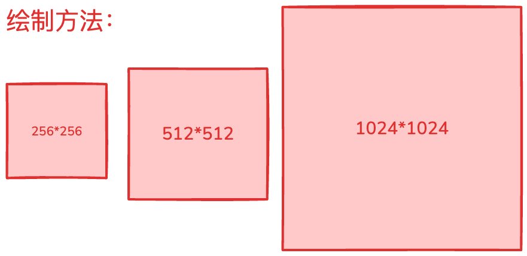
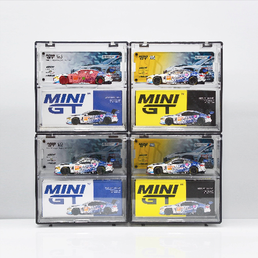
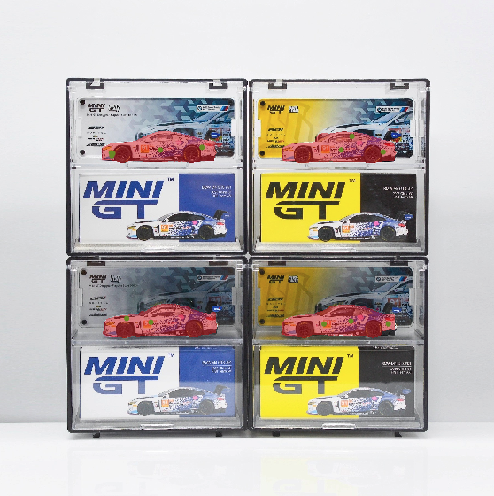
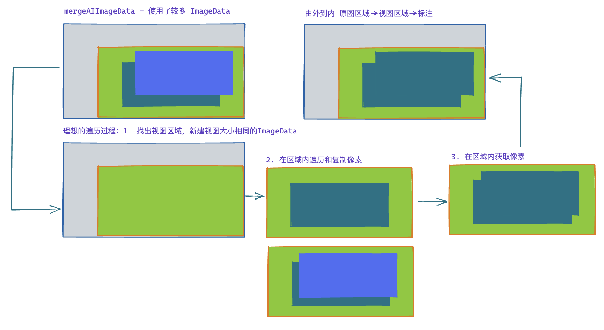
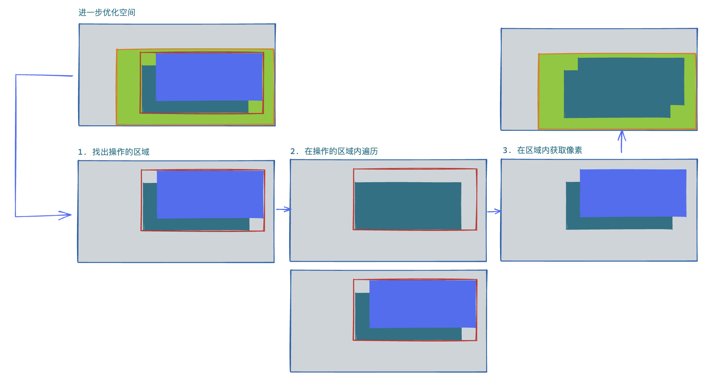
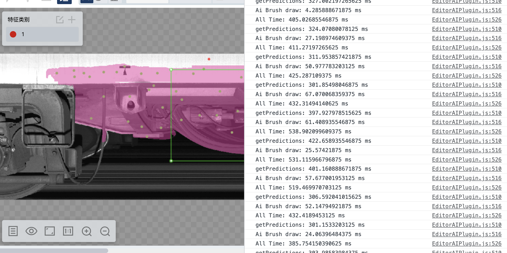
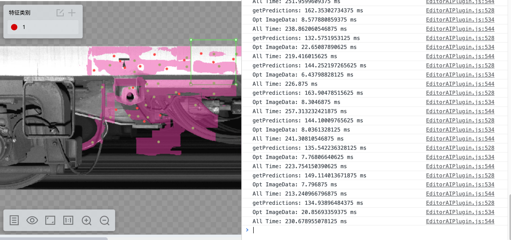
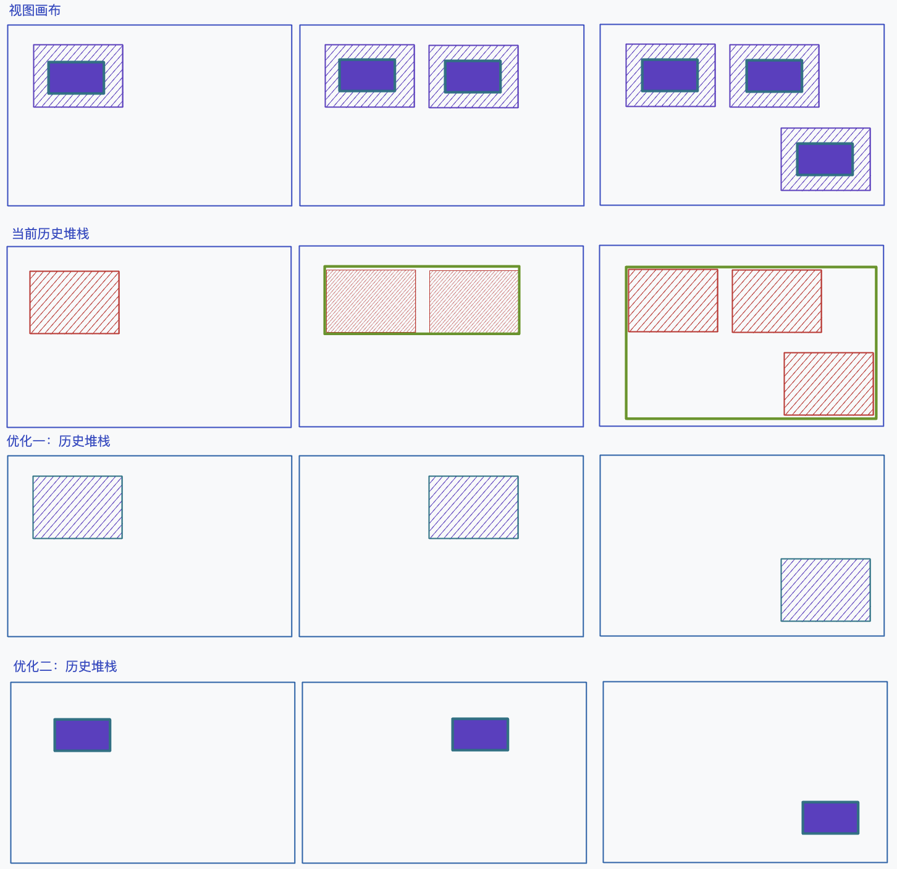

# 高性能计算 AI 模型应用库的设计与优化

## 背景知识

一个基于 WebAssembly 实现的高性能计算集合体。该项目专注于计算机视觉任务，特别是图像分割和 OCR 处理，旨在为用户提供跨平台的高性能解决方案。底层通过 CPP 代码实现模型调用与前后处理计算，应用层基于 WASM 封装成 TypeScript 工具库对外提供接口。

**项目目的**

提供在线的高性能图像分割、OCR 文本识别、模板匹配、跨平台兼容

**核心优势**

- 支持 Web 和原生应用；
- 基于 CPP 实现的高性能核心应用，具备实时处理能力；
- 基于 Web 浏览器的 WASM 编译；
- ESM 模块化架构，便于分包拓展；

## 架构设计

架构设计清晰地分离了核心计算逻辑和接口层。这使得多目标编译和在不同平台上高效执行成为可能。



**核心层**：完全基于 CPP 开发，实现了以下功能

- Labelman: 图像分割
- OCR Label: 单字符识别
- Seq OCR: 字符串识别
- Match Template: 模板匹配
- 调用 onnxruntime 推理模型

**编译层**：使用 CMake 结合 Emscripten，实现了以下功能

- 绑定 CPP 与 JS 的操作映射，以便生成 .js 胶水代码；
- 编译 CPP to WASM 文件，结合 JS 胶水代码形成 WASM 模块；

**接口层**：完全基于 TypeScript 开发，实现了以下功能

- 清晰的职责分离，对不同模块进行分包封装，避免无效引入；
- 为 WASM 模块提供完善的类型辅助，提供运行时与编译时的类型检查；
- 封装了 onnx 模型加载到 WASM 模块的全流程，便于 web 应用快速集成。

## 编译打包

**使用 rollup + api-extractor 进行打包，WASM 特殊处理。**

1. rollup 是一个支持 ESM 的 JS 应用打包工具，支持树摇
   - `@rollup/plugin-node-resolve`：解析`node_modules`中第三方模块
   - `@rollup/plugin-typescript`：解析 TypeScript 模块，注意配置`tsconfig`路径
   - `@rollup/plugin-alias`：`alias`模块名
   - `rollup-plugin-visualizer`：`rollup`打包产物可视化图分析依赖项
   - `rollup-plugin-progress`：构建进度条
2. api-extractor 是微软开源的一个辅助 TypeScript 类型打包工具，可以收集散落的 .d.ts 类型文件，形成一个统一入口；
3. WASM 使用文件 hash 校验，保证每次更新后获取的 JS 携带 hash 值避免依赖缓存。

## WASM 内存读取的性能优化

**WebAssembly.Memory**

可以分为 `ArrayBuffer` 和 `SharedArrayBuffer` 两种：

- 默认是 `ArrayBuffer`，可用 `Uint8Array/Int32Array` 等视图读写；WASM 与 JS 对同一底层缓冲区的修改即时可见；
- `SharedArrayBuffer` 则可以在 WASM 多线程/ Worker 的场景下使用，实现高性能的并发。

项目使用的是后者，目的就是为了在 CPP 侧可以借用 WASM 的多线程模型运行更高性能的处理，不过有如下限制：

- 需要保证浏览器环境安全，需要符合同源策略，且必须开启 HTTPS 证书；
- 最佳实践是在多线程并行、高性能数据共享的场景下使用。

**WebAssembly 多线程模型**

WASM 的多线程提案在浏览器环境下确实是基于 Web Workers 技术实现的， Web Worker 自身确实是一个独立的 os 线程，是真正运行在 CPU 线程上的，能够并行执行 WASM 的指令。

在 WebAssembly 启动并发模式的构建后，可以得到 `.wasm` `.worker.js` `.js` 文件，这不代表我们需要手动引入 `.worker.js` 实现并发，其实在 `.js` 文件中已经封装了对 `.worker.js` 的引用，在应用层使用的时候，只通过 js 文件的即可实现多线程并行处理。


## 分割结果性能优化

### 业务链条优化

从底层分析看整个业务链条到性能卡点是这样的：

1. 加载模型，这一块受限与 WASM 和 onnx-web 虽然比重较大，单除提升硬件性能外无很好的优化方法；
2. 运行模型得到特征掩模 Mat，模型层面已经做了大部份的优化，提升空间小；
3. 底层编辑器处理 Mat 转化成形状，这一块业务链路很多，亟需查找优化空间；
4. 底层编辑器触发形状绘制，浏览器进行渲染，这一块也主要受限于硬件性能。


**那么从 Mat 到形状绘制到底做了哪些事情呢？**

1. 将 Mat 用 UInt8Array 承接，进行一层 Uint8ClampedArray 转化后得到 ImageData；
2. 将 ImageData 通过 Canvas 处理后得到 Image 对象；
3. 将 Image 作为形状属性提交视图画布进行绘制；
4. 将 Image 作为形状属性提交数据画布进行绘制，与后端使用 Base64 交互；

经过这个简要梳理后，对每一项进行分析。

1. 既然 Mat 到 ImageData 之间需要做一层转化，那我是否可以直接拿到 Uint8ClampedArray 呢？

   首先先了解一下这两个数据的核心区别在于对溢出数据的处理完全不同

   ```js
   // 对于 Uint8Array 而言，数据溢出则取模
   const a = new Uint8Array([300]);
   console.log(a[0]); // 300 % 256 = 44

   // 对于 Uint8ClampedArray 而言，数据溢出则夹逼
   const b = new Uint8ClampedArray([300]);
   console.log(b[0]); // 255
   ```

   所以 Uint8ClampedArray 会被 ImageData 所使用是因其符合 0-255 这种像素数据的要求，Uint8Array 的取模操作在数据溢出时导致颜色出现奇怪的操作。那么对于 Mat 而言，其物理意义到底是什么呢？在这个场景下，其实这是一个单通道的灰度值，并不是一个二进制流，所以使用 Uint8Array 来承接误解了其本质，应当且必须使用 Uint8ClampedArray ！

   <br/>

   且在 ImagaData 中存在一个 data 属性是可以被赋值的，只要 ImageData 的宽度高度和数据长度能一致即可，这样就完全避开的拷贝复制的过程，可以直接把 Mat 数据放入 ImageData 缓冲区。

   ```js
   //	方法一
   const clamped = new Uint8ClampedArray(width * height * 4);
   const imageData = new ImageData(clamped, width, height);

   //	方法二
   const clamped = new Uint8ClampedArray(width * height * 4);
   const imageData = new ImageData(width, height);
   imageData.data.set(clamped);
   ```

2. 为什么在 ImageData 后还需要把 Canvas 转化成 Image 对象呢？

   首先，Image 其实表示的是一种资源，而 Canvas 其实是 “位图缓冲区” ，这个定义描述的是一种静态资源和动态可操作的 Buffer，使用一个不可变的静态资源进行绘制从业务上看十分的靠谱，但如果 Canvas 是完全受控的且能从业务上保证不变呢？

    <br/>
   
   显然，在 Canvas 完全受控的情况下是符合绘制要求的，其自身就是一个 `CanvasImageSource`  可以被放在 `drawImage` 中直接使用，那么这时候优化就变成了代码梳理和重构，将任何获取 Mat Canvas 绘制上下文的入口关闭掉，就又在性能上提升了一步！

3. 与后端使用 Base64 交互如何进行优化呢？

   要获取到 Base64 始终避不开一个叫 `toDataURL` 的函数，其只存在于 `offscreenCanvas` 与 `HTMLCanvasElement` 中，就意味着我们始终需要一个数据画布 Canvas 来绘制当前所有需要保存的形状再提交给接口，无法直接从 Uint8ClampedArray 入手实现数据保存。即这里的优化需要从接口去修改：

   - 游程编码：适合颜色区域大块连续、变化不频繁的图像，将重复像素压缩成计数形式，大幅减少传输大小；后端只需按规则解码恢复即可，但存在编码解码的过程，对于零散的数据提升并不大，且受图片大小影响很大。
   - 二进制流（Uint8ClampedArray）：直接传原始 RGBA 字节数据，比 Base64 更紧凑、无额外编码开销；接口改成接收 `ArrayBuffer` 或 `Blob`，可显著降低带宽与前端 CPU 消耗。

经过这次优化，以上过程可以直接转换成：

1. Mat 用 Uint8ClampedArray 承载，直接写入 ImageData 缓冲区；
2. 初始化 Canvas 画布，将 ImageData 转换成可绘制资源，使用 putImageData 操作画布数据缓冲区；
3. 保证 Canvas 不可变，并作为形状属性提交视图画布绘制；
4. 计算所有待保存的 Mat 的 minibound 初始化一个 Uint8ClampedArray 并通过 ArrayBuffer 传送给后台接口。

### 融合绘制优化

在业务上，图像分割的关键检测区域（ROI）其实包含以下三种，默认为 256\*256：

1. 固定尺寸：256\*256、512\*512、1024\*1024 ；
2. 自定义尺寸；
3. 全图尺寸；



在这些区域里面每次执行检测都会产生大量 Mat 再变成分割结果，例如我在左上角区域点击一个点后，出现了红色特征区域。



这些区域会随着每次点击而新增，或者随着撤销而去除，例如经过多次点击之后，图片的四个区域都覆盖了红色特征区域；



红色区域就是 ImageData 绘制出来的，其最初始的来源是模型的推理结果 Mat，一开始提及的绘制方法就固定了 Mat 可能产生的区域。那在这些 Mat 变成 ImageData 的过程中，由于每次运行模型得到的 Mat 都是相对独立的就需要做一个融合。

<br/>

这个过程涉及大量的 ImageData 操作，是性能损耗的重灾区，基于这些背景，让我来介绍一下如何一步一步把 MVP 落地上线。

1. 阶段一：以全图尺寸作为 Mat 的大小进行融合；
2. 阶段二：记录所有绘制尺寸所组成的 minibound 作为 Mat 的大小进行融合；
3. 阶段三：记录所有 Mat 所组成的 minibound 作为 Mat 的大小进行融合。

第一阶段在中小图的情景下，性能尚可，且不需要复杂的编码操作，但性能随尺寸变大陡然下降，1024\*1024 尺寸的图片和 8192\*8192 尺寸的图片性能可以相差（8\*8\*4 =256）倍，完全无法满足超大图标注的要求。

第二阶段开始摆脱图片尺寸的限制，性能提升明显，编码复杂度尚可，通过绘制区域的限制避免全图的无效操作，但在「全图绘制」的场景下，性能会直接坍缩层到阶段一，内部还存在较多可优化的空间（见图上绿色区域）。



第三阶段既摆脱了图片尺寸的限制，又摆脱了绘制区域的限制，只关注真正的特征区域内操作，但代码书写过程较复杂，需要对每个 Mat 的进行原图的转换坐标（推理时返回的 Mat 的坐标原点基于绘制区域左上角），在中小图场景下，运行速度无明显提升，但在中大图且点击操作累积时，性能提升明显。在不改变融合的逻辑下，已经较难找出更多优化空间了。



<u>对于遍历融合的过程尝试过 Rust-WASM 加速 JS 代码执行过程，测试下来实际的提升不大，反而导致维护成本上升，遂放弃。</u>

### 优化成果展示

最终实现的优化前后的结果对比，基于 8000\*1638 流程模式下的全图标注：


整体优化前，大图单次特征区域的绘制操作在几十毫秒的量级，虽然在总耗时中占比都不是最大的，



整体优化后，单次绘制在个位数的毫秒级响应，性能优化提升明显，且由于使用的是局部的 Mat 对于内存性能而言也是提升很大的。



## 分割结果内存优化

**背景**：在性能较差的机器上，经常会遇到浏览器内存溢出导致各类操作失败的问题；

**场景**：布料黑点检测，特点：超大图、缺陷小、标小缺陷占用的内存空间却依旧大；

### 什么时候需要开辟内存

1. 加载 AI 模型；CPP-WASM 内部需要开创内存空间用于加载模型、上下文记忆；

2. 历史堆栈记录；支持业务的撤销后退功能，且需要记录交互点上下文；

3. 调用 `opencv.js` 去操作图像；临时的内存空间，各类 Mat 操作；

**加载 AI 模型开辟的内存用途**：

- 简介：读取模型资源包，只有在保证资源能够成功加载到内存中后，才能运行算法；

- 特点：两个模型包（流畅、精确），小模型包占用资源小；

- 大小：2048 MB；

- 瓶颈：2048 MB 是兼容两种模型包的最大考量，**即小于该值无法加载精确模型**，但大于该值一定两者都一定加载成功。

**历史堆栈记录**

- 简介：保存全量数据的快照，保存当前标注区域的最大外接矩形中的所有像素数据；

- 特点：若缺陷集中则内存消耗不大，场景恢复快速，缺点，缺陷分散时每次都需要新增内存；

- 大小：动态新增一个与当前标注区域的最大外接矩形的大小的 Uint8ClampedArray；

- 优化：改用增量形式，每次仅更新每次操作 ROI 的区域；

- 挑战：找出每次操作的 ROI 区域内的有效像素区域。

**调用 opencv.js 去操作图像**

- 场景：Mask 转多边形，保存时执行一次性占用的临时内存空间大；
- 大小：转化依赖原图坐标，每次转换时需要绑定成原图大小；
- 缺陷：此处存在隐蔽内存泄漏，即**每次保存后原图大小区域的数据没有被释放导致累计**，因此多次保存后，内存必然发生泄漏。

### AI 模型加载的场景

这里的核心优化的需求是，内存大的机器多开创内存，性能较弱的机器开创小内存，需要给用户提示以提升使用体验。

在浏览器检测内存的方法：

- `performance.memory` ，获取 JS 堆的使用情况以及限制，较准确，但非浏览器实现的标准；
- `navigator.deviceMemory` 获取设备内存总量的估计，比较粗略，无法反应可用内存；
- `new WebAssembly.Memory` 获取浏览器对于 WASM 线性内存的分配上限，较准确，间接反应内存。

这里利用 `performance.memory` 计算当前系统的压力，做机器性能的区分，先筛选掉一部分 32 位机器，降级到流畅模型并给予相关提示。后续，使用 `new WebAssembly.Memory` 探测 WASM 内存上限，保证在高性能机器但内存压力较大的场景下，也能兼容流畅模型，在模型选择上提供更细粒度的支持，并提供若干客户手动优化的提示以支持高精度模型的使用。

#### WASM 的线性空间

WebAssembly 的线性内存是 WASM 模块与宿主环境（如浏览器）之间**共享的、连续的、可调整大小的字节数组**。它是 WASM 程序访问内存的主要方式，也是 WebAssembly 能够高效处理数据的关键机制。

线性内存是一个**扁平的字节数组**，具有以下特性：

- **连续**：内存地址从 0 开始连续递增；
- **可变大小**：可在运行时动态增长（但有上限），每页 64 KB，32 位的机器理论上线是 4GB 内存空间；
- **共享**：WASM 模块和 JavaScript 都可以读写；
- **类型安全**：通过索引访问，WASM 内检查边界；

```js
// JavaScript 中创建 WebAssembly.Memory
const memory = new WebAssembly.Memory({
  initial: 256, // 初始页数（每页 64KB）
  maximum: 1024, // 最大页数（可选）
});

// 增长内存（增加页数）
const additionalPages = 10;
const previousPages = memory.grow(additionalPages);

if (previousPages !== -1) {
  console.log(`内存从 ${previousPages} 页增长到 ${previousPages + additionalPages} 页`);
  console.log(`新内存大小: ${memory.buffer.byteLength} 字节`);
} else {
  console.error('内存增长失败：可能已达到最大值');
}
```

### 历史堆栈的优化

以下图为例

1. 视图画布指的是用户的操作，虚线为 ROI 特征区域受绘制尺寸的影响，而中间填充为推理得到的特征；
2. 快照的堆栈记录，红色区域为保存的单次 ROI 特征区域的所有像素值，绿色框表示当前步骤存储的所有像素区域；
3. 将全量式的快照拆分成记录单个步骤，蓝绿色区域表示单次 ROI 特征区域的所有像素值，增加绘制消耗换取内存空间；
4. 记录最核心的修改区域的像素值，只保留真正有效的信息，增加绘制消耗和坐标运算换取内存空间。



### opencv.js 内存泄漏

> 其实是一个低级错误

先看以下这段业务代码，获取一个数据画布，转化成 ImageMat ，进行相关处理后，将数据画布置空，退出程序，GC 回收。

```js
function readCanvas() {
  let dataCanvas = _editor.getDataCanvas();
  try {
    const imageMat = cv.imread(dataCanvas);
    //  do something
  } catch {}
  dataCanvas = null;
  return;
}
//    1. 执行
readCanvas();
//    2. 此处的 imageMat 已经不可达，触发 GC 回收
```

问题就出在最后一步 GC 回收上，JavaScript 的垃圾回收机制会自动收回变量的内存，但 `opencv.Mat` 对象是 CPP 中的对象，面向 JavaScript 的只是一个封装对象，GC 并无法真正识别 Mat 对象，因此如果没有手动调用 `Mat.delete()` 则其内存在会话的生命周期里面是始终存在的。

后续：在使用到 `opencv.js` 的地方，都要认真管理好内存空间，每一个 Mat 都应该有对应的 `detele`，在异步操作中则应当使用 `deleteLater`，优化后的代码：

```js
function readCanvas() {
  let dataCanvas = _editor.getDataCanvas();
  try {
    const imageMat = cv.imread(dataCanvas);
    //  do something
  } catch {
  } finally {
    imageMat.delete();
    dataCanvas = null;
  }
  return;
}
```

## 总结

以上，通过一些渐进式的优化步骤，即满足功能的快速上线，又能在业务验证后持续进行优化满足更多场景，提升用户体验。在这些例子中有许多费神但不费力，只需认真分析即可快速完成的优化，为什么在业务初期没注意到呢？在我的经验里，问题的核心在于没有足够的用户场景验证。

<br/>

根据性能优化的二八原则，「80% 的性能问题通常由 20% 的代码引起，同时 80% 的性能提升往往来自 20% 的关键优化」。在这个性能优化之前，其实还有一个**用户体验的二八原则**，这才是直接决定你需不需要去做这个优化的关键，即「百分之八十的功能都是没用的，用户深度依赖的只有这百分之二十的功能」，对这部分场景才是真正需要投入大量成本从技术层面做到最极致的优化的。

<br/>

二八原则不代表只需要关注”二“而忽略”八“，只有累计了大量的投入后，”八“足够大，”二“的价值才会越突出，技术优化如此，累计用户场景亦如此。所以往往在业务初期，技术上是很难发现这些优化点的，只有当累计了大量基数，反馈才会后置到来，才有了优化提升的空间。而实现**累计用户场景这一点才是一个商业平台最难的一点**，只有先站起来走起来，才能接着在行业里跑起来，才会想如何跑得更快。研发也要判断出当前自己的业务处于哪个阶段，在刚开始打算站起来的时候，应该注重如何快速验证商业价值，提升用户体验保证用户留存，这时候提出大部分极致的技术优化都应该直接划分为伪需求，这也是 ”过早优化是万物之源“ 从业务上的一个印证。
