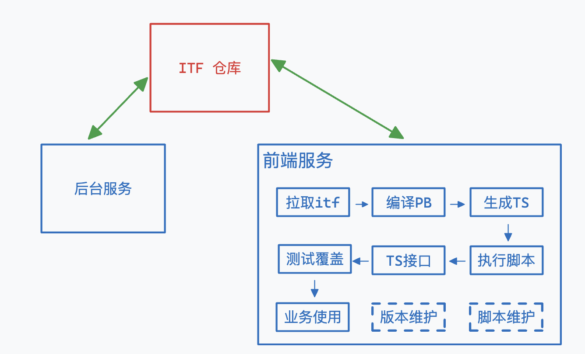
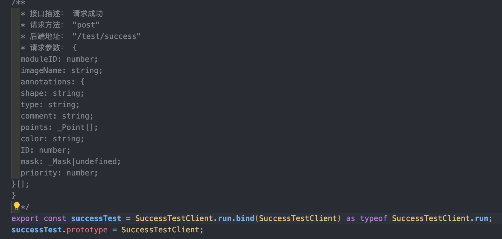
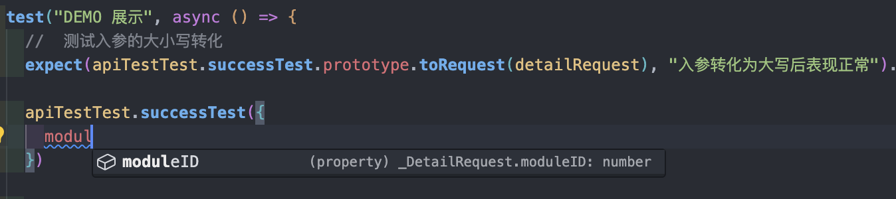
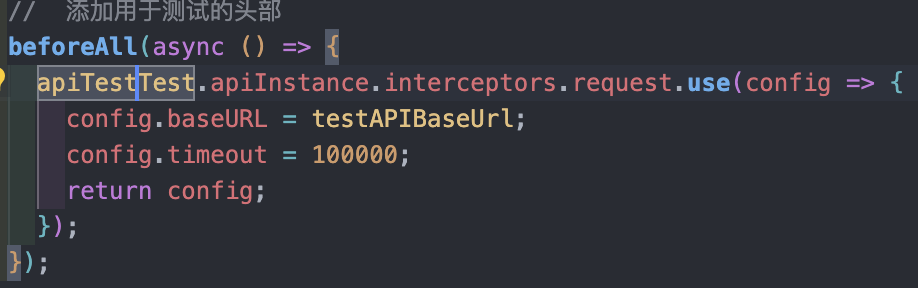
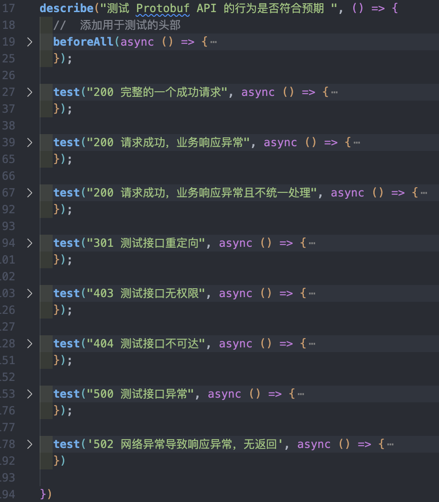

# TS-Protobuf in Frontend

> 一个比较奇怪的需求：即后台内部服务之间的通信使用的是 gRPC ，因此接口都使用了 Protocol Buffers 来实现数据结构定义，同时又通过 http（openAPI） 和前端交互。
>
> - protobuf: 跨平台的序列化数据接口定义的协议
> - openAPI: 一种用于设计、构建和文档化 RESTful Web 服务的规范

<br />

## 理论储备

已知 `Protobuf + OpenAPI` 可以写出如下代码片段：

```protobuf
syntax = "proto3";

message Person {
  required string name = 1;
  required int32 id = 2;
  optional string email = 3;
}

message AddressBook {
  repeated Person people = 1;
}

service Test{
  rpc SuccessTest(Person) returns (AddressBook) {
      option (grpc.gateway.protoc_gen_openapiv2.options.openapiv2_operation) = {
          summary : "请求成功"
      };
      option (google.api.http) = {
          post : "/test/success",
          body : "*"
      };
  }
}
```

定义的数据接口转化成 TS 描述就是：

```typescript
type Person = {
	name: string;
	id: string;
	email: string;
};

type AddressBook = {
	people: Person[];
};
```

同时，又有 `service` 来定义通信接口的结构就可以从中提取出接口地址、描述、通信方式等关键信息，通过 TS 可以拼接成如下代码：

```ts
async function TestAPI(data: Person): Promise<AddressBook> {
	const response = await http.post({
		url: '/api/test/success',
		body: data,
		headers: {
			'content-type': 'application/json',
		},
	});

	const { data: addressBook } = await response.json();
}
```

<br />

## 预期效果

1. 通过 Protobuf 的定义自动生成 TS 代码片段；
2. 支持字段转换；（业务中后端的接口请求/响应要求字段首字母大写，需要进行隐式转换）
3. 封装 HTTP 层的转换接口，axios/fetch 都轻松支持转换；
4. 完整的自测覆盖（虽然修改机会不多，但也别出错）；
5. 最好能有 js 版本（JSDoc）。

<br />

## 工程收益

1. 提升前后端联调的速度，不再需要 swagger-doc 的存在，完全避免对字段写错、请求方式用错等场景；
2. 从数据源开始的严格 TS 类型规范，同时还能减少 anyscript 的发生，为编程提供良好的代码输入提示；

| SwaggerDoc                   | protobuf                     |
| ---------------------------- | ---------------------------- |
| 敲定通信方式、数据结构       | 敲定通信方式、数据结构       |
| 编写前端 API 代码            | 自动生成前端 API 代码        |
| - 确认接口 URL               | -                            |
| - 确认字段对齐               | -                            |
| - 编写代码注释               | -                            |
| - 编写对象类型               | -                            |
| - 测试确认接口可用           | -                            |
| 业务功能调试（重复以上过程） | 业务功能调试（重复以上过程） |

**执行全流程：**


<br />

## 实现效果

1. TS 代码生成

   

2. 自动实现字段转换，将请求的首字母大写，将响应的首字母小写（可配置部分字段不转换），同时提供完善的类型提示提升工程质量；
   
   

3. 接入 axios 实例

   - 通过调用时传入/修改 api 实例；
     

   - 代码注入

     `import * as apiInstance from '**/*.ts'`

4. 自测覆盖（覆盖业务层的常用场景，手写 protobuf + vitest 实现）
   

<br />

## 实现过程

### 拉取 itf

itf 仓库是 protobuf 的数据源，前后端统一将其作为子仓库，由项目所有开发人员共同维护，核心是为了减少前后端接口数据结构的约定成本。

前后端维护同一个的仓库的好处如下：

1. all in code，不再需要双方频繁联系，不再需要接口文档；
2. 方便版本维护，开发联调时使用特性分支提交 pb 文件，前后端都能自动新增接口代码，待功能开发完成后一同合并到主分支，即完成开发；
3. 意外惊喜：各端同学都能及时发现是否有约定上的“不规范”，一旦 run error 就代表有问题，甚至还能发现「久远的不规范」。

具体的流程为：

1. backend/frontend sub module add itf;
2. [itf]feat/sb/doing -> 新增若干 API;
3. [backend]feat/sb/doing | [frontend]feat/sb/doing -> 功能完成，同步更新；
4. [backend] [frontent] [itf] release/1.0.0

当然，以上流程也可以调整为，前端只读、后端读写，接口定义依靠后端，进一步降低沟通成本。

<br />

### 编译 PB & 生成 TS

- **编译 PB**

  `.pb` 是数据定义的文件，真正要在业务代码上使用还需要使用编译器将其进行编译，而 `protoc` 就是用于编译的命令，用于自动生成 cpp、Java、gRPC 等代码。例如这条命令 `protoc -I=$SRC_DIR --cpp_out=$DST_DIR $SRC_DIR/test.proto` 会将工作目录下的 test.proto 转换成 cpp 相关的代码。同时，你还可以用 `--plugin_opt` 来引入相关插件完善编译的功能。你甚至可以封装这里的插件，利用 `protoc` 编译后的 AST 来完成以上描述的所有功能。

- **生成 TS**

  在本次项目中并不通过手写插件去直接操作 AST ，而是利用 [ts-proto](https://github.com/stephenh/ts-proto) 插件来生成 TypeScript 的类型文件(`.d.ts`)，后续通过这些类型文件拼接出真正可用的接口代码来。

  此处生成的类型文件主要为：

  1. `Message` 会被生成为多个对象类型 `type`；
  2. `Service` 会被生成为接口类型的数据 `interface`;
  3. `.pb` 文件通常还会引用第三方的库，所以这里还需要把第三库的收集成类型模块，再分别引用这些模块中的类型。

编译并生成 TS 类型文件的具体的 bash 命令可以以这个作为参考

```bash
#!/bin/bash
# 搜索 submodules 下的 pb 文件
PROTO_FILES=$(find api/ -regex ".*\.proto")
# 第三方库插件
THIRD_PARTY="api/third_party"
# 使用 ts-proto 插件，用于生成 TS 类型文件
PLUGIN="node_modules/.bin/protoc-gen-ts_proto"
# 输出的 schema
OUT_FILE="schema"
# protoc & ts-proto 的配置参数
COMMON_OPT="onlyTypes=true,snakeToCamel=true,lowerCaseServiceMethods=true"

protoc -I $THIRD_PARTY \
            -I ./ \
            --plugin=$PLUGIN \
            --ts_proto_opt=$COMMON_OPT,fileSuffix=.pb.d \
            --ts_proto_out=$OUT_FILE \
            $PROTO_FILES
```

<br />

### 执行脚本

单从以上脚本来看，bash 整体的语法还是偏复杂，作为前端开发工程师，那就要用属于 “前端开发工程师自己的 shell ” 来写脚本 - zx https://github.com/google/zx

> Bash is great, but when it comes to writing more complex scripts, <u>many people prefer a more convenient programming language.</u> JavaScript is a perfect choice, but the Node.js standard library requires additional hassle before using. The `zx` package provides useful wrappers around `child_process`, escapes arguments and gives sensible defaults.

简单介绍一下 `zx`，这是一种可以和 JavaScript 完美结合在一起使用的脚本库，其底层集成了各类好用的库，例如 `fs-extra` 可以用来读文件、`os` 用来查询系统信息、`path` 解析 URL 等等。`zx` 的语法也十分简单，具体可以见下面的代码片段展示。(windows 要执行这些命令提前准备好 WSL)

```javascript
#!/usr/bin/env zx

# 语法介绍 [Overview](https://google.github.io/zx/getting-started#overview)

await $`cat package.json | grep name`
const branch = await $`git branch --show-current`
await Promise.all([
  $`sleep 1; echo 1`,
  $`sleep 2; echo 2`,
])
const name = 'foo bar'
await $`mkdir /tmp/${name}`
```

<u>TIPS: 在使用 `zx` 的过程中，难免会碰到使用 esm 模块引入的问题，建议从一开始就将文件名修改成 `.mjs` ，或者修改 `package.json` 直接指明要使用 `esm` 来处理</u>

<br />

### 构造接口

#### 分类整理 service

在生成`.d.ts` 的代码后，要做的第一步就是把所有对外开发的接口（引入了 openAPI 包依赖的基本都是对外接口）都整理出来，以本文提及的 itf 仓库为例，使用的就是以文件作为路由区分各类服务，不同服务里面又对应了不同的接口信息。

```bash
api/
├── project
├── ...
├── user
└── third_party
```

做好大类区分后，可以深入单个具体的服务中，以 User 服务为例，可以找到 `deleteUser` 和 `listUsers` 这两个对外的接口，并可以找出的请求/响应数据类型。

```ts
export interface DeleteUserRequest {
	RequestID: string;
	ID: number;
}

export interface ListUserReply {
	RequestID: string;
	Users: UserCredential[];
	Total: number;
}

export interface UserCredential {
	ID: number;
}

export interface UserService {
	deleteUser(request: DeleteUserRequest): Promise<Empty>;
	listUsers(request: Empty): Promise<ListUserReply>;
}
```

接下来，就可以根据这个具体的接口信息结合模板代码生成出真正可用的接口业务代码，再把该过程运用到单个具体服务中，就能获取到全部的业务层使用的 API 接口代码。

```js
//	模板代码展示

export class $SERVICEClient {
  private static URL: string = $URL;
  private static method: string = $METHOD;
  public static summary: string = "$COMMENT";
  public static toRequestUpperCase = $WEB_REQUEST_TYPE.toUpper.bind($WEB_REQUEST_TYPE);
  public static toRequestLowerCase = $ORIGIN_REQUEST_TYPE.toLower.bind($ORIGIN_REQUEST_TYPE);
  public static toResponseUpperCase = $WEB_RESPONSE_TYPE.toUpper.bind($WEB_RESPONSE_TYPE);
  public static toResponseLowerCase = $ORIGIN_RESPONSE_TYPE.toLower.bind($ORIGIN_RESPONSE_TYPE);

  private static toRequest(data: $REQUEST_TYPE) {
    return this.toRequestUpperCase(data);
  }

  private static toResponse(data?: any) {
    return this.toResponseLowerCase(data) as unknown as $RESPONSE_TYPE;
  }

  /**
   * 接口描述： $COMMENT
   * 请求方法： $METHOD
   * 后端地址： $URL
   * 请求参数： $PARAMS
   */
  public static async run(data: $REQUEST_TYPE, config?: AxiosRequestConfig<any>) {
    const requestPreview = this.toRequest(data);
    let url = this.URL
    if(url.includes("{")){
      //	处理 obj 作为 queryParams
      const keys = Array.from(url.matchAll(/\{(?<key>.*?)\}/ig)).map(res=>res.groups?.key)
      keys.forEach(key => url = url.replace(/\{.*?\}/i,(requestPreview as any)[key as string]))
    }
   	//	结合 API 实例
    const httpConfig = { ...(config as Object), method: this.method, url, data: requestPreview } as any;
    if(this.method === 'get' || this.method === 'delete' ){
      httpConfig.params = requestPreview;
    }
    const response = await apiInstance(httpConfig);
    const result = this.toResponse(response?.data);
    response.data = result
    return response as unknown as {
      data:$WEB_RESPONSE_TYPE;
      status: string;
    };
  }
}

/**
  * 接口描述： $COMMENT
  * 请求方法： $METHOD
  * 后端地址： $URL
  * 请求参数： $PARAMS
  */
export const $API_NAME = $SERVICEClient.run.bind($SERVICEClient) as typeof $SERVICEClient.run;
$API_NAME.prototype = $SERVICEClient;
```

具体怎么解析到 `$COMMENT` 、`$METHOD` 的过程就不开源了技术难度不在这堆代码即可，主要有具体的实现思路即可。

#### 处理第三方依赖

```ts
export interface UserService {
	deleteUser(request: DeleteUserRequest): Promise<Empty>;
	listUsers(request: Empty): Promise<ListUserReply>;
}
```

以这个为例，可以看到`Empty` 代表的`{} 空对象`是一个由第三方库依赖 (google.protobuf.Empty) 引入的，那么具体要如何导入第三方库的类型当成作为声明来让 TS 编译不报错呢？

首先，在「编译 PB」章节中的 Bash 命令其实就对该问题已经做了处理：

```bash
# 这里分别将第三方库和业务代码分成了两个入口
protoc -I $THIRD_PARTY \
            -I ./ \

# 最终会得到
# schema/
# ├── api # 接口代码
# ├── google # 第三方库1
# ├── validate # 第三方库2
# └── ... # 第三方库....
```

1. 全局变量

   最简单的做法就只需要非 API 目录下的所有 `.d.ts` 文件收集到 `thridParty` 目录下，并修改 `tsconfig.json` 包含第三方库目录，再所有类型文件中的 `export` 关键字删除，则这里的第三方库的声明都会作为全局变量添加到环境中。但这样做的后果就是，在有重复的类型声明时无法做到解藕（自动类型合并），如果遇到刚好有两个 `type` 关键字声明的类型时，会导致类型重复无法编译。

2. 命名空间注入

   还可以依据库的结构来声明不同的命名空间，通过维护好一个第三方库的依赖表，在检测到相关依赖后出现后，在对应的类型声明前加上命名空间，从而做到部分隔离，兼容 `type` 关键字段。但这里也有缺点，需要侵入修改代码。

3. 字段导入

   第三方库中全部使用 `export` 将类型导出，继续维护一个第三方库的依赖表，在检测到相关依赖后出现后，需要找到库的代码位置，并将该第三方库暴露的对象导入到每一份 API 代码中。

在 `ts-proto` 中使用的是第三种方案，因此，也可以在保证依赖库和接口代码的相对位置下，直接拷贝代码即可。btw，实际上本人推荐使用方式 1，即全局变量的方式来实现，原因是 `ts-proto` 生成的都是 `interface` ，所以即使有声明重复也会合并，而且在业务过程中，也没有真的遇到重复的特殊情况，简单实现即可。

#### 处理大小写转换

首先，请求响应的数据的大小写转换是很简单的，在各类 http 拦截器上也能实现，此处真正要做的是实际是 TS 类型定义的大小写转换，并绑定到对应 API 函数上。

```ts
//	原始的
export interface ListUserReply {
	RequestID: string;
	Users: UserCredential[];
	Total: number;
}

//	转换后的
export interface Web_ListUserReply {
	requestID: string;
	users: Web_UserCredential[];
	total: number;
}

export interface Web_UserCredential {
	ID: number; //	ID 不转换
}
```

因此，简单有效的做法：all interface 的前缀加 `Web_` 然后全小写即可。注意，在遇到第三方依赖的时候不需要额外处理，跳过即可。后续统一将原数据结构给回。

在完成了类型声明以后，还得生成大小写转换的函数所需的相关信息。

- `data` 来自开发人员/响应，无需关注；
- `target` 需要生成，整理的过程使用 JS 正则表达式即可（也可以 TypeScript AST）；
- 核心难点：如何处理对象类型的大小写函数转化，以及如何避免循环嵌套调用。

```ts
//	首字母转化为大写，满足请求结构体
const uppercaseFunction = (data: Web_Requset, target: keyof Requset): Request => {};
//	首字母转化为小写，满足响应结构体
const lowercaseFunction = (data: Response, target: keyof Web_Response): Web_Response => {};
```

Tips：

- 大小写函数可以用 `typeName` 作为 key 存放，用 Map 存放
- 避免嵌套调用可以用引用比较

#### 封装 api 实例调用接口

- 通过导入的方式，注入 API 实例；

  ```ts
  import default as apiInstance from './http/custom/axios.js' 	//	使用自定义的 axios
  import default as apiInstance from './http/custom/fetch.js' 	//	使用自定义的 fetch
  ```

- 通过函数传参的方式，注入 API 实例；

  ```js
  async () => {
  	await successAPI({ apiInstance: axios });
  }; //	函数传参
  ```

封装 API 实例是为了兼容各类业务工程中旧接口，而且，通常工程上还会在实例上注册许多拦截器以实现统一的处理异常、打印网络日志等功能，封装 API 实例还能兼顾着一些功能，不至于修改太多。

<br />

### 测试覆盖

简单介绍一下 Vitest（由 Vite 提供支持的极速单元测试框架），极速易用就是他最大的特点。

```ts
describe("测试 Protobuf API 的行为是否符合预期 ", () => {
  //  添加用于测试的头部,前置每次执行单例前的一个配置
  beforeAll(async () => {
    apiTestTest.apiInstance.interceptors.request.use((config) => {
      config.baseURL = testAPIBaseUrl;
      config.timeout = 100000;
      return config;
    })
  });

  //	测试单例
  test("200 完整的一个成功请求", async () => {
    //  测试入参的大小写转化
    expect(apiTestTest.successTest.prototype.toRequest(detailRequest), "入参转化为大写后表现正常").toStrictEqual(detailRequestToAPI)

    //  测试请求是否正常
    const response = await apiTestTest.successTest(detailRequest)

    //  测试响应的结构体是否符合预期
    delete response.networkConfig
    expect(response, "响应的接口转为小写正常").toStrictEqual({ status: 200, data: successReponse })
  });
}
```

以这个为例，其常用的 API 有 `describe`创建一个测试套件， `test`定义一组期望，`dench`定义基准进行性能测试，`expect`封装了一系列断言

API Mock - 推荐一个 **Rap2 平台**

> 这是一款 API 文档管理工具，在 RAP 中，可以定义接口的 URL、请求 & 响应细节格式等等。同时 RAP 还提供 MOCK 服务、测试服务等自动化工等工具，帮助开发团队高效开发。

<br />

### 业务使用 & 版本维护

自动生成的 API 代码直接导入业务层中使用，这样在前后端业务回滚无需任何改动。

而自身的代码功能使用单独的 git 仓库来维护，可以在基础功能上，满足不同项目的特定需求。

<br />

## 后续想法 💡

- JSDoc 的设想

  拼装 JSDoc 的简易程度能比 TS 在轻一个量级，在类型提示方面也相差无几。但还需要把 upper 和 lower 拆离开，单独调用。

- 既然有 openAPI ，或许可以借用 protobuf -> openAPI -> restfulAPI(TS/JS)

  没有实地研究过，理论上是可行的。

- 使用 TypeScript AST 解析替换正则表达式实现

  这里会比正则更优雅，实现起来应该也更简单。
