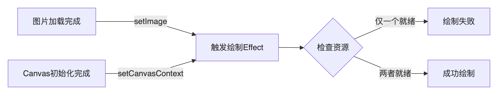
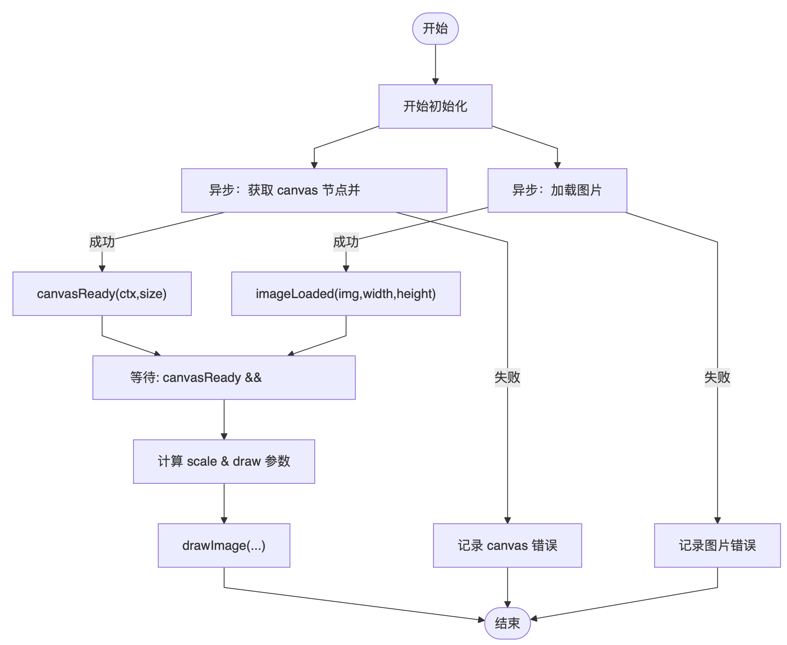
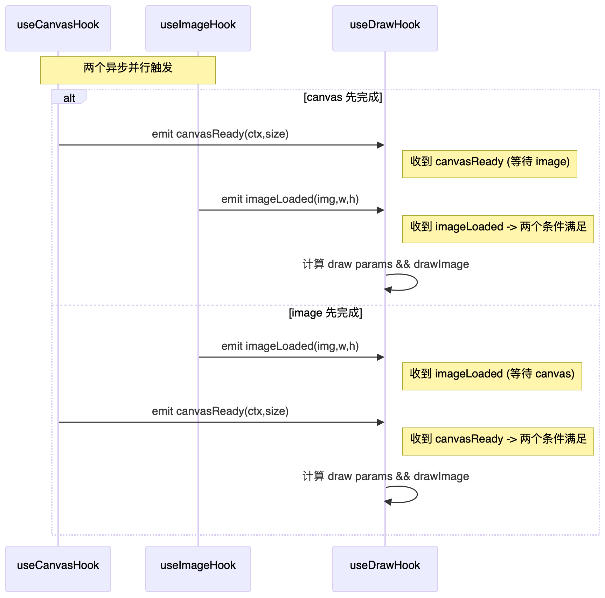
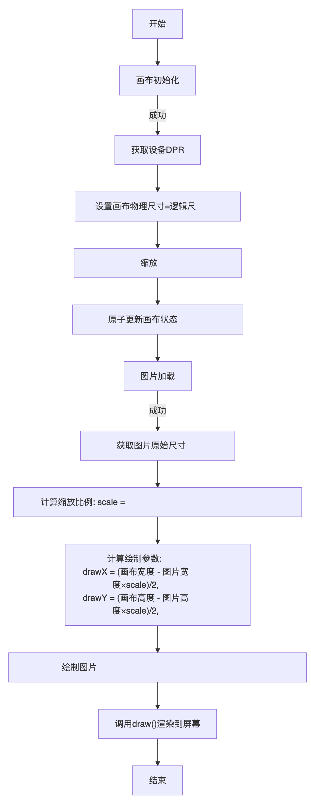
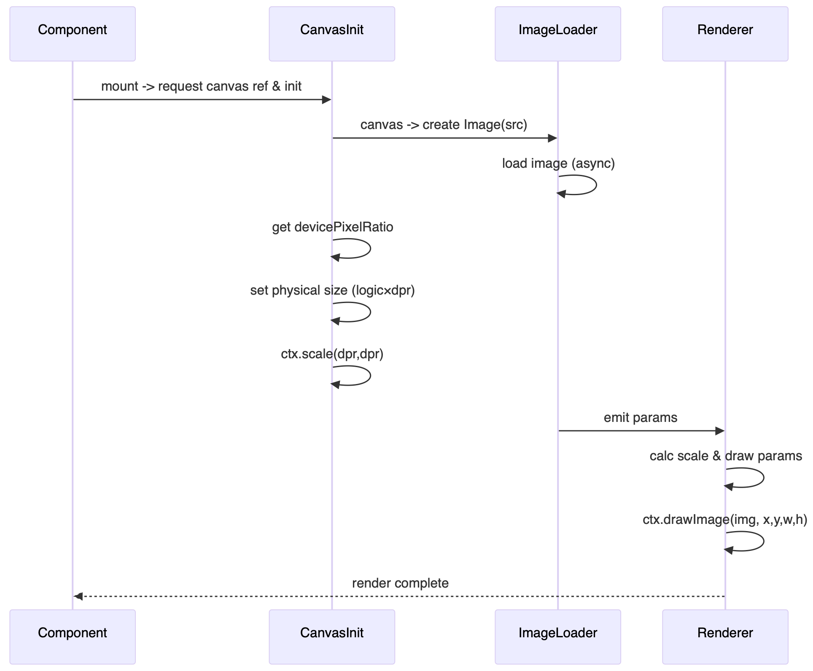

# useEffect 异步业务时许问题

> 介绍一下关于细粒度拆分导致的 useEffect 时序混乱的问题

**项目背景**：Taro（微信小程序） + Canvas 画布标注绘制

**功能介绍**：用户上传图片 ➡️ 画布绘制图片 ➡️ 画布绘制标注


## 拆分 Hook 

面对这样的业务，主要围绕三个 API 展开：`Taro.getImagePath`，`Taro.createSelectorQuery().select('#canvas-id')` ，`context2D.draw()`。

- 调用 Taro 封装的获取图片接口得到图片对象，并从中获取到图片的尺寸用于画布层绘制
- 通过查询 dom 来获取一个 Canvas 实例并得到对应的上下文
- 通过 Canvas 的上下文提供的 API 开始绘制图片+标注

通常基于此我们就会对这些业务用 Hook 进行封装，例如 `useImage`、`useCanvasDOM`、`useDraw`。这样看上去每个 Hook 之间各司其职，代码模块分割也足够整洁，一切似乎有条不紊地展开，假如所有代码都是同步且严格按照 hook 顺序执行的的话。

```js
// 同步逻辑下一切井然有序
useEffect(()=>{
  Taro.getImageInfo({
    src,
    success:(res)=>{
      setImage(res)
     	await res.decode()
    }
  })
},[src])

useReady(()=>{
  const query = Taro.createSelectorQuery();
        query
          .select(`#${canvasId}`)
          .fields({ node: true, size: true })
          .exec(async (res) => {
            if (res && res[0]) {
              const canvas = res[0].node;
              const ctx = canvas.getContext("2d");
              setCanvasContext(ctx);
            }
          });
})

useEffect(()=>{
  context.drawImage();
},[image,context])

```

然而，很不幸的，在以上过程中，加载图片和查询 dom 这两个核心业务并不是同步处理的。这就会让绘制的复杂情况陡然上升。



## 异步导致的时序问题

1. **图片未加载**
   
    在执行 `setImage()` 后，图片对象已经存在了，但我们的图片还未加载，此时直接 drawImage 势必导致 canvas 绘制失效。

    ```js
    //	解决方法：补充图片加载的代码，等图片加载完再设置 image
    Taro.getImageInfo({
        src,
        success:(res)=>{
          await res.decode()
          setImage(res)
        }
      })
    ```

2. **Canvas 对象未加载**

   由于在 Taro 中 selector 执行也是异步的，为了避免 Canvas 未加载我们也只能写出如下的代码，对团队代码提出高标准要求

   ```js
   Taro.createSelectorQuery().select(`#${canvasId}`).exec(async (res) => {
         if (res && res[0]) {
           const canvas = res[0].node;
           const ctx = canvas.getContext("2d");
           //	这里如果涉及到任何操作都需要保证代码顺序，否则可能会下文的 effect 冲突
           setCanvasContext(ctx);
         }
   });
   
   useEffect(()=>{
     //	考虑 Canvas 和 image 未加载的情况
   	if(!image || !context) return;
     context.drawImage();
   }, [image, context])
   ```

3. **滥用临时状态来保证各类异步加载的顺序**

   面对这些异步代码往往会加很多过程中的状态来进行区分，这样大大增加了后续使用 useEffect 的心智成本，甚至是链式增加，每一个要后续使用到这个上下文的都需要补充一个 `querying` 的判断

   ```js
   const [querying,setQuerying] = useState(false)
   
   setQuerying(true)
   Taro.createSelectorQuery().select(`#${canvasId}`).exec(async (res) => {
         if (res && res[0]) {
           const canvas = res[0].node;
           const ctx = canvas.getContext("2d");
           setCanvasContext(ctx);
           //	解放代码顺序
           setQuerying(false)
         }
   });
   ```

4. **指数膨胀的处理逻辑**

   在业务变得更复杂时:

   1. 如在画布初始化完成后，还需要根据移动设备的 `DPR` 进行画布缩放适配，这个过程严格要求在画布初始化完成后，图片绘制之前。
   2. 还需要根据图片的尺寸以及画布信息将图片自适应缩放到图片中心。
   
   那这时候依照上面的方法，我们是不是需要继续把控代码顺序、控制各种临时状态呢？还是开始使用 `nextTick + setTimeout + requsetIdleCallback` 等能使用到微任务的方法来执行各种细粒度的执行顺序区分呢？
   
  
   
   时序图里面需要包含两个异步并行的场景
   
  


## 最佳实践   

**优先从业务需求的功能层面去梳理，而不是为了拆分 Hook 而拆分。**

这里的业务其实是比较简单的：加载图片初始化画布，根据 DPR 调整画布，调整画布后将图片自适应缩放到画布中间，最后在画布上绘制标注。对这个过程进行封装的时候，主要可以分为两层

**初始化层：封装异步加载逻辑**

1. 通过选择器找到画布并初始化画布上下文
2. 在选择器查询的上下文中加载图片
3. 查询用户的 DPR 并调整一下画布的缩放系数
4. 保存画布上下文对象以及图片信息

**绘制动作层：封装同步绘制动作**

1. 获取到画布上下文对象以及图片信息**（一定能同时拿到）**
2. 将图片自适应缩放到画布中间并绘制
3. 绘制标注


通过这两层，我们完全可以将异步的初始化加载过程都封装到一起，这样即使我们需要保证代码顺序或者使用临时状态，那这种状态的处理也只有一个，比每次新增一个异步 hook 都维护一个状态要好得多。

从「绘制动作层」的角度来看，可以直接忽略到异步的过程，所有信息都是同步的，如果 `props` 或者 `provider` 未提供，则说明加载出来问题，不仅很容易屏蔽了复杂的加载过程，还方便开发时排查问题。


## 附图

完全串行的代码逻辑



串行的时序图


