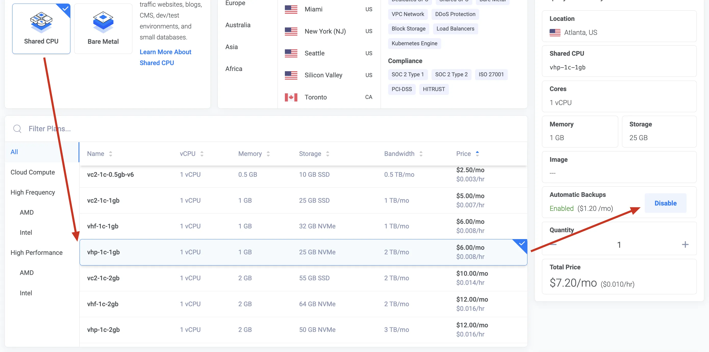
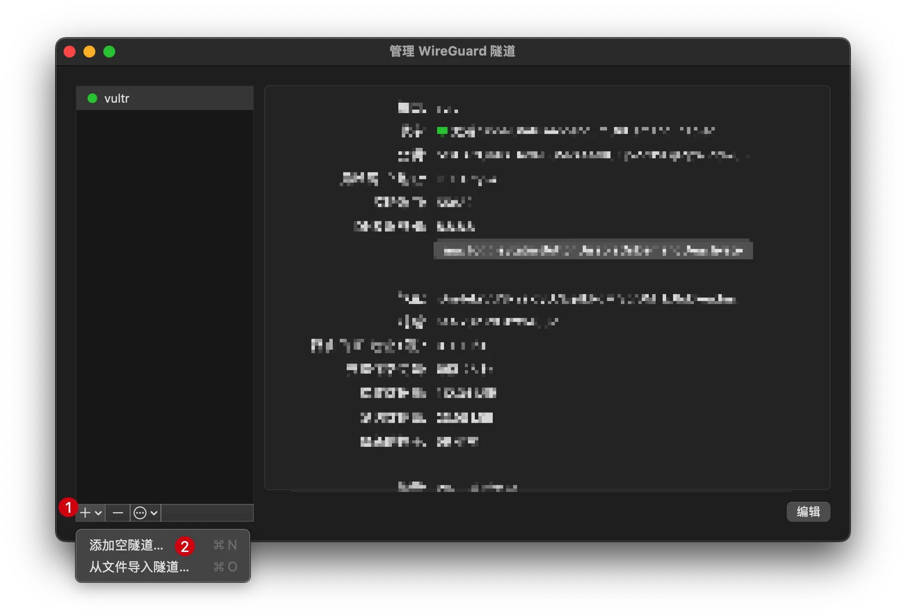
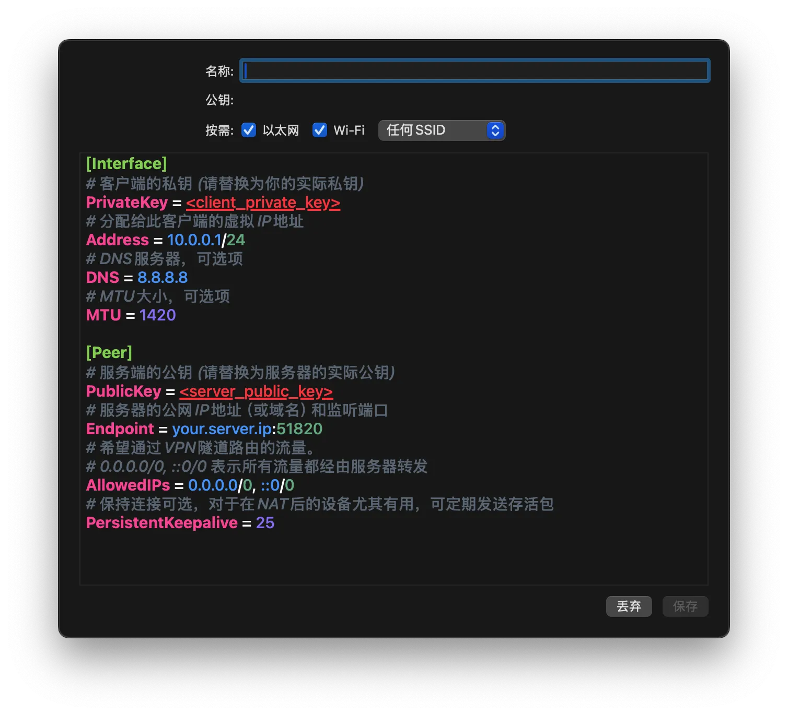

# vultr 老司机

## 优惠券

1. 谷歌搜索：*「2025年8月Vultr优惠码整理」*，找一个充一送一的优惠券

2. 注册帐号


## 选机

1. 选最便宜的 vCPU 云服务器（vc2-1c-0.5gb-v6），1CPU + 0.5 内存 + 1TB 流量

2. 选最的 vCPU 云服务器（vhp-1c-1gb），1CPU + 1 内存 + 2TB 流量 

   

3. 酌情考虑是否使用自动备份方案，这里是 VPS 我就不使用备份的费用了。

4. 充值美元，充值一年的机器着使用选机的金额x6 即可，记得在左上角填入对应的优惠码！！！


## 服务端配置

服务器安装 `wire-guard`

```bash
# 以 centent os 为例
sudo dnf install wireguard-tools

# 生成密钥
sudo umask 077
sudo mkdir -p /etc/wireguard
cd /etc/wireguard

# 生成服务器私钥和公钥
sudo wg genkey | tee privatekey | sudo wg pubkey > publickey

#生成客户端私钥
sudo wg genkey > client1.key

# 通过客户端私钥生成密钥
sudo wg pubkey < client1.key > client1.key.pub

# 记住四个密钥分别的内容

# 创建配置文件
touch /etc/wireguard/wg0.conf
vim /etc/wireguard/wg0.conf
```

`/etc/wireguard/wg0.conf` 配置表

```ini
# wg0.conf
[Interface]
Address = 10.0.0.1/24
ListenPort = 51820
PrivateKey = <SERVER_PRIVATE_KEY>
PostUp = firewall-cmd --add-port=51820/udp && firewall-cmd --add-masquerade
PostDown = firewall-cmd --remove-port=51820/udp && firewall-cmd --remove-masquerade

[Peer]
PublicKey = <CLIENT_PUBLIC_KEY>
AllowedIPs = 10.0.0.2/32
```

启动 `wire-guard`

``` bash
# 开启 ipv4 转发
echo 'net.ipv4.ip_forward = 1' | sudo tee /etc/sysctl.d/99-wireguard.conf
sudo sysctl -p /etc/sysctl.d/99-wireguard.conf

# 启动并启用服务
sudo systemctl enable wg-quick@wg0

# 将 wg0 接口添加到 trusted 区域
sudo firewall-cmd --permanent --zone=trusted --add-interface=wg0

# 检查防火墙
sudo firewall-cmd --list-all

# 保证 masquerade: yes
sudo firewall-cmd --permanent --add-masquerade
sudo firewall-cmd --reload
```


## 客户端配置

1. 安装 WireGuard 客户端

   

2. 配置隧道

   ```ini
   [Interface]
   # 客户端的私钥 (请替换为你的实际私钥)
   PrivateKey = <client_private_key>
   # 分配给此客户端的虚拟IP地址
   Address = 10.0.0.1/24
   # DNS服务器，可选项
   DNS = 8.8.8.8
   # MTU大小，可选项
   MTU = 1420
   
   [Peer]
   # 服务端的公钥 (请替换为服务器的实际公钥)
   PublicKey = <server_public_key>
   # 服务器的公网IP地址（或域名）和监听端口
   Endpoint = your.server.ip:51820
   # 希望通过VPN隧道路由的流量。
   # 0.0.0.0/0, ::0/0 表示所有流量都经由服务器转发
   AllowedIPs = 0.0.0.0/0, ::0/0
   # 保持连接可选，对于在NAT后的设备尤其有用，可定期发送存活包
   PersistentKeepalive = 25
   ```

   