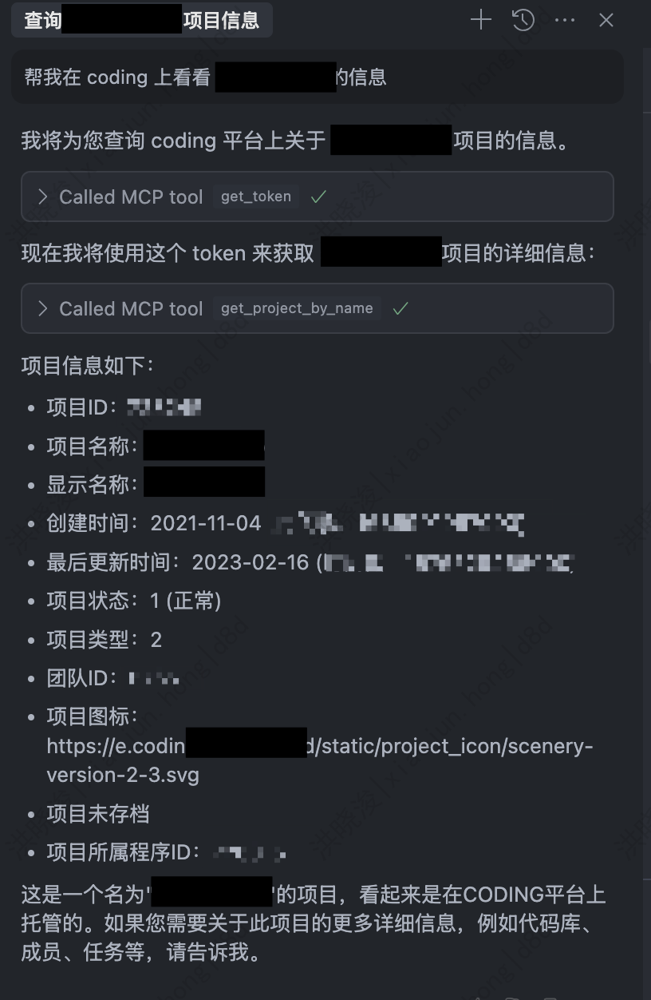

# 如何写一个自己的 MCP 

**diy-devops-mcp-nodejs**

内部开源的 MCP 服务，主要用于管理 DevOps，包括 PR 合并审查、代码仓库查询、敏捷迭代管理、产品需求复盘等命令。

<br/>

## 使用 TypeScript 开发一个 MCP

**MCP：model 模型 context 上下文 protocol 协议，模型上下文协议。**

- 模型：大模型

- 上下文：对一类内容的解释

- 协议：统一格式的约定


**为什么通过 MCP 就能实现将 AI 链接到 Coding 呢？**

1. 必要条件是模型足够聪明，模型能够从庞杂的数据里面找到相关信息并收集汇总，提炼重点。

2. 我们通过上下文告诉了模型去哪里能获取到什么样的信息。

3. 通过统一约定的格式和所有模型都打好交道，每个模型都知道能理解我们的信息。


**具体干了啥？**

Coding 提供了完整的 OpenAPI 能力，我们把这些 API 作为 Tool 并把接口文档作为上下文发给了模型，模型通过这些接口拥有了操作 Coding 和查询 Coding 的能力。

<br/>


### 实现一个 MCP Server 

首先需要一个开发包 [Model Context Protocol](https://github.com/modelcontextprotocol)  提供五种语言开发，我们这里以 TypeScript 为主。

#### 1. 准备工程

创建一个文件夹并初始化一个项目，命令行：`pnpm init -y` ，直接修改项目 package.json，支持 SDK 开发相关的配置依赖。

```json
{
  "type": "module",
  "bin": {
    "coding": "./build/index.js"  // 注意这里不要出现命令的保留字
  },
  "name": "coding-mcp",  // MCP 的名称
  "version": "1.0.0",
  "description": "Coding MCP Server NodeJS Version 1.0.0",
  "main": "index.js",
  "scripts": {
    "build": "tsc && node -e \"require('fs').chmodSync('build/index.js', '755')\""  // 编译命令
  },
  "files": [
    "build"
  ],
  "keywords": [
    "mcp",
    "coding",
    "mcp-server",
    "mcp-nodejs"
  ],
  "dependencies": {
    "@modelcontextprotocol/sdk": "^1.9.0",  // MCP 的 SDK
    "zod": "^3.24.2"  // 数据校验库
  },
  "devDependencies": {
    "@types/node": "^22.14.1",  // Node.js 的类型声明
    "typescript": "^5.8.3"  // TypeScript
  }
}
```

安装项目依赖，完成项目工程的前置工作，命令行：`npm i` ，到这一步，我们就已经安装了 SDK 以及对应开发需要使用到的依赖库  

<br/>
    
#### 2. 开始使用 SDK

新建一个 index.ts 

```typescript
import { z } from 'zod';
import { McpServer } from '@modelcontextprotocol/sdk/server/mcp.js';
import { StdioServerTransport } from '@modelcontextprotocol/sdk/server/stdio.js';
import { DescribeProjectByNameRequest, describeProjectByName } from './api';

//  初始化一个 MCP 服务器
const server = new McpServer(
  {
    name: 'Coding-MCP-Server',  // MCP 的名称
    version: '1.0.0',
  },
  {
    capabilities: {
      tools: {  // 工具列表
        'get-token': {
          description: 'Get the API Token',  // 工具描述
        },
        'get-project-by-name': {
          description: 'Get project details by project name',  // 工具描述
        },
      },
    },
    instructions:  // 指令，让模型知道这个 MCP 是做什么的
      '该MCP服务用于获取Coding代码托管平台上的代码信息、合并请求信息，以及执行合并请求操作等代码仓库管理功能。Coding是一个提供代码托管、项目协作与开发流程管理的平台。',
  },
);

// 工具具体实现，这里通过环境配置的方式获取 API Token
server.tool('get-token', '获取当前用户的API Token用于后续的API请求', async () => ({
  content: [{ type: 'text', text: process.env.CODING_TOKEN || '' }],
}));

// 工具具体实现，请求参数校验，获取项目详情的结果
server.tool(
  'get-project-by-name',
  '获取项目详情，需要提供项目名称',
  {
    projectName: z.string().describe('项目名称'),
  },
  async (request: DescribeProjectByNameRequest) => {
    const { projectName } = request;

    const project = await describeProjectByName({ projectName });
    return {
      content: [{ type: 'text', text: JSON.stringify(project) }],
    };
  },
);

// 连接 MCP 服务器
const transport = new StdioServerTransport();
await server.connect(transport);
```

再写一个 `api.ts`，这里主要是定义了请求和响应的接口，以及具体的实现。

```typescript
// 编写良好的类型定义可以提高代码的可读性，减少错误，并能让模型知道我们请求和响应的参数是什么
export interface DescribeProjectByNameRequest {
  projectName: string;
}

export interface DescribeProjectByNameResponse {
  RequestId: string;
  Project: Project;
}

export interface Project {
  Id: number;
  Name: string;
  DisplayName: string;
  Description: string;
  CreatedAt: number;
  UpdatedAt: number;
}

const USER_AGENT = 'coding-mcp/v1.0.0';  // 用户代理
const CODING_API_URL = 'https://e.coding.xxx.cloud/open-api?Action=';  // Coding API 地址

/**
 * 获取项目详情
 * @param request 请求参数
 * @returns 项目详情
 */
export async function describeProjectByName(request: DescribeProjectByNameRequest): Promise<DescribeProjectByNameResponse> {
  const response = await fetch(`${CODING_API_URL}DescribeProjectByName`, {  // 请求地址，可以拼接具体的 API 地址
    method: 'POST',
    headers: {
      Authorization: `Bearer ${process.env.CODING_TOKEN}`,  // 校验 API Token
      'Content-Type': 'application/json',  // 请求头，可以拼接具体的 API 地址
      'User-Agent': USER_AGENT,  // 请求头，可以拼接具体的 API 地址
    },
    body: JSON.stringify({
      Action: 'DescribeProjectByName',  // 请求参数，可以拼接具体的 API 地址
      ProjectName: request.projectName,  // 请求参数，可以拼接具体的 API 地址
    }),
  });

  return response.json() as unknown as DescribeProjectByNameResponse;  // 返回项目详情
}
```

编写一个 `tsconfig.json` 来配置一下编译信息

```json
{
  "compilerOptions": {
    "target": "ES2022",
    "module": "NodeNext",
    "moduleResolution": "NodeNext",
    "outDir": "./build",
    "rootDir": "./",
    "strict": true,
    "esModuleInterop": true,
    "skipLibCheck": true,
    "forceConsistentCasingInFileNames": true
  },
  "include": [
    "index.ts",
    "api.ts"
  ],
  "exclude": [
    "node_modules"  // 排除 node_modules 目录
  ]
}
```

用命令行来编译一下，编译完成的构建产物在 build 目录下，`命令行：npm run build`

<br/>

#### 3. 引入到 Cursor 里面

```json
{
  "mcpServers": {
    "coding-mcp-test": {
      "command": "node",
      "args": ["$ROOT/build/index.js"], // 临时动态编译的，构建产物地址
      "env": {
        "CODING_TOKEN": "$CODING_TOKEN", // 环境变量，可以拼接具体的 API Token
        "CODING_PROJECT_NAME": "$PROJECT_NAME" // 环境变量，可以写默认的一个项目
      }
    }
  }
}
```

这里需要修改三个地方

- `$ROOT`：看一下构建产物放在具体哪个位置

- `$CODING_TOKEN`：在 Coding 上创建授权令牌

- `$CODING_PROJECT_NAME`：看具体项目的名称要用哪个

如果都配置完成编译成功了，应该可以看到出现一个小绿标提示成功

<br/>

#### 4. 在 Cursor Agent 模式下使用看看

这样我们就已经得到了一个 MCP 了，在 Cursor Agent 模式下使用看看，进行完善的链式调用，实现更复杂的功能。测试通过之后就可以发布到 NPM 制品仓库给团队内部使用了。



<br/>

## 安装与配置 MCP

### 1. 安装 Node.js

请先安装 [Node.js](https://nodejs.org/en)。


### 2. 登陆 CODING 并配置令牌
> coding 为公司内部使用的代码管理平台

1. 访问 [CODING NPM 包地址]() 获取令牌。

2. 令牌操作：密码为 CODING 密码。

  ```bash
  # 登陆 coding
  npm config set registry=https://devops-npm.pkg.coding.xxxx.cloud/xxx-xxx/npm
  # 账号登陆
  npm login
  ```

3. 全局安装 MCP 服务

  ```bash
  # 全局安装一下依赖
  npm install --global @xxx/coding-mcp@1.0.2 --registry=https://devops-npm.pkg.coding.xxxx.cloud/xxx-xxx/npm/
  ```


### MCP 配置

```json
{
  "mcpServers": {
    "@xxx/coding-mcp": {
      "command": "npx coding-mcp",
      "env": {
        "CODING_TOKEN": "$TOKEN",
        "CODING_PROJECT_NAME": "xxx-xxx",
        "CODING_DEPOT_NAME": "xxx-project"
      }
    }
  }
}
```

在 Setting / MCP Servers 中重新连接后可以看到 MCP 服务已经存活。在 Agent 中即可立即使用 MCP 咨询产品需求，代码仓库查询，敏捷迭代管理，产品需求复盘等命令。

