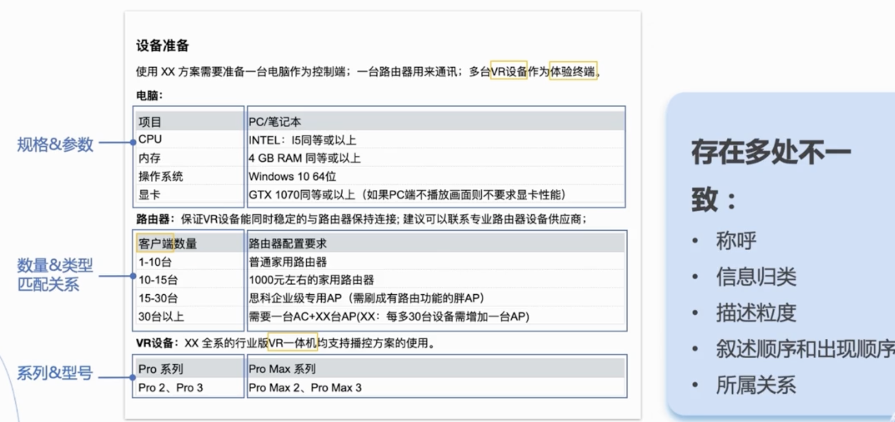

# 技术写作原理

## 了解读者

> 1. 明确身份
> 2. 明确读者阅读的目的
> 3. 明确读者需要的信息（读者的认知水平）

 

### 平衡信息差-核心

知识诅咒｜知识陷阱，越深入体会一个东西就越无法理解不熟悉的用户的体会。

### 信息差来源

- 术语
  - 使用标准的术语
  - 一个意思用同一个术语
  - 提供术语解释
- 相似物
  一个产品提供两种相似的功能，需要帮助读者解析。以 SDK 举例，不同平台可能有一些功能是不被支持的，需要及时澄清
- 新事物
  所有在文档中新出现的事物，都需要充分解释并告知来源

### 怎么做？

1. 走进读者（时间精力成本）

   - 把身边的同事当成受众，邀请同事评审
   - 读者访谈，找到目标用户进行访谈
   - 文档支持群，搜集用户的问题

2. 头脑风暴
   - 读者是谁从哪来？他们有什么目标，基于什么背景，遇到什么困难，处于什么状态
   - 读者在哪？读者的状态，在什么文件下，下一个指令是什么，会遇到什么问题
   - 读者要去哪？为什么我们要告诉读者这些信息，对读者有什么帮助

#### 案例

1. 统一术语
2. 需要对新事物的接受完全（出现花屏是新事物，上下麦瞬间是新事物）
3. 关注主语，具体是什么东西发生了什么事，对什么东西产生了怎样的影响

---

## 结构化写作

> 不着急写标题，先搭建框架，结构化写作的过程就是有效的组织信息，从无序到有序的过程

### 概念介绍

#### 核心：先框架后细节，先整体再局部

- 理清信息的逻辑关系
- 无序信息排序成有序
- 创建顺畅的信息流
- 提炼和组织内容

#### 作用：理清写作思路、降低阅读成本

- 写作思路，找出写作的方向和重点
- 降低成本，获取重点信息，找到核心信息

#### 方法：

1. 整理框架
2. 填充信息
3. 结构化呈现

### 1. 搭建框架

#### 纵向关系：层层延伸可以形成文档的主干

- 结论先行
- 以上统下，使得结论更加可信

#### 横向关系：补充文章的脉络

- 归类分组，把相关联的信息进行分类，探寻事物、问题的本质
- 逻辑递进，梳理信息之间的关系

#### 案例

1. 搭建框架「找问题（结论先行），写章节（以上统下）」

   

2. 填充必要信息「可以在各节点上，进行 “搭建框架” 的工作」

   

### 2. 结构化的呈现方式

- 有序列表
- 无序列表
- **表格（这里需要善用，本人就不咋用）**

---

## 写好标题

> 先框架，后标题，提取核心精炼内容

### 主标题：核心内容

副标题：补充主标题

- 分标题：承上启下，清晰文章脉络

### 什么是好的标题

- 精简凝练，越简短越阐明意思
- 准确清晰，了解文档主要内容

**SPA 原则**

- Simple 简洁，标题不宜过长，十个中文字符内，保留核心关键字
- Profit 利益相关，标题体现的目标读者关注的内容
- Accurate 准确客观，没有主观信息，概括文章本质

### 公式

---

## 极简化

> 了解用户、结构化写作是为了写出满足读者期待，符合规范的问题，极简化就是在这个基础上减少成本

### 概念

`Big idea in a simple way` ： 简化理解成本，用最精炼的语言提取最有价值的信息

- 节省时间
- 节约成本
- 易于理解

### 核心

**先讲结果、再讲过程**

- ~~输入 run 可以运行程序~~
- 需要运行程序，则输入 run

### 方法

- 保持一致（术语、表达方式）
- 避免啰嗦（去掉口语化，整合信息，要求时常回顾，需要经常训练）
- 提供路径索引（方式多样）
  - 3W 原则故事线，是什么为什么怎么样
  - 精炼的标题
  - 主题内容结束后，告知下一步学习的方向

### 案例

#### 参考性文档：保持一致

问题点：

- 称呼名词不一致
- 信息归类不一致，表格的阅读习惯多变，每一张表都要换个思路
- 叙述不一致，路由器、VR 设备都有简洁，电脑没有
- 逻辑关系不一致，在提及 VR 前就说了路由器，会让人产生两者的关联性
  
  技巧：一表大于多表

#### 概念文档：避免啰嗦

- 书面化的表达
- 叙述逻辑调整：讲背景（重要性）→ 痛点（解决的问题，回归重点）→ 怎么做（落地）

#### 操作型文档

- 没有索引，安装很笼统，安装什么？
- 没有引导，插件在哪，步骤在哪
  

---

## 检查文档

> 以批判者的角度来审查信息，核心提升文档的一个步骤

### 原理

先冷却再检查

1. 主题，主题是否明确，是否符合读者目标，文章是否跑题
2. 结构，结构化写作，是有按照逻辑，是否结论先行、以上统下、分组归类、逻辑递进
3. 标题，SPA
4. 内容，是否精炼
