# 操作系统原理

## 第一章 操作系统概述 P9

### 1.1 操作系统概念

操作系统是系统软件，是用户与计算机之间的接口，基本职能是**控制和管理系统内部的各种资源**，有效地组织多道程序的运行，**扩充硬件功能**。从

- **作为扩展机器的操作系统**把硬件细节与程序员隔离开，实际客户是应用程序
- **作为资源管理的操作系统**的功能是管理系统中的硬件资源和数据、程序等软件资源，控制协调各个程序对这些资源的利用，涉及资源共享的问题。操作系统是计算机系统的资源管理器这种观点占主导地位

- 用户观点：操作系统处于用户和硬件之间，有助于用户使用计算机系统的接口和各种资源
- 系统观点：操作系统是硬件上第一层软件，管理*硬件资源和软件资源*的分配问题，是资源分配者
  （_操作系统要对 IO 设备和用户程序加以控制，防止非法操作，这样看操作系统就是控制程序_）
- 进程管理观点：进程是程序在并发环境中的执行过程

与操作系统相关的几种主要寄存器: **用户可编程寄存器以及控制与状态寄存器**。
**用户可编程寄存器**是机器语言或者汇编语言可以进行操作的寄存器，如数据、地址、条件码寄存器
**控制与状态寄存器**可以被处理器用来控制自身操作，或者被有特权的操作系统例程用来控制相关程序的执行。如 PC（程序计数器）、IR（指令）、PSW（程序状态字）寄存器等

CPU 能执行的全部指令集合称作**指令系统或指令集**，**特权指令**用于操作系统或者其他系统软件，主要用于系统资源的分配和管理；用户使用的是**非特权指令**，如算术运算和访管指令。

CPU 运行模式：**内核态和用户态**（与 PSW 有关）

**中断和异常**是实施并发的基础，由硬件和软件结合而成，中断来自 CPU 外，异常来自 CPU 内

系统初启的一般过程：

1. **硬件检测**：BIOS 加电进行硬件自检，然后读入系统引导区的程序，并将系统控制权交给引导装入程序
2. **加载引导程序**：其不直接引导操作系统，但能根据盘区划分的信息找到活动分区，然后从其中将引导程序读入内存；**运行引导程序**，从硬盘中读入其他几个软件，由后者**加载内核**；内核加载完毕后系统跳到 setup 程序，在实模式下运行，设置系统参数和显示器；**最后进入保护模式**跳到内核映像开头，**执行内核初始化**。
3. **初始化内核**：
   - 第一个阶段是**CPU 本身初始化**：设置内核页表、启动页面映射机制、建立系统第一个进程、初始化内核的全局变量和静态变量、设置中断向量表等；
   - 第二个阶段是**系统一些基础设施的初始化**：设置内存边界、初始化内存页面、设置各种处理程序入口地址、定义系统中最大进程数目、创建 init 内核线程等
   - 第三个阶段是**对上层的初始化**：初始化外部设备、加载驱动、创建核心线程、初始化文件系统并加载
4. **实现用户登录**：init 程序在 tty 每个端口上都创建一个进程 login，用于登录

**操作系统的构建目标**：**高效性**（对软硬件资源合理的调度和分派）、**方便性**（操作系统对外提供接口，方便用户使用）、**安全性**（保护信息不被未授权人员使用）、**鲁棒性**（稳定性、强健性）、**移植性**（从一个硬件平台到另一个平台时的改动不能过多且要容易实施）

软件分类：**系统软件**（操作系统、编译、汇编、链接、数据库、网络程序）、**应用软件**、**支撑软件**（辅助软件技术人员从事软件开发的工具）

**操作系统是整个计算机系统的控制管理中心**，经过软件扩充功能后的机器称为“虚拟机”

操作系统提供的服务：用户接口、程序执行、IO 操作、文件系统管理、出错检测、通信、资源分配、统计、保护。
操作系统的服务方式是**系统调用和系统程序**

- 系统调用：一般处于操作系统核心的最高层，CPU 执行用户程序中的系统调用时，处理机的状态会从用户态变成核心态，进入操作系统内部；而过程调用只能在用户态下运行，不能进入核心态，系统调用完成了用户态到核心态的转变。系数调用可以大致分为五类：进程控制、文件管理、设备管理、信息维护和通信
- 系统程序：系统程序主要指系统程序包（库函数）中提供的大量系统程序。大概分为六大类：文件管理、状态信息、文件修改、程序设计语言的支持、程序装入和执行、通信。最重要的系统程序是命令解释程序，系统程序是对系统调用功能的集成和应用简化

### 1.2 操作系统的功能

OS 应当具有的五大基本功能：存储管理、进程和处理机管理、文件管理、设备管理、用户接口

1. **存储管理**：用户程序在运行之前要装入内存，**内存是所有运行程序的共享资源**，存储管理的主要功能为：内存分配、地址映射、内存保护和内存扩充

   - **内存分配**：主要任务是为每道程序按某种策略来分配一定的内存空间，并且接收释放的空间

   - **地址映射**：编写程序时不需要考虑程序和数据要存放在内存的什么位置，CPU 在执行用户程序的时候要从内存中取出指令或数据，就必须把逻辑地址转换成内存的物理地址，这叫地址映射需要有硬件支持

   - **内存保护**：不同用户的程序都在内存中，必须保证它们在各自的内存空间中活动，不能相互干扰，不能侵犯其他空间，必须建立内存保护机制。可以设置两个界限寄存器（上界地址和下界地址）

   - **内存扩充**：逻辑扩充使用虚拟存储技术，一个程序不是全部放在内存中，其余部分放在磁盘上，以后根据程序执行时的要求和内存情况，随机将所需部分调入内存或回收已分配的内存

2. **进程和处理机管理**：**所有用户程序和系统程序都必须在 CPU 上运行**，对它的管理直接影响整个系统的性能，主要包括：**作业和进程调度、进程控制、进程同步和进程通信**
   - 作业和进程调度：用户的计算任务称为**作业**，程序的执行过程称作**进程**，**进程是分配和运行处理机的基本单位。**首先作业经过**作业调度**，把一批选中的**作业放入内存并为其分配资源**，**建立相应的进程**，然后**进程调度**按一定的算法从就绪进程中**找出一个合适进程在 CPU 上运行**
   - 进程控制：进程是系统活动的主体，进程控制包括创建进程、撤销进程、封锁进程、唤醒进程
   - 进程同步：多个进程在活动过程中彼此彼此会发生相互依赖或制约等关系，为了保证所有进程都能正常活动就必须设置进程同步机制：分为同步和互斥
   - 进程通信：相互合作的进程之间往往需要交换信息，为此系统要提供通信机制
3. **文件管理**：在计算机工作经常要建立文件、打开文件、对文件读写等，所以文件管理功能应该包括：文件存储空间的管理、文件操作的一般管理、目录管理、文件读写管理和存储控制
   - 文件存储空间管理：系统文件和用户文件存放在磁盘上，需要由文件系统对所有文件以及文件的存储空间进行统一管理：为新文件分配必要的外存空间，回收释放的文件空间
   - 文件操作：对文件的创建删除打开关闭等
   - 目录管理：目录文件的组织、实现“按名存储”，目录快速查找和文件共享
   - 文件读写管理和存取控制：按请求从外存读或者写入外存，防止未授权用户破坏
4. **设备管理**：设备的分配和驱动由 OS 负责，设备管理的主要功能包括缓冲区管理、设备分配、设备驱动和设备无关性
   - 缓冲区管理：解决 CPU 和外设速度不同的问题
   - 设备分配：根据请求为用户分配设备
   - 设备驱动：实现 CPU 与通道和外设之间的通信，屏蔽硬件细节
   - 设备无关性：用户写的程序（逻辑设备）和实际使用的物理设备无关，由 OS 映射到物理设备
5. **用户接口**：OS 对外提供的多种服务，使用户方便有效地使用计算机硬件和用户程序
   - 程序接口：也称系统调用，是 OS 内核和用户程序应用程序的接口，只能在核心态下运行
   - 命令行接口：OS 与用户的交互界面，输入命令后程序解释这些命令，交给 OS 内部程序处理
   - 图形用户接口：用户利用图形界面工具操作计算机

### 1.3 操作系统的特征

OS 特征为:并发、共享、异步性和抽象性

- 并发：微观上单个进程在 CPU 上执行，进程交替运行，宏观看是并行
- 共享：资源被多个任务共用，被共享的程序必须是纯码（在执行过程中本身不作任何变化）
- 异步性：进程执行过程中“走走停停”，但在相同初始数据下总能得到同样结果
- 抽象性：把复杂的事情简单化

### 1.4 操作系统的形成和基本类型

OS 的形成和发展：手工操作阶段、早期批处理阶段（联机批处理，脱机批处理）、多道批处理系统、分时系统、实时系统（后三种是传统意义上 OS 的基本类型）

**多道程序设计**的基本思想是，在内存中同时存放多道程序，在管理程序的控制下交替地执行

分时系统的特征和优点：同时性、交互性、独立性、及时性

实时系统的类型：过程控制、信息查询、事务处理系统，其实现可分为软式硬式两种方式

### 1.5 操作系统的主要结构

OS 主要有单体结构、层次结构、虚拟机结构、微内核结构和客户-服务器结构

- 单体结构：OS 中有大量模块，模块就是完成一定功能的子程序，是构成软件的基本单位
- 层次结构：把模块分为若干层，底层不能调用高层
- 虚拟机结构：最底层是虚拟机监控程序，向上层提供多台虚拟机，虚拟机是裸机硬件的复制品。是通过共享物理机器资源实现的，每台虚拟机可以使用不同的操作系统，在系统调用时陷入自身的操作系统里面，最后的 IO 操作由虚拟机监控程序完成
- 微内核结构：把扩展机器功能向上移，操作系统被分为文件服务、进程服务、终端服务或者内存服务，各个服务器在用户态下运行并不直接访问硬件，客户进程通过微内核访问服务，因此微内核在核心态下实现所有操作系统的基本功能：中断处理、进程管理等
- 客户-服务器结构：多用于分布式系统，进程如微内核结构分为两类：服务器和客户进程

### 1.6 UNIX | LINUX 系统的核心结构

UNIX 是多用户、多进程、多任务的分时系统，其分为三层：靠近硬件的底层是内核即 UNIX 常驻内存部分，核外中间层是 shell 层，最高层是应用层

LINUX 和 UNIX 一样多用户和多任务，从结构上看是采用单体结构的操作系统，所有的内核系统功能都包含在一个大型的内核软件之中
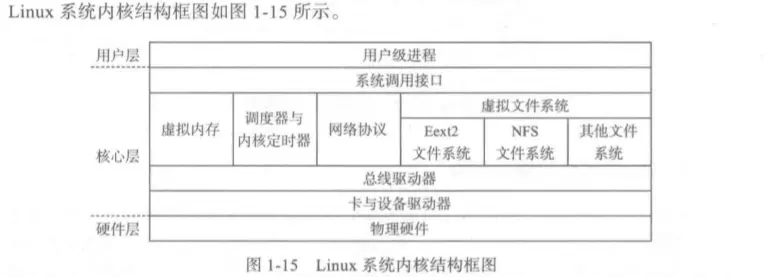

 

## 第二章 进程管理 P42

### 2.1 进程概念

进程和程序的区别：

1. 动态性：程序是静态的，进程是动态的，程序作为一种软件资源长期保留，而进程是程序的一次执行过程，动态的产生和销毁
2. 并发性：进程作为资源申请和调度单位存在，而程序不能作为独立运行的单位并发执行，因为进程不仅包括相应的程序和数据，还有一系列描述其活动的数据结构，能用于 CPU 调度
3. 非对应性：一个程序可以被多个进程共用，一个进程可以在活动中执行若干程序
4. 异步性：各个进程在并发执行时会产生互相制约关系，导致前进速度不可预测

进程的特征：动态性、并发性、调度性、异步性、结构性

### 2.2 进程状态描述及组织方式

进程映像：程序、数据集合、栈和**PCB**（进程控制块）| 栈用来保存过程调用和相互传参的踪迹

- 进程控制块 PCB：**进程名 PID**、**状态信息**、特征信息、**优先级**、通信信息、**现场保护区**（中断时保存现场环境）、**资源需求**、实体信息、族系关系、其他。
- LINUX 中进程控制块为 task_struct 数据结构，系统维护一个进程向量组 task，元素是指向 task_struct 结构的指针，进程的栈和 task_struct 数据结构紧密联系
  

LINUX 进程状态：运行态、可中断等待态（可被中断唤醒）、不可中断等待态（只能等待资源满足唤醒）、停止态、僵死态（进程被种子但是进程控制块依然保留着）

### 2.4 线程概念

在现代操作系统中，进程只作为资源拥有者，负责申请和占有所需的全部资源；而参与调度和运行的是线程，线程是进程执行运算的最小单位，即执行处理机调度的基本单位

线程的组成：每一个线程用于一个 Thread 结构（线程控制块）
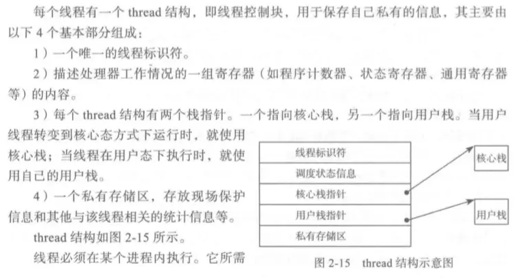

线程的实现方式 ：

- 在用户空间实现，管理线程的工作完全由应用程序完成，每个进程有一个私有的线程表，核心只对进程实施管理；
- 在核心空间实现，核心知道线程的存在并实施管理，线程表和进程表都在核心空间中，线程在创建或者删除一个线程的时候需要使用系统调用，核心可以同时调度同一进程的多个线程

### 2.5 进程间的同步和互斥

进程间的相互关系主要分为：互斥、同步和通信

- 互斥关系中，并发进程对共享资源的竞争，这些资源称为**临界资源**，访问临界资源的那段程序称为**临界区**，简称 CS 区。进程互斥进入临界区前需要申请，执行后需要退出才能执行其他代码，禁止两个或者两个以上的进程同时进入临界区

实现互斥的方法

1. 硬件方法：关中断（不响应中断），另一种是设置专用机器指令（测试并上锁）

2. 软件方法：设置软件锁

3. 一种更通用的方法：信号量即 PV 操作原语，信号量是一种设施，在进程间发送信号

   - 整形信号量：将信号量定义成一个特殊可共享的整形量，有“忙锁”问题
   - 记录型信号量：信号量一般由整形变量和指向 PCB 的指针组成，信号量的值大于 0 时表示当前可用的资源数量，小于零则绝对值表示等待使用该资源的进程个数
   - 一般应用还分了二值信号量（类似互斥锁 01 的值）和一般信号量
     具体过程：
     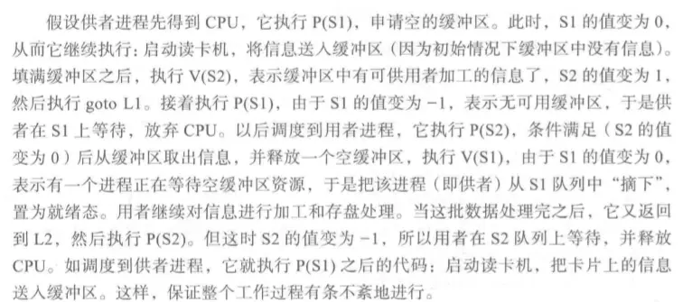
   - 生产者消费者问题中，应先执行同步信号量 P 再执行互斥信号量，不能调换顺序不然可能产生死锁
   - 读者写者问题，仅在第一个访问数据库的读者才对信号量 w 执行 P 操作，最后一个访问的读者才对信号量 W 进行 V 操作，隐含读者优先级高于写者
   - 哲学家进餐问题，解决死锁有三种方法：最多 4 人拿、均可用才拿、奇拿左偶拿右
   - 理发店问题 P85

   使用信号量的提示：先确定有几个或者几类进程，确定进程制约关系确定信号量种类，定义信号量含义和初值，编写代码，PV 操作要成对出现

### 2.7 进程通信

互斥和同步机构因交换的信息量少，归结为低级通信，高级进程通信分为三类：共享存储器、管道文件和消息传递

1.  共享存储器：在内存中分配一片空间作为共享存储区
2.  管道文件：也称管道线，连接两个命令的一个打开文件，一个命令写，一个命令读
3.  消息传递：以消息为单位在进程间进行数据交换，有直接通信和间接通信两种方式
    - 消息缓冲通信（直接通信）：进程发送信息前先向系统申请缓冲区，缓冲区中写入消息，然后将缓冲区连到接收进程的消息队列中，并通知接收者，接受者在自己占用的内存中指定一个接收消息区，接收消息。
    - 信箱通信：信箱可以存放一定数量的消息，发送进程将消息送入信箱，接收进程从信箱中取出发给自己的消息，有公有信箱（操作系统创建）、共享信箱（某个进程创建，创建者和共享这可以从中取走发给自己的消息）、私有信箱（用户进程创建，创建者可读，其他进程只能发）

### 2.8 linux 系统的进程通信

信号亦称为软中断，只有父子进程和进程自身可以应用信号机制通信，也并不是专为进程间通信设置，可以用于内核与进程间通信，内核只能发送不能接收
处理信号的方式：忽略信号、阻塞信号、由进程处理信号、默认由系统处理信号
检测信号的时间：从系统空间返回用户空间之前，进程刚被唤醒的时候

### 2.10 死锁

产生死锁的根本原因是资源有限且操作不当，
产生死锁的四个必要条件：互斥条件、不可抢占条件、占有且申请条件、环路等待条件，

当死锁发送时四个条件一定是同时满足的，任何一个条件不成立，死锁就不会发生

对待死锁的策略：忽略死锁、死锁预防、死锁避免、死锁检测与恢复
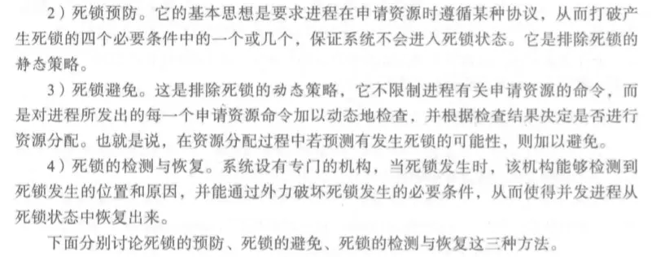

死锁预防：

1. 破坏互斥条件：一般不使用，因为某些资源固有属性就是独占性
2. 破坏占用且等待条件：预分配，所有进程开始之前就分配所需全部资源；空手申请，只有进程不占有资源时才可以申请资源
3. 破坏非抢占条件：一个进程在申请资源时会隐性释放申请前已占有的资源，只有当该进程获得所有申请的资源和被剥夺的资源后才能重新启动。
4. 破坏环路等待条件：为资源有序分配序列，确保占用资源时不会形成环路

死锁避免：是排除死锁的动态策略，它不限制有关申请资源的命令，而是在实施资源分配前检查，若预测有死锁发生的可能则加以避免。

1. 银行家算法是死锁避免，允许互斥、占有且申请和不可抢占条件

死锁检测：
对单体资源（所有类型的资源只有一个实体），可以将资源分配图中的资源去掉形成只有边的等待图，系统定期搜索等待图中的环路
对多体资源，系统检查未完成的进程是否能满足资源请求，不满足则说明有死锁

死锁恢复：通过抢占资源、回退执行和杀死进程自动从死锁中恢复，或者直接通知系统管理人员

1. 抢占式：临时从资源从占用它的进程中剥夺过来
2. 回退执行：系统定期检查进程，出现死锁就让某个占有必要资源的进程回退到前一个检查点，释放占有资源
3. 杀死进程：一次终止一个，终止后要进行死锁检测

活锁和饥饿：活锁是忙式等待，饥饿是调度问题

## 第三章 处理机调度 P114

处理机分配由调度和分派两个功能组成，调度是指组织和维护就绪进程，分派是当 CPU 空闲就从就绪队列中取出 PCB 将其运行

调度级别：高级调度（作业调度）从作业中选出若干个作业分配必要的资源；中级调度，内存紧张时将某些进程从内存中移到外存上；低级调度（进程调度）按一定算法将 CPU 分派给就绪队列中的某一个进程

### 3.2 作业调度

作业通常分为：提交、后备、执行和完成四种状态，

作业调度功能

1. 记录系统中各个作业的情况，记录在作业的 JCB 中
2. 按照某种调度算法从后备作业队列中挑选，决定接纳多少个作业进入内存
3. 为选中的作业分配内存的外设（存储管理和设备管理）
4. 为选中的作业创建进程，放入就绪队列中
5. 作业结束后善后处理，释放 JCB

进程调度：使就绪进程获得 CPU 的控制权

调度算法的性能评价：1、CPU 利用率 2、吞吐量 3、带权周转时间 4、就绪等待时间 5、响应时间

### 3.7 实时调度

静态调度：在系统开始之前作出调度决定，必须在知道有关需要完成的工作和截止时间的情况下才能起作用；（优先级谁速率单调的调度算法，优先级和速率呈线性关系，总是运行优先级最高的进程）![image-20200705201308138]/assets 理/image-20200705201308138.webp)
动态调度：在运行时做调度决定，不受限制。（最早截止时间优先调度算法，每个进程申请 CPU 时，表明自己的存放和截止时间等信息，调度程序把所有可运行的进程按截止时间排序，选最紧迫的进程运行）

### 3.8 LINUX 系统中的进程调度

LINUX 调度机制主要涉及调度方式、调度策略、调度时机和调度算法

1. 调度方式基本采用抢占式优先级的方法
2. 调度策略有 FIFO RR OTHER（由进程剩余时间配额设置优先级，由 nice 命令设置优先级）
3. 调度时机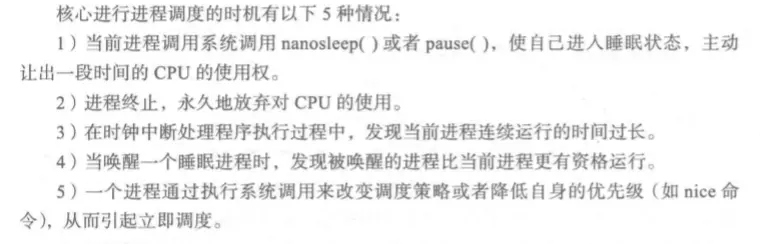
4. 调度算法：抢占式优先级算法

### 3.9 中断处理

保存现场时有两种方法：集中式保存，在内存的系统区设置一个中断现场保存栈；分散式保存，在每个进程的 PCB 中设置一个核心栈

中断优先级：可能某个时刻有多个中断同时出现，在**硬件设计中断响应**时，必须按各种中断事件的轻重缓急对线路进程排队，**安排中断响应次序**；而在软**件中处理中断也要排序**，可以和响应顺序不同，**高级别中断有打断低级别中断处理程序的权利**。

中断屏蔽：中断请求提出后 CPU 不响应，常常用来防止同级中断的打扰
中断禁止：系统不接受中断信号，不会提出中断请求

系统调用：陷入和捕俘，所有陷入事件有一个总的服务程序：陷入总控程序，在处理系统调用处理的过程中并不自动关闭中断
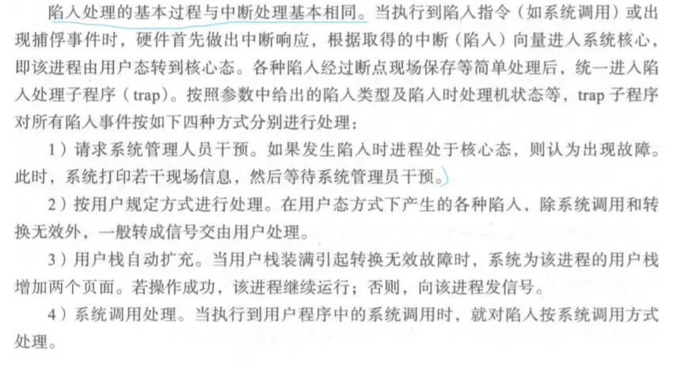
具体过程为：陷入总控程序将参数压入系统栈，调用陷入处理程序 trap，程序根据陷入事件的不同类型进行不同的处理，对于非法指令、指令故障、转换无效等事件，转入信号机构处理；对于系统调用使用系统调用函数处理

## 第四章 存储管理 P149

### 4.1 地址空间与重定位

程序装入内存有三种方式

- 绝对装入：程序中使用的所有地址都是内存绝对地址，程序装入到内存的指定位置
- 可重定位装入：程序中根据内存当时的使用情况，决定存放到内存的位置，程序使用相对地址
- 动态运行时装入：装入内存的程序可以换到磁盘，需要时再换入内存中，需要硬件支持

静态重定位：由装入程序对目标程序中的指令和数据的地址进行修改，执行过程中不再改动
动态重定位：在程序执行期间，每次访问内存之前都要进行重定位，靠硬件地址转换机构实现，通常采用一对重定位寄存器，一个存放程序在内存的初始地址（基址寄存器）另一个表示程序的逻辑地址最大范围（限长寄存器），都为特权寄存器

UNIX | LINUX 中对内存管理还利用了多道程序对换技术（中级调度），内存中保留多个进程，当内存空间紧张则把某些进程换出到外存中。

### 4.2 分区技术

内存一开始为一大块，各个分区在相应进程进入内存时才建立，大小和进程大小相同，在进程完成后就释放所占分区，系统尝试将其与邻接的空闲分区合并起来，成为一个大分区

动态分区法常用于记录内存使用情况的数据结构有：空闲分区表和分区链 P159
分配算法有：最先适应算法、最佳适应算法、循环适应算法和最坏使用算法

- 最先适应：分区表按位置排列，先找到满足的空闲区就直接分配，释放内存时就根据分区表合并上下空闲区，如果无相连空闲区，则新建并插入分区表
- 最佳适应：以空闲区大小为序，从小到大，同样想找到先分配，划分后有剩余则修改分区大小和重新确定空闲区在表中位置
- 循环适应：和最先使用一样，但每次找到合适的空闲区后就记录，下次查找空闲区从记录位置的下一个空闲分区开始找
- 最坏适应：从大到小排，利用划分后剩余的分区来减少碎片

采用分区技术需要有硬件保护，通常由一对寄存器分别表示用户进程在内存空间中的上下界

### 4.3 分页技术

分区和对换技术都要求把一个进程放置在一片连续的内存区域，而分页允许程序存储空间不连续，从而解决外部碎片的问题，提高内存利用率

**逻辑空间分页、内存空间分块**，块大小和页面大小相同。分页情况下，系统以块作为单位把内存分给各个进程，**进程的每个页面对应一个内存块**，为了找到每个页面在内存中对应的物理块，系统为**每一个进程设立了一张页面映射表**，操作系统通过**建立内存块表**管理整个内存

为了解决放置页表带来的存取速度下降的问题，可以设置一个高速联想存储器快表，快表包含键（页号）和值（块号）

**页的共享**：只有只读的页可以共享，而且通常因为系统分页情况是用户不可见的，会把私有数据和可共享数据混杂到同一个页，不容易实现共享

**页的保护**

1. 利用页表本身进行保护：页表基址信息放在进程的 PCB 中，访问内存要利用页表进行地址转换，各进程在自己的存储空间内活动
2. 设置存储控制位：在页表表现设置存取控制字段，指明块的内容允许何种操作
3. 设置合法标志：非法时表示该页不在该进程的逻辑地址空间中

**页表构造**（为了节省内存空间，需要动态调入页表）

- **多级页表**：用来防止一级页表过大，进程只保留部分页表，剩下的页表动态调入到内存中
- **散列页表**，处理**大于 32 位地址空间的通用方式**，表中每一项有一个链表，由页号、对应的内存块号和指向下一个元素的指针组成
- **倒置页表**，用于 64 位虚拟地址空间在处理器上的应用，系统中只有一个页表，每个内存块对应唯一的表项，表项由进程标识符和虚拟页号组成，**访问地址时用 PID 和页号查询块号**，如果找不到，则此页未调入内存，产生请求调页中断，如果还没有，则地址错误

### 4.4 分段技术

将用户程序分成若干相对独立的部分，每段从 0 开始编址，并采用一段连续的地址空间
程序地址结构：整个进程的地址空间分成多个段，**逻辑地址分成段号 S 和段内地址 d** ，段的信息的逻辑单位，用于可以知道自己的程序分成几段以及相应的功能

段表和段表地址寄存器，一个进程的全部段都在该进程的段表中登记，系统还有一个段表地址寄存器，一部分指出段表在内存中的起始地址；另一部分指出段表的长度，主要用于段寻址和越界检测

段的保护

- 存取控制：在段表中记录本段允许的操作，可读、可写、可读写
- 段表本身的保护：利用段表地址寄存器判断访问空间
- 保护环：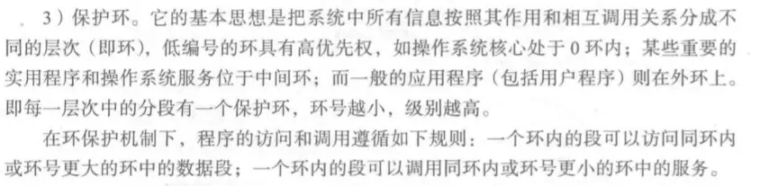

### 4.5 段页式结合系统

分页存储管理能提高内存利用率，分段存储可以满足用户需求，两者结合可以“各取所长”

段页式存储管理的基本原理：

1. 等分内存：把内存分成大小相等的内存块
2. 进程地址空间采用分段：吧进程的程序和数据分成若干段，每段一个段名
3. 段内分页：把每段分成若干页，页面大小和内存块相同
4. 逻辑地址结构：由段号、段页页号和页内地址组成
5. 内存分配：内存分配单位为块
6. 段表、页表和段表地址寄存器：系统为每个进程建立一个段表，为每一个段建立一个页表。因此段表中不再是段长和内存地址，而是页表长和页表地址

> 实现的具体过程为：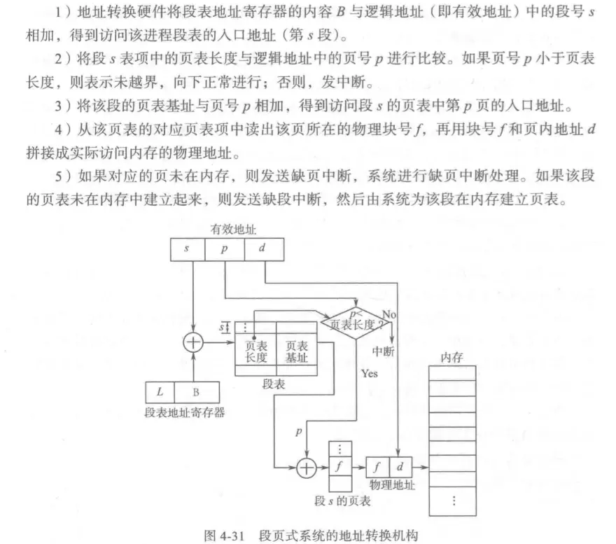

### 4.6 虚拟存储器

虚存特征
虚拟扩充：不是扩大物理空间，而是扩充逻辑内存容量
部分装入：进程不是一次性全部装入内存，而是将当前运行需要用到的那部分程序和数据装入内存中
离散分配：一个进程在内存的部分可能散布在内存的不同地方，避免浪费也为动态调入提供了方便
多次对换：一个进程运行期间，它所需的全部程序和数据分成多次调入内存

### 4.7 请求分页

页表结构
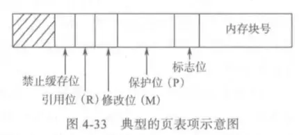

抖动是指，如果置换算法不合适，可能出现刚换出的页面又很快被访问，系统大部分时间用在页面调度和传输上，实际效率太低

页面置换算法：

- 先进先出、最佳置换、最近最久未使用
- 第二次机会置换法：查看引用位，被引用过为 1 则视为刚装入，并把引用位清零，继续寻找引用位为 0 的页
- 时钟置换法：是对第二次机会置换法的改进，使用循环链表![image-20200706153036986]/assets 理/image-20200706153036986.webp)
- 最近未使用：启动进程时所有页的引用位和修改位都置成 0，引用位会定期清 0![image-20200706153222897]/assets 理/image-20200706153222897.webp)
  过程为，从当前指针指向的位置开始查找循环队列（结构和时钟算法一样），先找第一类，不满足则再找第二类，第二类也不满足则把引用位都清 0

### 4.8 内存块分配和抖动问题

1. 内存最少块数：每个进程需要有最少的内存块数，分配的总块数不能超过可用块的总量
2. 内存块分配策略：固定分配，给进程分配的内存块数是固定的，缺页时只能从分给该进程的内存块中进行页面置换；可变分配，如果进程运行持续缺页率较高，则多分内存块
3. 页面置换范围：全局置换，运行一个进程从全部内存中选取淘汰的内存块；局部置换，只能置换分给进程的那一组，全局置换只能和可变分配策略相结合
4. 分配内存块的算法：等分法、比例法（依照进程的地址空间）和优先权法（依照进程的优先级）

防止抖动的方法：

- 采用局部置换：当进程出现抖动时，其不能从另外的进程那里获得内存块，使抖动局限在一个小范围，但未解决抖动
- 挂起某些进程：腾出内存空间给抖动进程使用
- 采用缺页频度发：如果缺页率太高则给进程更多内存块，控制缺页率
- 利用工作集：程序往往具有局部性，**时间局部性**，某条指令刚被执行后，往往很快又被执行（循环顺序）；**空间局部性**，某个位置被访问，它附近的位置也要被访问（数组结构）
  工作集就是一个进程在某一小段时间内访问页面的集合，工作集大小 WSSi 与时间间隔 d 有关，如果 d 过小则不能反映工作集缓慢变化，如果 d 太大则不体现局部的效果
  有公式 $D=\sum^n_{i=1}WSS_i$ ，其中 D 是系统中全部进程的总请求量，D 大于可以的内存块总量 m 表示将出现抖动

### 4.9 请求分段

段式虚存可以实现动态链接技术，使用*间接编址*和*链接故障指示*两个硬件设施,间接地址是指存放直接地址的地址,链接故障指示检查时，如果段未链接上，硬件会产生链接中断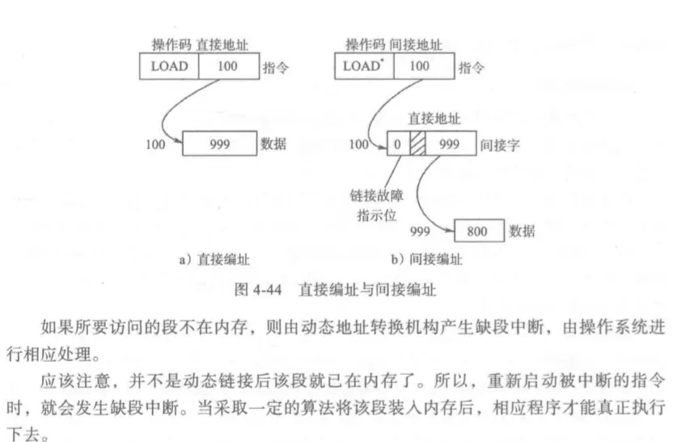

### 4.10 linux 系统的存储管理技术

采用了和 UNIX 一样的**请求分页存储管理**技术和**对换技术**。页面置换使用 LRU，管理用位图和链表结构

## 第五章 文件系统 P207

### 5.1 文件及其分类

文件是从存储设备抽象出来的被命名的相关信息的集合体，通常存放在外存中。

文件类型按用途分类

1. 系统文件：操作系统和其他系统程序信息组成的文件，只能通过系统调用为用户服务
2. 库文件：由标准子程序和常用的应用程序组成的文件，允许用户使用但不能修改
3. 用户文件：由用户保存管理的文件，可以被创建者或者被授权者进行操作

按数据形式分类：源文件、目标文件（编译后未链接）、可执行文件（编译链接）
按存储权限分类：只读文件、读写文件和可执行文件
按保存时间分类：临时文件和永久文件

在 UNIX 和 Linux 中按文件的内部构造和处理方式分类：

1. 普通文件：内部没有固定结构，由程序、数据活文本的字符串构成
2. 目录文件：由下属文件的目录项构成的文件，可进行读写等操作
3. 特殊文件：特指各种外部设备，系统把 IO 设备作为文件对待，进行统一管理![image-20200707103847223]/assets 理/image-20200707103847223.webp)

普通文件分为**文本文件**（ASCII 文件）和**二进制文件**，二进制文件有内部结构，在 UNIX 和 Linux 中有五个区，**文件头、正文段、数据段、重定位区和符号表区**，**文件头结构**由标志可执行文件特征的**幻数、正文段长度、数据段长度、BSS 段长度、符号表的长度和入口单元及各种标志**组成，重定位时利用重定位区，而符号表用于调试程序

文件抽象最重要的特性是“按名”管理对象，**用户对文件也是“按名存取”**。

文件系统是 OS 负责操纵和管理文件的一套系统

- 文件管理：创建删除、打开关闭、读写执行一个文件
- 目录管理：为每个文件建立一个文件目录项，若干文件的目录项构成一个目录文件，根据用户要求创建或者删除目录文件、对用户指定文件进行检索和权限验证、更改工作目录等
- 文件存储空间管理：对文件的存储空间分配与回收，并为文件逻辑结构与物理地址建立映射
- 文件的共享和保护：在系统控制下使用户能共享其他用户的文件，防止对文件的未授权访问或破坏
- 提供方便的接口：为用户提供统一的文件存取方式，实现“按名存取”，OS 为用户提供有关文件操作的系统调用，给用户编程使用

### 5.2 文件的逻辑组织和物理组织

逻辑组织有无结构文件和有结构文件两种

- **无结构文件**是有一组相关信息组成的有序字符流，OS 并不关心文件中存放的内容是什么，其看到的都是一个一个的字节，具体内容由用户级程序解释；
- **有结构文件**，又称记录型文件，文件是由若干相关记录组成的，每个记录是一组相关的数据集合（具体类似于 JSON 文件），用于描述一个对象某个方面的属性，如年龄、姓名等。分为**定长和变长记录文件**两种

存取方式分为顺序存取和随机存取，顺序存取严格按照字符流或记录的排序依次存取，随机存取这允许用户随意存取文件中的一个记录
随机存取基于磁盘的文件存取模式，对于定长记录文件，随机存取把文件视为一系列编号上的块或记录，通常每块的大小是一样的，被操作系统作为最小的定位单位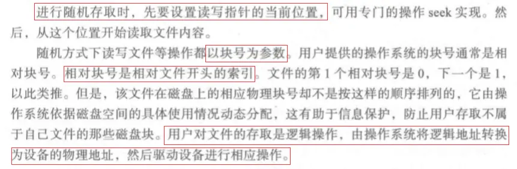

文件的物理组织

1. 连续文件：把逻辑上连续的文件信息存放在连续编号的物理块中，如定长文件大小为 2000，假设一个物理块大小为 512，文件需要占用 4 块
2. 链接文件：逻辑连续的文件分散存放在不同物理块中，为各个物理块设置链接字，指示该文件的下一个物理块，系统维护一个文件分配表，每个文件都在表中独占一项，其中包括了文件名、起始块号和最后块号
3. 索引文件：系统为每一个文件建立索引表，表项指出存放该文件的各个物理块号，索引表也存放在一个盘块中，由文件目录项指出索引盘块地址
4. 多重索引
   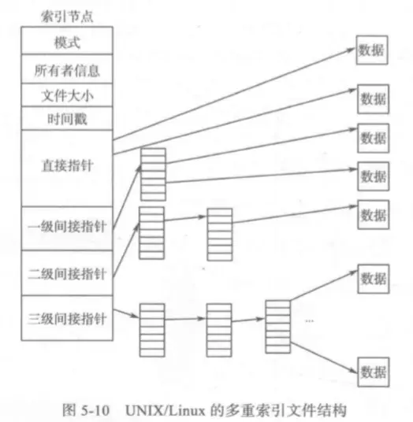

### 5.3 文件控制块和文件目录

文件系统内部给每个文件唯一地设置一个文件控制块，核心利用该结构进行管理时，首先会验证权限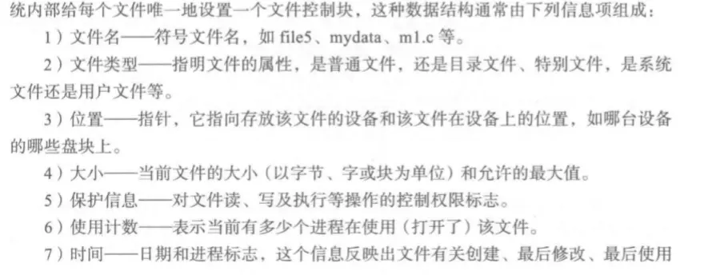

UNIX 和 Linux 中该结构称为 **i 节点**，i 节点分为**静态和动态**两种，**静态在磁盘上**，**动态在内存中**，每个文件对应一个唯一的静态 i 节点，而**每个打开的文件都有一个对应的动态 i 节点**，只有动态 i 节点才有节点号，**节点号是唯一的，指向静态 i 节点**。

文件目录是文件控制块的有序集合，完全由目录项组成的文件称为目录文件
目录结构有：单级目录、二级目录（多了用户目录）、树形目录（多级目录）、非循环图目录（带链接的树形结构）

### 5.4 文件存储空间管理

空闲空间管理技术有：空闲空间表法、空闲块链接法、位示图法和空闲块成组链表法

- 空闲块成组链表法：把所有空闲盘块按固定数量分组，如 50 个空闲块为一组，组中第一块为组长块，第一组的 50 个空闲块块号放在第二组的组长块中……最后一个块（可能不到 50 块）放在文件系统超级块中的空闲块号栈里
  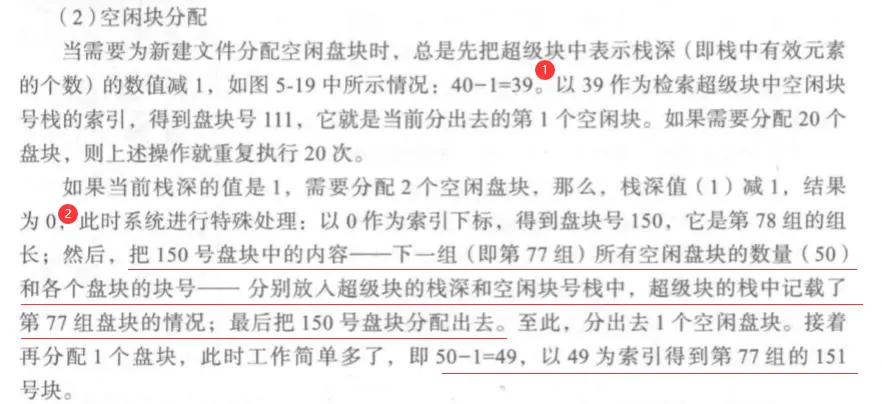

  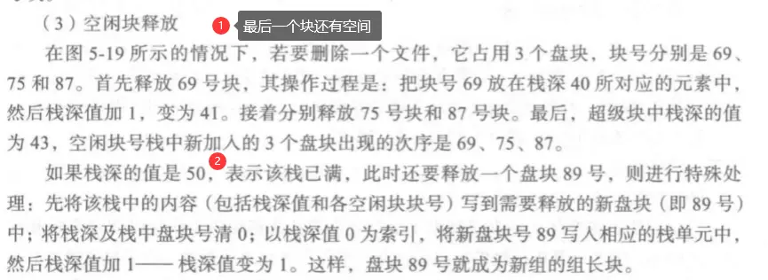

  第一个块中的警戒位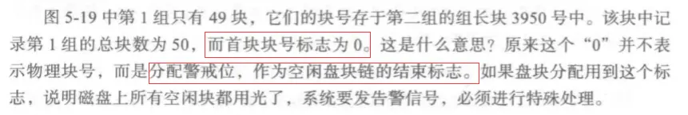

### 5.7 linux 文件系统

每个进程有两个数据结构来描述进程与文件的相关信息，一个是 fs_struct 指向两个 VFS 索引节点，分别是根目录节点和当前目录节点；另一个是 files_struct（进程文件描述符表） 保存该进程打开文件的有关信息，其中的指针指向对应的 file 结构（打开文件描述表表）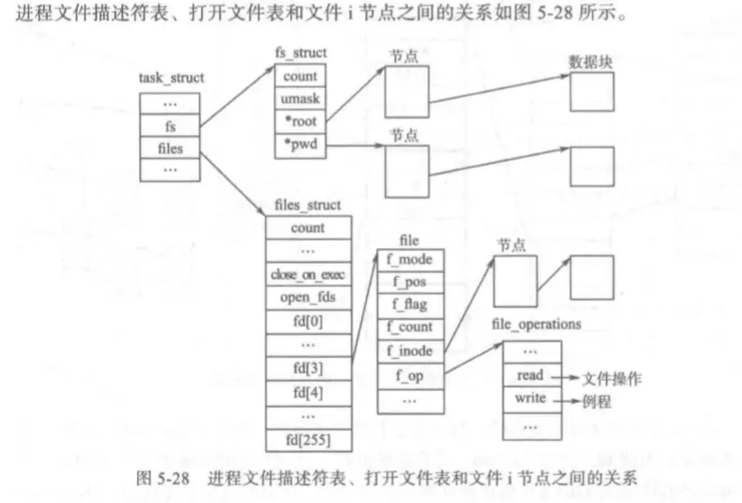
进程文件描述符表让各个进程掌握它当前使用文件的情况，不要同时打开太多文件，并加速对文件的查找速度
核心设置打开文件表的原因是，一个文件可以被多个进程打开

## 第六章设备管理 P254

### 6.1 设备管理概述

设备分类
按工作特性分为存储设备和输入输出设备两大类，有个别不符合这两类的，如时钟

按设备使用性质分为独占设备（只能一个进程独占）、共享设备（多个进程同时共用）和虚拟设备（利用某种技术吧独占设备改造成多个进程共用的设备）

按数据传输方式分为串行设备（二进制位一位一位顺序传送）和并行设备（8 位数据同时通过并行线进行传送的设备）

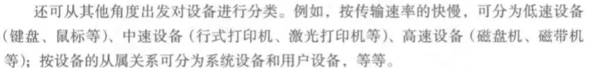

设备标识：OS 为每台设备分配一个唯一**设备绝对号用于区分和识别设备**，UNIX 和 Linux 中每个块设备的名字由两部分组成：**主设备号和次设备号**。
多道程序环境中，写程序时使用的是主设备号（**设备的类型号**），而次设备号表示同类设备的**相对序号**，用户程序只知道使用设备的类型，具体使用哪一台由系统分配，**OS 负责进行“地址转换”，将类型号变成设备绝对号**

---

#### IO 系统结构：主机 IO 系统和微型机 IO 系统

**主机 IO 系统**
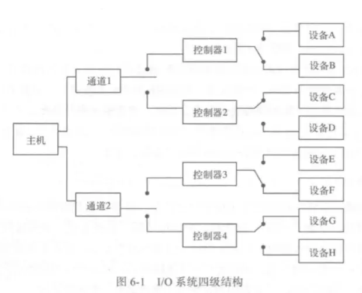
通道相当于小型处理机，独立执行通道程序，对外部设备的 IO 操作进行控制，实现内存和外设之间的数据传输，主机委托的 IO 处理完成后，通道发出中断信号，请求 CPU 处理使 CPU 和外设并行效率提升

**主机 IO 系统的通道**三种类型

- 字节多路通道：以字节为信息传输单位，服务于多台低速 IO 设备，当通道为一台设备传输一个字节后立刻转向为下一台设备传送字符，交叉控制下属各个设备的工作
- 选择通道：同一时间只能为一台设备服务，连续地传输一批数据，主要用于连接高速外部设备
- 成组多路通道：广泛用于连接高速和中速设备，结合了字节多路通道分时操作和选择通道高速传送的优点，允许多个通道程序在同一 IO 通道中并行，每执行完一条通道指令就转向另一通道程序，任意时刻只能为一个设备服务但又能立刻切换到下一个通道

**微型机 IO 系统**
大多使用总线 IO 系统结构，实现 CPU 和控制器之间的通信
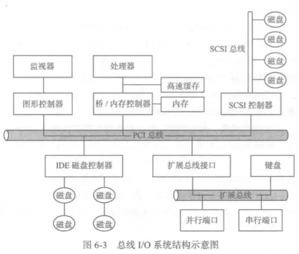
IO 设备一般有机械和电子两部分组成，**电子部分称为设备控制器或适配器**，可以**管理端口、总线或设备，实现设备主体和主机间的连接与通信**，一台设备控制器可以控制多台同一类型的设备，**控制器是可编址的设备，OS 常常通过控制器实施对设备的控制和操作**

---

#### IO 系统的控制方法

程序控制直接传递方式，程序查询方式，中断控制方式，直接存储器访问方式，独立通道方式，IO 处理器方式

##### 直接存储器访问方式 DMA

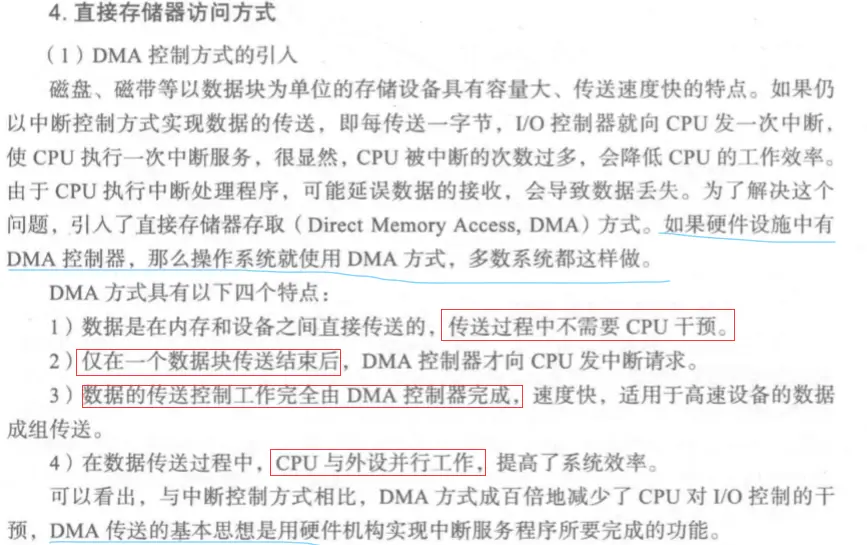
DMA 传送操作：DMA 包括内存地址寄存器、字节计数寄存器、一个或多个控制寄存器，控制寄存器指明所用的端口、传送方向（读还是写）、传送的单位（一个字节或者字），本次传送的字节数，CPU 可以读写这些寄存器

​ DMA 工作过程：

1. **CPU 把一个 DMA 命令块写入内存**，命令包含传送数据的源地址、目的地址和传送字节数，然后**把该块地址写入到 DMA 控制寄存器中**，CPU**向磁盘控制器发送读盘命令**，然后 CPU 处理其他任务，当**有效数据存入到磁盘控制器的缓冲区中后开始 DMA 存取**

2. DMA 控制器启动数据传送，通过总线向磁盘控制器发送读盘请求，读数据到指定内存单元中

3. 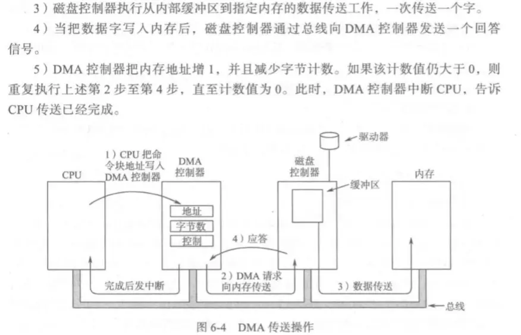

   某些 DMA 可以每次一字或者整块传送
   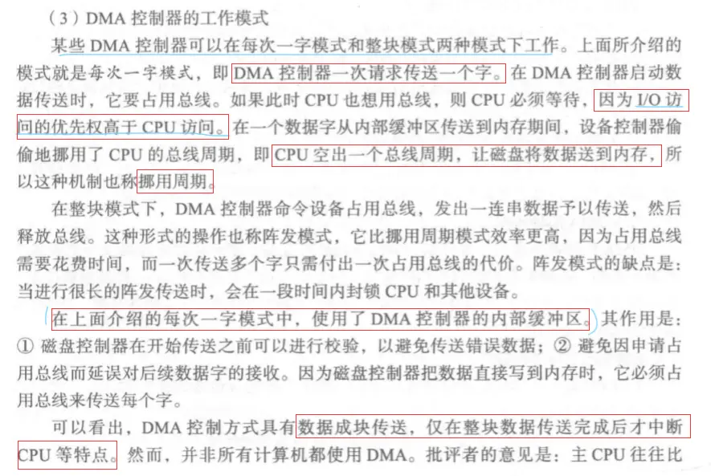

---

#### 缓冲技术

为了解决 CPU 和 IO 设备速度不匹配的矛盾，提高 CPU 和 IO 设备的并行性
可设置为硬缓冲和软缓冲（从内存中开辟区域做缓冲区，缓冲区大小一般与盘块大小一样）
可设置单缓冲、双缓冲或多缓冲
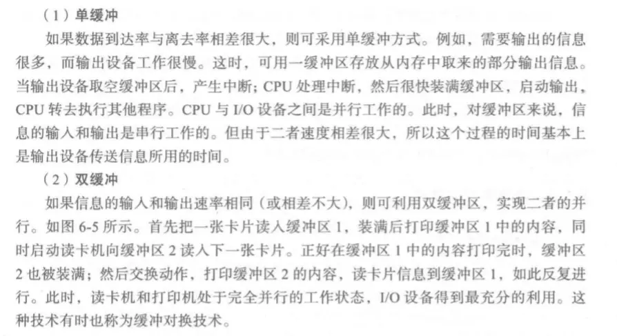
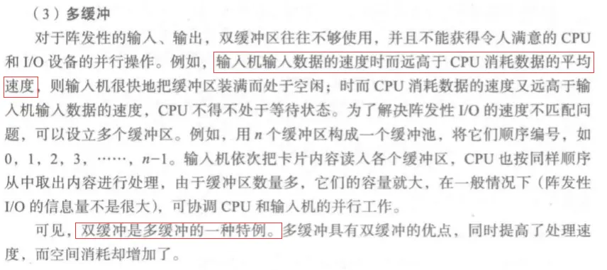
在多缓冲基础上可以构造循环缓冲或缓冲池，有两个指针：一个指向缓冲区中数据第一个字，一个指向首个空闲区位置。为了提高缓冲区利用率，往往采用公用缓冲池的方式，池中的缓冲区可以供多个进程使用

---

#### 设备管理的功能

设备管理的目标：

1. 使用方便：屏蔽物理特性，按统一规则使用设备，OS 负责输入输出工作
2. 设备独立性：OS 分配实际设备，程序只关心设备类型
3. 效率高：利用通道和缓冲提高 CPU 和 IO 设备的并行性
4. 管理统一：对各种外设采用统一的管理方法

为实现目标所需的功能：

1. 监视设备状态：记住所有设备、控制器和通道的状态，以便有效管理和调度使用
2. 进行设备分配：按类型和分配算法实施设备分配
3. 完成 IO 操作：OS 按用户的要求调用具体设备驱动程序，进行 IO 操作并处理中断
4. 缓冲管理和地址转换

### 6.2 分配技术和 SPOOLing 系统

设备分配的相关因素有：IO 设备的固有属性、os 采用的分配算法、分配应防止死锁发生、用户程序使用的逻辑设备和物理设备无关

设备分配技术：独占分配、共享分配和虚拟分配（SPOOLing 系统）

分配算法：先来先服务，优先级高的优先服务

SPOOLing 系统一般分为存输入、取输入、存输出、取输出
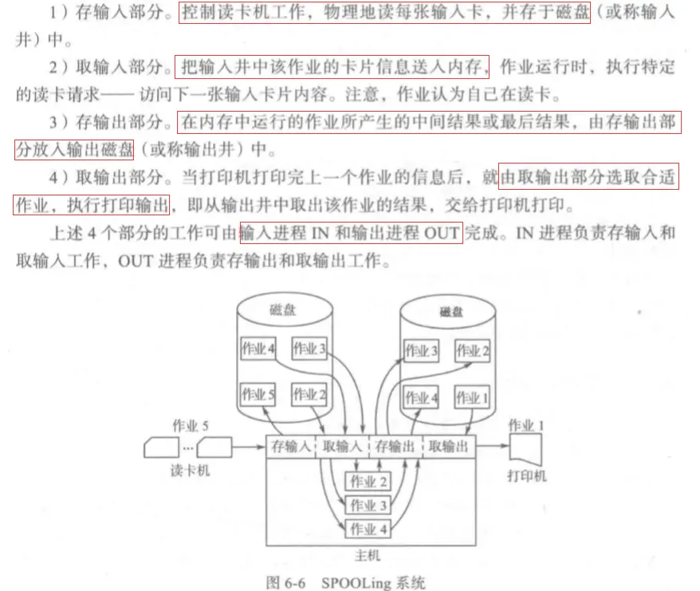

### 6.3 IO 软件构造

IO 软件系统的层次：
为了实现设备独立性、统一命名、出错控制和同步（阻塞）异步（中断驱动）处理
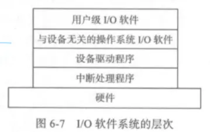

总体过程

---

#### 设备驱动程序

功能：接收上层与设备无关的读写请求，IO 请求排在请求队列队尾；取出请求队列队首请求，并将设备分配给它；想设备控制器发送命令，完成 IO 操作；处理来自设备的中断

设备驱动程序在系统中的逻辑位置
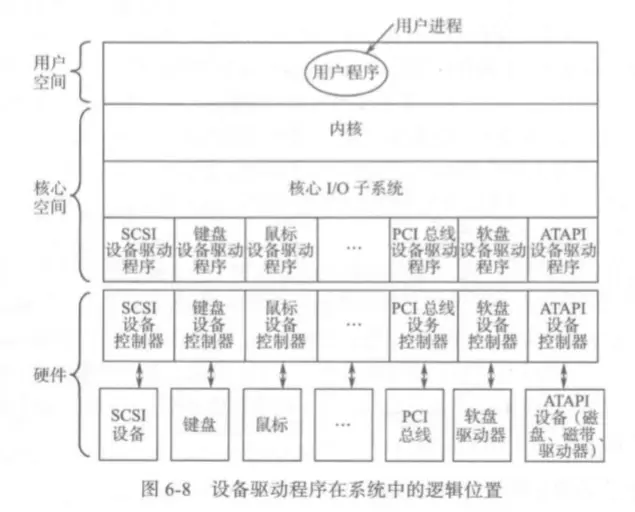

#### 与设备无关的操作系统 IO 软件

基本功能是执行所有驱动器共同的 IO 功能和为用户级软件提供统一接口，所有驱动程序都有相同的接口，新驱动程序遵守接口规则，这样很容易加入操作系统
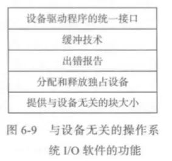

1. 设备驱动程序的统一接口：
   与接口相关的问题是 IO 设备如何命名，设备无关软件负责把符号设备名映像到相应的设备，每个设备指定唯一的一个特殊文件 i 节点，包含主设备号和次设备号，主设备号用来确定相应的驱动程序，次设备号作为传递给驱动程序的参数。还有保护问题，系统管理员可为每台设备规定权限
2. 出错报告：很多错误与设备相关，需要由相应的驱动程序处理，但出错处理的架构与设备无关
   错误产生的原因：**一类是程序错误**，如把信息写到输入设备上（键盘）、提供的参数错误、指定设备不合法等，处理方法是**直接向调用者报告**；一类是**实际 IO 错误**，如把信息写到坏块中、从关机的设备中读信息，此时**驱动程序可以向设备无关软件报告**，
   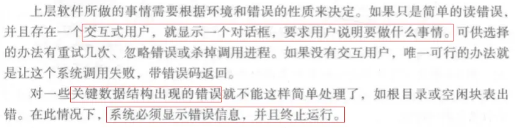
3. 分配和释放独占设备：处理的简单方法是让进程打开设备特殊文件，如果设备不可用则打开失败，以后通过关闭独占设备释放它；另一种方法是设立专门机制，**负责独占设备的申请和释放**，设备不可用则阻塞调用者，**进程放入阻塞队列，当申请设备可用时，阻塞队列第一个进程使用它**
4. 提供与设备无关的块大小

#### 用户空间的 IO 软件

以库函数的形式出现，如 printf、scanf 等函数，编译链接后放入内存，运行时利用系统调用进入到操作系统，由 OS 接收用户的 IO 请求，提供相应服务。由于把设备当成特殊文件处理，对设备的访问变成了对文件的访问，输入输出管理就是打开关闭、读写和查找文件

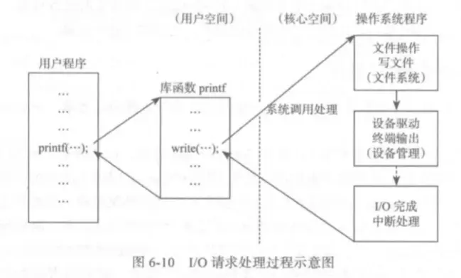

### 6.4 磁盘调度和管理

磁盘硬件：磁头，柱面，扇区；
现代磁盘驱动器提供给操作系统的是虚拟的几何参数，到操作系统提出寻道请求时，再由磁盘控制器把请求的参数重新映射成实际磁道地址，也就是磁盘的逻辑地址是由逻辑块组成的一维数组，文件系统读写某个文件时，由逻辑块号映射成物理块号，再由磁盘驱动程序转换成磁盘地址，再由磁盘控制器把磁盘地址定位到具体的磁盘物理地址。

### 6.5 Linux 系统设备管理

Linux 系统中硬件设备分为：块设备、字符设备和网络设备

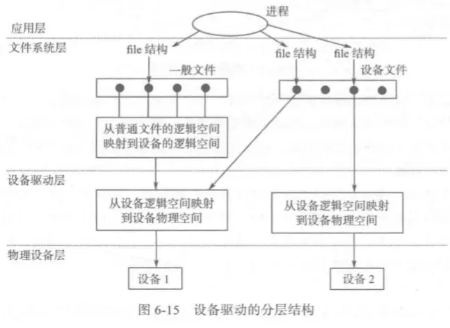
**设备转接表是文件系统和设备驱动程序之间的接口**，每类设备在转接表中都占有一项，**转接表中记录了对该类设备执行操作的各个子程序的入口地址**，连接表在系统初启时根据硬件配置情况建立，**系统只有这两个设备转接表**

硬件和驱动程序之间的接口是通过相关控制寄存器或操纵设备的 IO 指令及中断向量组成的

**Linux 系统的缓冲技术**：使用多重缓冲技术来平滑和加快文件信息从内存到磁盘的传输

**块设备管理**
磁盘块的读写方式，读有立即读和预读两种，写有立即写、异步写和延迟写

**上述读写的实现机制**

系统中有一个描述一系列在系统中登记的块设备的结构，使用主设备号作为索引，还包括了指向有关操作的函数指针，其是连接抽象的块设备操作与具体块设备类型操作之间的枢纽（实现块设备转接表功能）
