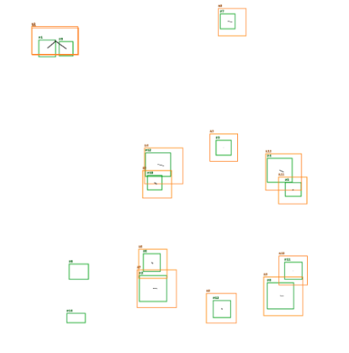
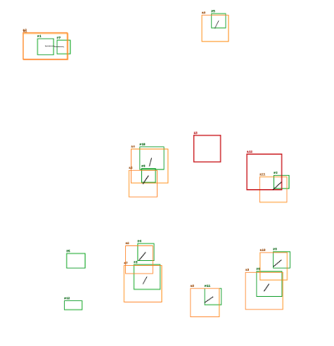
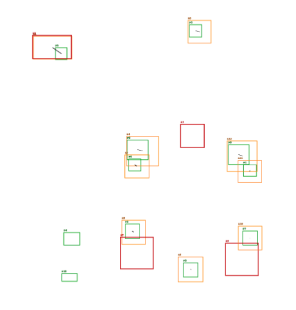

# 标注群整体偏移纠偏的技术方案

## 背景说明

在算法项目中，遇到一个场景，客户通过模版图片+标注表示测试集，交付目标需要在现场运行图上将所有特征检出并匹配到对应的测试标注上。在落地过程中遇到一个问题，即现场运行图片与测试图片的偏差较大，简单通过 NMS 进行匹配经常失效，处理这种偏移失效通常有两种方式：

1. 找出图片本身的差异，如传统模版匹配，或者使用深度学习找关键区域计算纠偏。这类方法需要保证图片本身的成像质量，在实际落地中发现能覆盖 80% 左右的场景，剩余部分受限于光学成像，如图像整体偏移过大、存在角度、面积畸变、特征信息不够明显等等，匹配难度比较大。
2. 找出标注群和标注群之间的差异，通过对测试集标注和现场运行标注进行计算，得到两个标注群之间的联系，建立起测试集标注和推理结果之间的一一对应关系。这种方案理论上可以处理无限大的偏移情况，能忽略角度、面积畸变的影响。

这篇文章主要介绍在项目落地时我们如何处理「标注群之间的关系」，实现标注级别的纠偏方案，其中主要使用两种方法：投票法和 RANSAC

## 两种方法的流程介绍

1. 投票法（搜集个体关系，统计最佳偏差，实现整体偏移）

   把每个标准标注的中心点和每个预测的中心点两两配对，计算它们之间的平移向量 `(tx, ty)`；把这些向量按一定步长（`quant`）量化后统计哪一对 `(tx,ty)` 最常出现，出现次数最多的就是“投票结果”——也就是我们认为的**全局平移**。

2. RANSAC（选取个体差异，应用到整体，计算整体误差后迭代出最佳纠偏值）

   RANSAC 在这里的作用是：当投票法不够“集中”时，随机抽取最小样本（一个标注-预测对），用该样本计算一个平移模型 `(tx,ty)`，统计有多少标注-预测对在这个平移下被“认可”（即“inlier”——距离小于 `tol`）。重复若干次，选择能产生**最多 inlier** 的平移作为最终估计，然后用这些 inlier 再精修一个更准确的 `(tx,ty)`。

## 投票法

1. **准备点集**

   - 从标准模板（annots）中取出每个标注的中心点 `(ax, ay)`。
   - 从推理输出（preds）中取出每个预测的中心点 `(px, py)`。

2. **计算所有平移向量**

   - 对每个标注点 `A`、每个预测点 `P`，计算 `tx = px - ax`、`ty = py - ay`。
   - 得到一份向量列表 `[(tx1, ty1), (tx2, ty2), ...]`。
   - 说明：如果有 `N` 个标注、`M` 个预测，理论上有 `N*M` 个向量（复杂度 O(N\*M)）。

3. **量化（quantization）**

   - 直接对浮点向量投票会很分散，所以先把 `(tx,ty)` 按 `quant` 做量化：

     $$
     qtx = \mathrm{round}(tx / quant),\quad qty = \mathrm{round}(ty / quant)
     $$

     投票的单位就是 `(qtx, qty)`，实际估计平移为 `(qtx * quant, qty * quant)`。

   - `quant` 的作用：控制鲁棒性与精度的平衡。大的 `quant`（比如 10、20）更稳健（抗噪声、抗离群点），小的 `quant`（比如 1、5）更精确（适合偏差较小或你需要亚像素精度时）。

4. **计票（histogram / mode）**

   - 将量化后的向量作为键做计数（Counter/HashMap），选出出现次数最多的那一对 `(qtx, qty)`，对应的实际平移为 `(tx*, ty*) = (qtx*quant, qty*quant)`。

   - 同时计算**支持度**（support）：
     $$
     support = \frac{\text{该量化区块的票数}}{N \times M}
     $$
     或者用票数 / 所有票数（两者等价，取决于实现）。`support` 表示“多少对标注-预测支持这个平移”。

5. **结果判定**

- 如果 `support` 很高（经验上 > 0.15–0.2），说明投票是可靠的，可直接采用 `(tx*,ty*)`。
- 若 `support` 很低，说明投票分散，应回退到 RANSAC 。

### 步长量化的方法举例

假设有 3 个标注中心：A1=(100,100), A2=(200,100), A3=(100,200)；

推理得到 3 个预测中心（实际偏移约为 +185, +38）：P1=(285,138), P2=(385,138), P3=(285,238)。

计算向量（部分列举）：

- A1→P1: (185, 38)
- A1→P2: (285, 38)
- A1→P3: (185, 138)
- A2→P1: (85, 38)
- ... 等等，共 9 个向量。

如果 `quant=10`，向量 (185,38) 被量化为 (19,4)（因为 185/10=18.5→19，38/10=3.8→4）。如果多个配对落在 (19,4)，这个 bin 就会有较多票，最后以 (19*10,4*10)=(190,40) 作为估计平移——接近真实 (185,38)，偏差为 (5,2)，这通常足够用于后续 IOU/coverage 匹配。

## RANSAC

1. **随机取样**

   随机挑一个标注 A 和一个预测 P，计算它们之间的平移 `(tx = px-ax, ty = py-ay)`。

2. **应用预测偏差**

   用这个 candidate `(tx,ty)` 去检查“全表”：把每个标注移动 `(tx,ty)` 后，看是否存在某个预测使得该标注与预测的中心差距 ≤ `tol`（或其它相似性条件）。能找到的标注数就是这次采样的 inlier 数。

3. **训练迭代**

   重复步骤 1–2 多次（`iters` 次），记录 inlier 数最多的 `(tx,ty)`；那就是候选的最佳平移。

4. **求取最佳平移**

   用该候选的所有 inlier 对（可能不止一个）做平均/最小二乘/中位数求解，从而把 `(tx,ty)` 做一次精修（提高精度）。

5. **结果判定**

   最后返回精修后的 `(tx,ty)` 和这组 inlier（便于后续匹配使用）。

## 运行结果展示

- 精确对齐的场景，即模板标注集为推理结果的子集，整体可以应用「投票预测」

  

- 部分漏检的场景，模版标注集和推理结果互相有交集，可以应用「投票预测」+「RANSAC」

  

  
