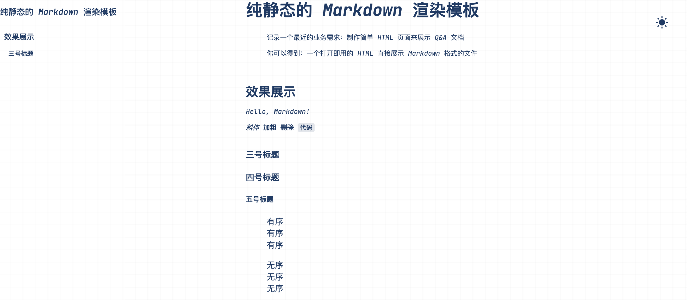
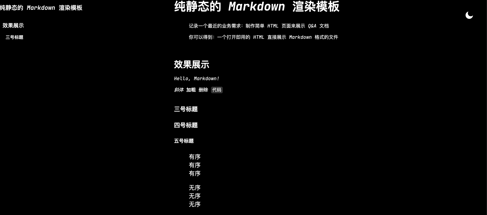

# 纯静态的 Markdown 渲染模板

> 记录一个最近的业务需求：制作简单 HTML 页面来展示 Q&A 文档
>
> 你可以得到：一个打开即用的 HTML 直接展示 Markdown 格式的文件

## 效果展示

- 浅色模式

  

- 深色模式

  

## 怎么足够让页面简单？

既然要足够简单打开即用，那就 all in HTML + CSS + JS , 所以没什么可以分享的，JS 解析 Markdown 提供几个库来处理就好了

1. `markdown-it.js`
2. `markdown-it-toc.js` 用来解析 TOC
3. `markdown-it-named-headings` 给文章的标题挂上标签
   - `kebabcase.js` 依赖的子组件

这里需要解决的主要问题是解析 Markdown 的库的 CDN 引入的 JS 是使用 commonjs 模块来导出相关资源的，这就要求我们魔改用全局变量来承接这些导出的对象（函数），并使其满足各类依赖之间的调用。

具体的修改方式为：（细节就不赘述，有兴趣直接看资源即可）

```js
//	xxx.min.js
modules.export = (() => {
	return sm;
})();
//	after edited
window.a = (() => {
	return sm;
})();

//	use it in other dep.js
() => {
	a.xxx();
};
```

## 怎么展示目录？

\[\[toc\]\] 关键字在我们使用 `markdown-it-toc.js` 时会自动解析成一块独立的元素，要展示这个目录的时候，我们可以直接把这块元素直接脱离页面布局固定在左边。

```css
.table-of-contents {
	position: fixed;
	left: 0;
	top: 0;
}
```

同时，这个解析库的配置项是很丰富的，欢迎大家去关注一下配置。例如以下配置就是只解析到一、二、三号标题。

`md.use(window.markdownToc,{includeLevel:[1, 2, 3]})`

## 怎么处理深色主题？

### JS 部分

1. 从 SessionStroage 中获取，这样能够满足刷新页面的要求
2. 适配系统主题做初始化

```js
//	处理主题
const theme = (() => {
	if (typeof sessionStorage !== 'undefined' && sessionStorage.getItem('theme')) {
		return sessionStorage.getItem('theme');
	}
	//	适配系统的主题
	if (window.matchMedia('(prefers-color-scheme: dark)').matches) {
		return 'dark';
	}
	return 'light';
})();

//	处理点击事件
const btnID = 'modeBtn';
const btnElement = document.getElementById(btnID);

if (theme === 'light') {
	btnElement.setAttribute('src', './assets/sun.svg');
	document.documentElement.classList.remove('dark');
} else {
	btnElement.setAttribute('src', './assets/moon.svg');
	document.documentElement.classList.add('dark');
}

window.sessionStorage.setItem('theme', theme);

const handleToggleClick = (e) => {
	const src = e.target.src;
	const isMoon = src.endsWith('moon.svg');
	//	处理显示图标
	e.target.setAttribute('src', isMoon ? './assets/sun.svg' : './assets/moon.svg');
	//	更新css主题
	const element = document.documentElement;
	element.classList.toggle('dark');
	//	切换 sessionStorage 的存储变量
	const isDark = element.classList.contains('dark');
	sessionStorage.setItem('theme', isDark ? 'dark' : 'light');
};

document.getElementById('modeBtn').addEventListener('click', handleToggleClick);
```

### CSS 部分

不同环境配置不同的变量

```css
:root {
	--tab-width: 480px;
	--background-color: #fff;
	--tab-background-color: #ffffff7f;
	--text-color: #163b66;
	--highlight: #163b6620;
}

:root.dark {
	--background-color: #000;
	--tab-background-color: #0000007f;
	--text-color: #fff;
	--highlight: #6666667f;
}
```

## 资源

[静态资源包下载](https://github.com/hamburgerdog/hamburgerdog.github.io/blob/astro/resource/md-html.zip)
