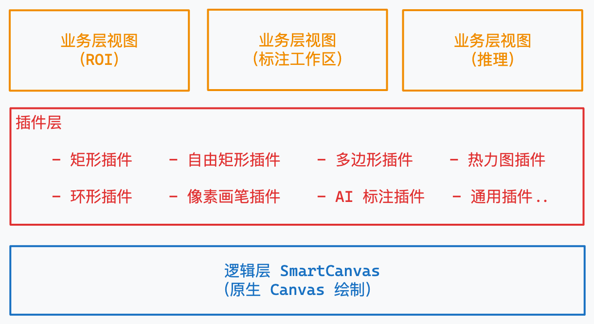

# 高性能画布绘制提速

## 首屏绘制卡顿

### 业务层大任务未拆分，单条任务阻塞主线程

| 条件     | 优化前     | 优化后     |
| :------- | ---------- | ---------- |
| 视图大小 | 1500\*1500 | 1500\*1500 |
| 标注数量 | 481        | 481        |
| 绘制次数 | 90         | 2          |
| 总耗时   | 915.48ms   | 27.79ms    |
| 提升     | -          | 3389%      |

**核心原因**

单个绘制任务执行了 915ms ，导致页面卡顿。

**背景介绍**

随着项目迭代的进行，越来越多功能会间接或直接依赖画布的更新，例如初始化绘制形状、窗口大小改变触发画布更新、替换背景图等等，在“煽增”定律的作用下逐渐使得绘制过程变得混沌，以这个 Task 为例，首屏渲染执行了至少 90(915ms/10fps) 个独立的绘制动作，而这 90 个绘制动作，绘制都是极相似的图片，属于重复执行。


### 优化思路

在多人协同开发的模式下，要求开发人员在业务层对绘制动作进行约束的心智成本是很大的（需要改变开发习惯、制定编码规范、严格执行 Code Review）。要想做到释放开发效率还要兼顾性能，只能从插件和编辑器做起。



#### 【插件层】屏蔽不必要的插件，减少间接调用

**为什么可以屏蔽插件**

- 在业务上，插件是服务于视图的，不同的视图的业务进行细分后会搭配不同的插件组来实现相关功能。例如在「导入视图」里，我们只需要使用 Mask 插件和通用插件，其他的插件都不需要引入，而分割模块的视图则不需要引入矩形、环形等插件。

- 在技术上，插件的设计之初就是可插拔的。

**为什么屏蔽插件可以提速**

插件层是通过 OOP 实现的，不同的插件实现了统一的接口，业务层可以通过控制器去初始化注册插件、管理插件实例、调用插件方法。


在控制器派发消息的时候会发送给所有插件实例（插件不关心业务层的实现）。因此，业务层在注册的时候不进行屏蔽无用的插件，就会间接调用到这些插件实例的方法，即使这些插件内部都做了或多或少的屏蔽。

```js
//	业务层调用控制器
ViewA.PluginEditor.draw();

//	控制器派发消息
PluginEditor.invoke('draw', ...args);

//	插件执行
PluginEditor.PluginA?.draw();
PluginEditor.PluginB?.draw();
PluginEditor.PluginC?.draw();
```

<br/>

#### 【底层编辑器】合并提交绘制

**策略原理**

从业务层、插件层再到底层编辑器，最终用户可见的只会是 HTML 上的 Canvas 元素，若把 Canvas 当成显示屏，那每一个绘制动作都会渲染成一张图片，成为刷新这个显示屏的一帧数据。只要控制更新动作的执行时间，就能控制 Canvas 的刷新频率，因此在性能危机时，当然也可以采用“降频”的策略来提升浏览器主线程的执行速度。

**实际运用**

不难看出，这个绘制链路就是一个节点树模型，所有绘制动作会收敛到底层编辑器封装的原生 Canvas API 中，在这种模型下，为了做到“降频”，最简单有效的方法就是隔单位时间执行一次绘制动作，且总取最新提交的绘制动作来执行。例如：若要做到 60fps 则每隔 16ms 执行一次绘制动作即可。

> 当然，这个“降频”策略是一个理想模型（能及时给出每一帧的数据），我们业务层在面临大图、大数量标注的时候，往往一条执行动作的整体时间就已经远远超过了 16ms ，后续的章节会详细解析<u>「如何使用不同的策略来优化帧渲染的时间」</u>。

```js
//	以 loadsh-es 的 throttle 为例

private Draw() {
  throttle((ctx)=>ctx.draw(), 1000 / FPS)
}
```

<br/>

### 优化效果

| **条件** | **优化前** | **优化后** |
| -------- | ---------- | ---------- |
| 视图大小 | 1500\*1500 | 1500\*1500 |
| 标注数量 | 481        | 481        |
| 绘制次数 | 90         | 2          |
| 总耗时   | 915.48 ms  | 27.79 ms   |
| 提升     | -          | 3389 %     |


<br/>
<br/>

## 切图性能提速

### 背景图绘制滞后，视觉上等待较久

**核心原因**

绘制的任务都统一放在动画帧中执行无法很好区分优先级，会导致视觉上背景图和标注同时出现，若标注绘制耗时久，则会导致视图较长时间未响应。

**背景介绍**

`requestAnimationFrame()` 会在浏览器重绘前执行一个回调，在底层编辑器的实现中，所有画布图层的绘制都会该方法的回调来执行以尽量避免影响浏览器 JS 主线程，但这也会带来了「绘制优先级无法区分」的问题。

在业务层会具体表现为，代码已经使用各类阻塞来限制「背景图和标注的显示顺序」，但总还是在性能波动时（快速切换图片）出现图片闪屏、标注显示错位等问题，原因是重绘执行的任务太多了变得不受控了。

<br/>

### 优化思路

#### 【底层编辑器】调整绘制逻辑

背景图片优先提交绘制展示，标注展示的图层依赖 `requestAnimationFrame` 在重绘时执行，其他特性图层无须及时更新，则借用 `requestIdleCallback` 在浏览器空闲时执行，从而区分好展示的优先级。

1. 优先展示在画布上的数据，同步执行 JS 堆栈；

2. 展示标注相关的数据，在浏览器重绘的每一帧来执行；

3. 与用户交互、非关键信息的数据，可以在浏览器空闲时执行。

```JavaScript
// 同步绘制
ImageCanvas.draw();

// 动画帧绘制
canvasList.forEach((canvas) => {
  requestAnimationFrame(async () => {
    canvas.draw();
  });
});

//  在空闲时刻绘制 actionCanvas 特征选择图层
requestIdleCallback(() => {
  featureCanvas.draw();
});
```

### 优化效果

这种优化不会直接对代码执行性能进行优化，但通过展示优先级调整也能提升展示体验感。

<br/>
<br/>

## 单次绘制动作提速

### 主要性能损耗点

**React flushSync（调度更新）**

这里有 49.6% 的耗时占用在了 React 组件的更新上，Canvas 绘制才占了 42.8%


**Canvas 相关 API 操作**

draw 函数会直接调用 Canvas 原生 API ，可以看到性能开销还是很大的，其中绘制文本的耗时用了 31%


**优先级划分不够清晰**

特征图层是离屏的服务于形状选中功能，实际上这是可以延后执行


**大批量数组计算处理**

可以看出在待处理的数组变大后，该段函数的耗时会上升，甚至已经超过了一个图层绘制的耗时，该函数主要耗时过程分为两类，调用 Canvas 底层的 getImageData() 和通过计算坐标获取形状。


<br />

### 优化思路

#### **降低 React 更新调度频率**

**核心原因**

简而言之，动画帧的性能是有限的，同时更新 React 组件和 Canvas 画布会影响性能，可以优先更新 Canvas 延后更新 React，保持优先级平衡。

在代码层面来看，业务层和插件的通信太过于频繁，插件会在鼠标事件触发时，通过回调的方式通知业务层，业务层触发 React 组件更新，且这个通信过程是比 Canvas 绘制要早执行的，直接导致了动画帧内的性能浪费。

**优化方法**

处理鼠标移动、拖拽、点击时的回调，保证一定频率内去刷新 React 组件，即通过防抖/节流手段就可以实现相关优化。

以<u>「标注信息展示框为例」</u>可以看到优化后，Canvas 每一帧都能及时响应（红框部分），React 组件的更新被延缓（蓝框部分）


屏蔽业务层里其他的各类隐藏触发更新 React 组件无效更新的过程就不展示了，核心原理与上述一致。

<br/>

#### **更细粒度的优先级**

**核心原因**

在解决完业务层和画布的绘制优先级问题后，深入聚焦到画布绘制的过程，还能继续挖掘到一些可优化的点。

例如在【主要性能损耗点】提及的隐藏图层同步绘制问题：一个动画帧里面分部执行了 `drawCanvas` 和 `drawActionCanvas`，但实际上 `drawActionCanvas` 是后续用户选中交互时才会利用的，可以继续延迟执行。


**优化方法**

既然动画帧里面执行了两个性能损耗大绘制过程，那最简单的想法就是：

1. 多分一个动画帧来执行

2. 了解 V8 引擎的 JS 线程模型的同学会意识到，其实还有另一个方法来优化 JS 执行的过程，即微任务队列。

3. 如果对新特性熟悉的同学还会意识到，浏览器目前还有另一个的 API 可以帮助开发人员对线程进行最细粒度的控制，即[Scheduling: isInputPending() method - Web APIs | MDN](https://developer.mozilla.org/en-US/docs/Web/API/Scheduling/isInputPending)

`Talk is cheap, show you the code.`

```js
//  图层的绘制逻辑
this.drawCanvas();
requestAnimationFrame(async () => {
	//  主动让出主线程
	await Tool.yieldToMain();
	//  在空闲时刻绘制 actionCanvas 特征选择图层
	this.drawActionCanvas();
});

/**
 * 等待主线程空闲
 */
const yieldToMain = (waitTime = 0) => {
	return new Promise((resolve) => {
		setTimeout(resolve, waitTime);
	});
};

/**
 * 当输入事件挂起时，让出主线程
 */
const yieldWhenInputPending = async () => {
	if (
		//  为了兼容浏览器，这里需要判断 navigator.scheduling 是否存在
		navigator.scheduling?.isInputPending()
	) {
		await yieldToMain();
	}
};
```

所以整个绘制逻辑会变成：`drawCanvas`，动画帧绘制时进入微任务队列并让出线程，等该轮事件结束后，执行 `drawActionCanvas`。


以上过程还能继续进行优化，即 `drawActionCanvas` 在微任务队列中可能会被阻塞，而实际上画布需要的永远是最新的一个 `drawActionCanvas`。因此，还可以把微任务队列中的大部分函数弃用，只要保证页面及时更新即可。

**优化效果**

- 优化前：


- 使用防抖触发优化后


<br/>

#### 关闭非关键耗时任务

**核心原因**

再继续深入到底层代码层面，可以分析单 draw 函数要调用的全部 canvas 动作数量，而这每一个动作最终都会渲染到画布上。

在画布上展示的一定需要是有效的信息，但在标注数量巨大时，过多的信息不仅会掩盖掉标注主体，还会直接影响绘制性能。

以绘制一万两千个标注为例，这个过程整体（包含渲染）的耗时为 524ms，平均单个标注的绘制为 0.044ms。


如果以纯 JS 执行的事件来分析，不难看出，红框部分为真正绘制形状主体的过程，在单条执行动作中的耗时其实占比极小，把绘制文本、形状圆角上下标、判断绘制与否的过程去除，实际上这里的执行速度可以提升至少 `(1 / (100 % - 25.1% - 18.1% - 17%)) === 2.5 倍`


优化后：轻松 Cover 标注一万 ➕

**优化方法**

结合业务需求去除所有非必要的展示过程，性能提速明显


<br />
<br />

### 最终整体的优化效果

同样的绘制效果过程，优化后可以看出有 LongTask 已经被消灭了，JS 主线程也能在 Scripting 执行的间隙更新，页面刷新频率同时得到了保障（不关闭非关键耗时任务）


<br />

## **总结**

1. 时时回顾，避免技术债堆积；

2. 代码设计要收敛，有约束方才存在更多的优化空间；

3. 善用 Performance 面板，尝试浏览器新 API；

4. 业务层到底层，每一层的封装要够干净，各司其职，减少心智成本；

5. 别在编码层面有太多规范约束；

6. 别提前优化。
